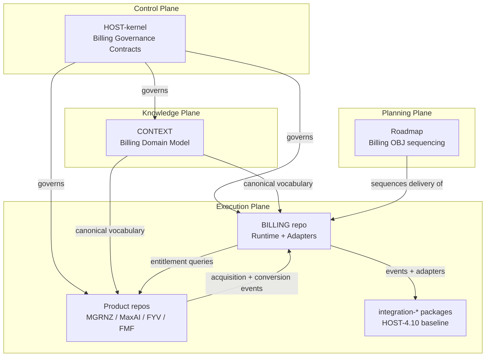
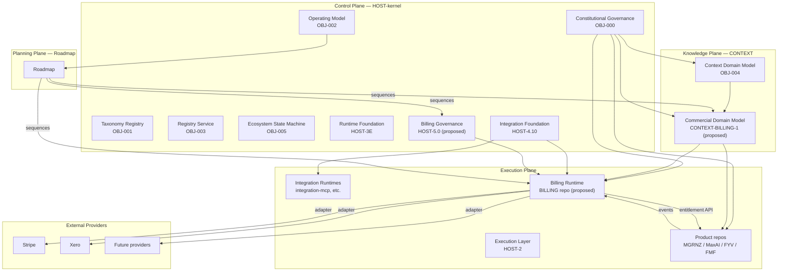

# HOST Billing Kernel — Architecture & Adoption Review

## Governance Metadata

| Field | Value |
| --- | --- |
| Document Type | Architecture Review (pre-ADR) |
| Proposed Objective | OBJ-BILLING (unallocated) |
| Proposed ADR | ADR-BILLING-01 - Billing plane assignment and adoption |
| Status | Draft for Review |
| Version | 0.1 |
| Owner | HOST |
| Last reviewed | 2026-07-14 |
| Constitution | [OBJ-000 - Ecosystem Constitution](docs/constitution/ecosystem-constitution.md) |
| Governing Operating Model | [OBJ-002 - HOST Kernel Operating Model](docs/kernel/operating-model.md) |
| Baseline | Kernel 1.10, Governance Baseline v1.0 (README, HEAD 3d9b44fa) |
| Related documents | [OBJ-001 Taxonomy Registry](docs/taxonomy/taxonomy-registry.md), [OBJ-004 Context Domain Model](docs/context/context-domain-model.md), [ADR-009 Integration Platform Baseline](docs/architecture/ADR-009-integration-platform-baseline.md), [HOST-4.10 Integration Platform Baseline](docs/objectives/) |

---

## Purpose

Evaluate whether the proposed **HOST Billing Kernel** should be adopted as a permanent platform capability of HOST v1.0, and if so, **which plane, which repository, and which Objective** it belongs to.

The review answers the six criteria set by the platform update brief:

1. Kernel Test
2. Platform Fit
3. Service vs Kernel Boundary
4. Roadmap Impact
5. Future Kernel Candidates
6. Architectural Stability Review

It concludes with a formal Adoption Recommendation, an updated capability map, kernel boundary recommendations, and a Future Kernel Candidates appendix.

---

## Context

### What the review evaluates

The Billing Kernel is currently a **design proposal**, not a shipped artefact. Its specification lives in two prior briefs recorded in this thread:

- Phase 1. Commercial Catalogue — brand model, product model, plan archetypes, customer types, revenue attribution, journeys, entitlements, Stripe readiness.
- Phase 2. Billing Kernel Repository Foundation — eleven documents (00 Vision through 10 Roadmap) framed as a HOST Kernel capability.

**No Billing Kernel documentation has been authored or committed to the HOST-kernel repository.** This review therefore evaluates *design intent* against the actual Kernel 1.10 baseline. Wherever the review recommends adoption, an authored specification must follow through the normal governance workflow (Request → Objective → Decision → ADR → Roadmap → Delivery → Validation → Completion) before implementation.

### What the review takes as given

The following are treated as fixed by the briefs and not re-litigated here:

- MGRNZ owns commercial operations. Revenue ultimately belongs to MGRNZ, but every transaction preserves originating brand, product, journey, campaign, customer, accounting refs, and payment references.
- Products consume Billing. Products never implement commercial logic.
- Payments do not grant access. Entitlements do.
- Commercial history is immutable. Adjustments occur through new events.
- External providers (Stripe, Xero, future) are replaceable adapters.
- Brands remain independent-feeling to customers while sharing a central commercial ledger.

### What has actually shipped

Kernel 1.10 in the HOST-kernel repository provides:

- **Control Plane** governance (OBJ-000 Constitution, OBJ-001 Taxonomy, OBJ-002 Operating Model, OBJ-003 Registry, OBJ-004 Context Domain Model, OBJ-005 Ecosystem State Machine).
- **Execution Plane substrate** for Control Plane operations: `context-runtime`, `context-store`, `context-persistence` (with filesystem and SQLite provider adapters), `context-service`, `api-host`.
- **Transport Layer**: `transport-adapter` (contract v1.0.0), `transport-rest`, `rest-runtime-host`. No web server or listener present.
- **Runtime Foundation**: `runtime-contracts`, `runtime-composition` (DI bootstrap).
- **Integration Platform Baseline v1.0** (HOST-4.10 frozen): `integration-contracts`, `integration-events`, `integration-workflow`, `integration-execution`, `integration-execution-persistence`, plus the first concrete reusable integration runtime `integration-mcp`.

Explicit non-scope of the HOST-kernel repo, per README:
- Not a product.
- Not HOST (the public interface).
- Not Cockpit (the operator interface).
- No product-specific integration, broker runtime, scheduler runtime, or third-party SDK runtime.

---

## Executive Recommendation

**Adopt the Billing capability, but split it across three planes and three repositories rather than as a single monolithic "Billing Kernel" inside HOST-kernel.**

A single Billing Kernel inside HOST-kernel would violate OBJ-000 governance principle *"One repository owns one responsibility boundary"* and would collapse Knowledge, Control, and Execution concerns into one boundary. The correct decomposition follows the constitutional four-plane model already in force:

| Component | Plane | Repository | Objective | Status |
| --- | --- | --- | --- | --- |
| **Billing Domain Model** — canonical vocabulary for Brand, Customer, Order, Subscription, Invoice, Payment, Entitlement, Ledger Entry, etc. | Knowledge Plane | CONTEXT | New OBJ under OBJ-004 Context Domain Model | To author |
| **Billing Governance Contracts** — commercial-history immutability, revenue-attribution invariants, entitlement grant semantics, event vocabulary discipline, adapter-neutrality rules | Control Plane | HOST-kernel | New OBJ, new ADR | To author |
| **Billing Runtime & Adapters** — order/subscription/invoice/payment/entitlement runtime, Stripe adapter, Xero adapter, GST handling, webhooks | Execution Plane | New sibling repo (e.g. `BILLING` or `host-billing`) | New OBJ series | To author |

**Final adoption verdict for each component:**

1. **Billing Domain Model → Adopt as Shared Knowledge (CONTEXT).**
2. **Billing Governance Contracts → Adopt as HOST Kernel capability.**
3. **Billing Runtime & Adapters → Adopt as Shared Platform Service in a new execution repository.**

Together these three form the **HOST Commercial Capability**. The name "Billing Kernel" is retained only to refer to component 2 (the Control Plane contracts). Referring to the whole system as "the Billing Kernel" would be a category error under the constitution.

**Blocking prerequisites** before implementation may begin (per OBJ-002 rule *"No implementation begins before governance is complete"*):

- **ADR-BILLING-01** authoring and approval — decides the plane assignment above.
- **OBJ-BILLING-DOMAIN** in CONTEXT — canonical commercial vocabulary as an extension of OBJ-004.
- **OBJ-BILLING-KERNEL** in HOST-kernel — governance contracts.
- **OBJ-BILLING-RUNTIME-INIT** — allocation of the new execution repo.
- **Maximised AI Price Book** delivered and referenced — no pricing invented.

---

## 1. Kernel Test

The brief poses five questions; each is answered against the HOST-kernel definition of a Kernel capability (Control Plane governance capability, per OBJ-002).

### 1.1 Is it consumed by multiple products?

**Yes.** Every product named in the ecosystem — MGRNZ (Signal Audit, AI Advisory, Opportunity Engine, Future SaaS), Maximised AI (Websites, Quote Automation, Business Automation, AI Services, Advisory), Find Your Vertical (Creator discovery, Assessment, Intelligence, Services), and FunkMyFans (Creator ops, Automation, Messaging, Agency ops) — participates in the commercial flow either as an acquisition point, conversion point, entitlement consumer, or all three.

### 1.2 Is it independent of any single application?

**Yes.** The specification explicitly forbids products from implementing commercial logic. Billing sits *above* products in the same way OBJ-002 governance sits above execution repositories.

### 1.3 Does it provide reusable platform services?

**Yes.** Entitlement grants, commercial event vocabulary, revenue attribution metadata, and external-provider adapter contracts are all reusable across every current and future product.

### 1.4 Does it define canonical platform concepts?

**Yes.** Brand, Organisation, Customer, Account, Product, Service, Plan, Price, Offer, Quote, Order, Subscription, Invoice, Payment, Credit, Refund, Promotion, Tax, Entitlement, Transaction, Ledger Entry — all are canonical business objects that today do not exist in OBJ-004 Context Domain Model and would otherwise be redefined inconsistently across products.

### 1.5 Would multiple products become inconsistent without it?

**Yes, unambiguously.** In the absence of a shared commercial capability:
- FYV would define its own "Customer" separately from FMF's "Customer" and Maximised AI's "Customer".
- Revenue attribution would fracture. Cross-brand transitions (FYV → FunkMyBrand → FunkMyFans, or Signal Audit → Maximised AI → Managed Services) would lose lineage.
- Every product would implement its own Stripe integration, guaranteeing inconsistent webhook handling, tax logic, and refund semantics.
- Entitlement models would be product-specific, making cross-brand offerings impossible.

### 1.6 Verdict

**The Billing capability passes the Kernel Test.** However, "passing the Kernel Test" answers the question *"is this genuinely a platform-level concern?"* — it does **not** answer *"which plane does it belong to?"* That is the subject of Sections 2, 3, and 4.

---

## 2. Platform Fit

### 2.1 Plane assignment

The brief lists six "Kernel capabilities": Runtime, Registry, Context, Execution, Governance, Integration. In the actual HOST constitution these are not all Kernel capabilities in the same sense:

| Brief's label | Actual location in HOST |
| --- | --- |
| Runtime | Control Plane — `kernel-api`, `kernel-core`, `runtime-composition`, `runtime-contracts` |
| Registry | Control Plane — `kernel-registry`, plus registry surfaces in the Integration Foundation |
| Context | **Knowledge Plane, separate repository (CONTEXT).** HOST-kernel only holds the execution-plane substrate for CONTEXT records (`context-runtime`, `context-store`, `context-persistence`). Context itself is owned by CONTEXT, not HOST-kernel. |
| Execution | Execution Plane — HOST-2 execution layer, `integration-execution` |
| Governance | Control Plane — OBJ-000 Constitution, OBJ-002 Operating Model |
| Integration | Control Plane contracts (Integration Foundation, HOST-4E) with Execution Plane implementations (`integration-mcp`) |

A Billing capability that tries to fit as a single peer of this list would necessarily span planes. The correct fit is **three sibling capabilities across three planes**, not one Kernel peer.

### 2.2 Dependencies

The proposed Billing capability depends on (in order):

1. **OBJ-000 Constitution.** All Billing artefacts must adhere to governance principles.
2. **OBJ-001 Taxonomy Registry.** Billing terms enter the canonical ecosystem vocabulary via OBJ-001 (or a Billing extension under OBJ-001).
3. **OBJ-004 Context Domain Model.** Commercial entities extend the Context domain — Customer, Account, Order, etc. are Context records with an evidence chain, not free-standing types.
4. **HOST-4.10 Integration Platform Baseline v1.0.** Stripe, Xero, and future provider adapters ride on the Integration Foundation. `integration-events` provides the substrate for `payment.authorised`, `subscription.created`, etc. `integration-execution` and `integration-execution-persistence` provide durable coordination for adapter workflows.
5. **HOST-3E Runtime Foundation.** Auth, correlation, observability apply to commercial event flows.
6. **HOST-2 Execution Layer.** `context-runtime`, `context-store`, `context-persistence` are the substrate for durable commercial state.

Billing must **not** depend on any single external provider. Stripe is one implementation of the payment-provider adapter contract, replaceable by any conforming adapter.

### 2.3 Boundaries

**Billing owns:**
- Commercial catalogue definitions (Brands, Products, Services, Plans, Prices, Offers, Promotions).
- Commercial history (Orders, Subscriptions, Invoices, Payments, Credits, Refunds, Ledger Entries).
- Entitlement grants and revocations.
- Revenue attribution metadata on every commercial event.
- External provider adapter contracts (Stripe, Xero, GST, future).
- Commercial event vocabulary (`offer.created`, `payment.authorised`, `entitlement.granted`, etc.).

**Billing does NOT own:**
- Product access enforcement (products query Entitlements themselves).
- Identity of customers as ecosystem members (Identity, if promoted to a Kernel — see §5).
- Accounting entries themselves (Xero is an adapter; the ledger inside Xero is Xero's).
- Marketing lifecycle (CRM concerns) or customer support workflows.
- Pricing decisions (Price Book is external input, not a Billing responsibility).

### 2.4 Interactions

### 2.5 Overlap and architectural conflicts

**No hard conflicts, but two overlap risks:**

- **Overlap with OBJ-004 Context Domain Model.** Commercial entities (Customer, Order) are Context records. The Billing Domain Model must extend OBJ-004 rather than duplicate it. Resolution: a new OBJ under OBJ-004 that adds the commercial subdomain, not a standalone parallel domain model.
- **Overlap with `integration-events`.** Commercial events (`payment.authorised` etc.) are events, and HOST-4.6 already froze the canonical event contract foundation. Billing must not create a parallel event bus. Resolution: Billing events register into the existing event registry as a commercial event namespace.

---

## 3. Service vs Kernel Boundary

Every major Billing responsibility is classified as one of:

- **HOST Kernel** — Control Plane governance.
- **Shared Platform Service** — Execution Plane, cross-product reusable runtime.
- **Product Responsibility** — Execution Plane, product-specific.
- **External Provider** — Non-HOST, adapter-mediated.

| Responsibility | Classification | Reasoning |
| --- | --- | --- |
| Commercial vocabulary and canonical domain model | **CONTEXT (Knowledge Plane)** | OBJ-004 owns canonical entities. Billing entities are Context records with evidence chains. |
| Commercial history immutability rules | **HOST Kernel (Control Plane)** | Governance invariant. "No history rewrite" is a constitutional rule, not runtime logic. |
| Revenue attribution invariants (revenue owner = MGRNZ; every txn preserves brand/product/journey/campaign/customer) | **HOST Kernel (Control Plane)** | Constitutional rule that binds every product. |
| Adapter neutrality rule (no dependency on any specific provider) | **HOST Kernel (Control Plane)** | Constitutional rule. Determines shape of adapter contracts. |
| Entitlement grant semantics (payments do not grant access; entitlements do) | **HOST Kernel (Control Plane)** | Constitutional rule that governs how commercial events translate to platform capability. |
| Commercial event vocabulary (canonical event names, envelopes, ordering) | **HOST Kernel (Control Plane) contracts + Shared Platform Service registration** | Contracts live in HOST-kernel; the event registry entries live in the shared event registry from HOST-4.6. |
| Order / Subscription / Invoice runtime | **Shared Platform Service** | Reusable across every product, but implementation is Execution Plane. Belongs in the new BILLING repo. |
| Entitlement service (grants, revocations, queries) | **Shared Platform Service** | Products query it; it doesn't govern them. |
| Stripe adapter | **External Provider (via adapter)** | Adapter code lives in BILLING repo. Stripe itself is external. |
| Xero adapter | **External Provider (via adapter)** | Accounting export runs above the ledger; Xero owns the ledger. |
| GST calculation | **Shared Platform Service** | Tax logic is jurisdiction-specific and reusable. Belongs in BILLING as a service, not in HOST-kernel. |
| Price Book | **External input** | Not a Kernel artefact. Referenced by the Commercial Catalogue but authored outside. |
| Commercial Catalogue (brand + product + plan + price mapping) | **Shared Platform Service (data)** with **HOST Kernel (schema governance)** | The schema for catalogue entries is governed. The catalogue data is owned by BILLING/MGRNZ operations. |
| Customer Portal, Checkout flows | **Product Responsibility** | Per-brand UX. Each brand renders its own. |
| Webhook receivers | **Shared Platform Service** | Above `integration-events`. One receiver per adapter. |
| Fraud detection, dispute resolution | **External Provider** (Stripe et al.) with **Shared Platform Service** for local records | Providers handle disputes; BILLING records the outcomes. |

**Boundary rule of thumb:** if it is a constitutional invariant or a definition that products would otherwise redefine, it is Control Plane. If it is a reusable runtime that products call, it is a Shared Platform Service. If it is per-brand rendering or per-product logic, it is a Product Responsibility. If it lives outside the ecosystem, it is an External Provider reached only through an adapter contract.

---

## 4. Roadmap Impact

### 4.1 Where Billing appears in the HOST roadmap

**Proposed placement:** HOST-5.x series, immediately after HOST-4.10 Integration Platform Release Baseline v1.0 and before any product-specific delivery Objectives.

**Rationale:** HOST-4.10 provides the substrate (events, execution, integration adapters, durable state) that Billing requires. Billing cannot land before it. Billing must land before any product-specific commercial launch — otherwise products will start implementing their own commercial logic in the meantime, permanently fragmenting the ecosystem.

### 4.2 Proposed Objective structure

| Objective | Owner | Depends on | Purpose |
| --- | --- | --- | --- |
| **ADR-BILLING-01** | HOST | OBJ-002 | Records the plane-split decision. Must be authored and approved first. |
| **HOST-5.0 Billing Foundation** | HOST | ADR-BILLING-01 | Governance contracts: history immutability, revenue-attribution invariants, entitlement grant semantics, adapter neutrality. |
| **CONTEXT-BILLING-1 Commercial Domain Model** | CONTEXT | OBJ-004, HOST-5.0 | Canonical commercial vocabulary as an extension of the Context Domain Model. |
| **HOST-5.1 Commercial Event Vocabulary** | HOST | HOST-4.6, HOST-5.0 | Registers the canonical commercial event namespace in the event registry. |
| **HOST-5.2 Entitlement Contract** | HOST | HOST-5.0 | Contract for entitlement grants, revocations, and product queries. |
| **HOST-5.3 External Provider Adapter Contract** | HOST | HOST-4.10, HOST-5.0 | Adapter contract shape for payment providers and accounting exports. |
| **BILLING-0.x Runtime Foundation** | BILLING repo | HOST-5.0..5.3, CONTEXT-BILLING-1 | Order/Subscription/Invoice/Payment/Entitlement runtime. |
| **BILLING-1.x Adapters** | BILLING repo | BILLING-0.x, HOST-5.3 | Stripe adapter, Xero adapter, GST service. |
| **BILLING-2.x Catalogue Loader** | BILLING repo | BILLING-0.x, Maximised AI Price Book | Loads the Price Book into the Commercial Catalogue. |
| **HOST-5.9 Billing Platform Release Baseline v1.0** | HOST | All above | Freezes the Billing capability. Peer to HOST-4.10. |

### 4.3 Roadmap adjustments required

- **New execution repository allocation.** Roadmap must sequence the creation of `BILLING` (or `host-billing`) as an execution repository, with its own governance metadata and initial Objective.
- **Product roadmap gating.** Any product-specific commercial launch (FYV paid products, FMF subscriptions, Maximised AI subscriptions) must be sequenced *after* HOST-5.9 baseline, not before. Products should not be allowed to implement commercial logic in the interim.
- **Price Book intake.** Roadmap must allocate a task for Maximised AI Price Book delivery and its formal registration into the Commercial Catalogue.
- **Cockpit UI implications.** The operator interface (Cockpit) will need surfaces to inspect commercial history, entitlements, and adapter status — these are Cockpit's concern, not HOST-kernel's, but the roadmap must schedule that work.
- **HOST (public interface) implications.** Per-brand Checkout and Customer Portal flows are Product concerns — Roadmap should ensure the shared Entitlement query pattern is documented before brands start integrating.

### 4.4 Implementation priority

Highest priority: **ADR-BILLING-01** and **HOST-5.0 Billing Foundation** in parallel with **CONTEXT-BILLING-1 Commercial Domain Model**.

These three are the blocking prerequisites — until they are approved, no other Billing work should begin per OBJ-002 rule *"No implementation begins before governance is complete."*

### 4.5 Milestones

| Milestone | Objective(s) reached |
| --- | --- |
| M1. Adoption decision | ADR-BILLING-01 approved |
| M2. Governance foundation | HOST-5.0, CONTEXT-BILLING-1 approved |
| M3. Contract layer complete | HOST-5.1, HOST-5.2, HOST-5.3 approved |
| M4. Runtime foundation | BILLING-0.x delivered |
| M5. First adapter shipped | BILLING-1.0 (Stripe) validated end-to-end |
| M6. Catalogue loaded | BILLING-2.0 with Maximised AI Price Book |
| M7. Billing Platform Baseline v1.0 | HOST-5.9 frozen |

---

## 5. Future Kernel Candidates Appendix

During the review, several concepts surfaced that appear to warrant their own future Kernel capability. **No recommendation is made to create them now.** They are captured here for future evaluation.

### 5.1 Identity

- **Purpose.** Canonical model of ecosystem members: users, agents, service accounts, and their credentials.
- **Justification.** The Billing Kernel needs a canonical Customer identity that today does not exist. Multiple products would independently define Users, guaranteeing fragmentation. The brief's second phase referenced Identity as if it were already a Kernel capability — it is not.
- **Products affected.** All. Every product needs to know who a customer is.
- **Maturity assessment.** Not yet designed. Would need its own OBJ and ADR. Likely a peer of HOST-5.x Billing.
- **Recommended sequencing.** Consider before Billing runtime lands, so BILLING can consume Identity contracts rather than modelling Customer independently. If not before, then a compatibility mode must be defined.

### 5.2 Entitlement (as a standalone Kernel)

- **Purpose.** Reusable capability grants — decoupled from commercial purchases entirely.
- **Justification.** Entitlements might be granted by more than just commercial purchases (trials, promotional grants, admin overrides, team invitations, government-issued permissions in future). Extracting Entitlement into its own Kernel would let Billing be a *source* of grants rather than the owner of grants.
- **Products affected.** All product access decisions.
- **Maturity assessment.** Currently proposed as a Billing responsibility. Adequate for v1. Promotion to standalone Kernel becomes appropriate only if multiple non-commercial grant sources emerge.

### 5.3 Ledger and Audit

- **Purpose.** Immutable event history as a first-class platform capability, generalising beyond commercial events.
- **Justification.** Governance changes, entitlement changes, and commercial events all require the same immutability guarantee. Rather than each capability implementing its own append-only history, a shared Ledger Kernel could serve all three.
- **Products affected.** HOST-kernel governance, BILLING runtime, future audit consumers.
- **Maturity assessment.** Interesting but premature. `integration-execution-persistence` already provides durable state; a Ledger Kernel would need to demonstrate value beyond that. Revisit after HOST-5.9.

### 5.4 Adapter Registry

- **Purpose.** Formal registry of external-provider adapters with lifecycle, versioning, and capability declarations.
- **Justification.** Billing will introduce Stripe and Xero adapters. Other future capabilities will also need external adapters (mail provider, SMS provider, hosting provider, etc.). A shared Adapter Registry Kernel would formalise this pattern.
- **Products affected.** All Shared Platform Services that reach external providers.
- **Maturity assessment.** HOST-4E Integration Foundation already provides much of what an Adapter Registry would need. The question is whether adapters are just integrations (current position) or a distinct concept. Revisit after two or more adapter families exist (Billing being the second family after Integration).

### 5.5 Notification / Communication

- **Purpose.** Canonical model for outbound customer communication (email, SMS, in-app).
- **Justification.** Commercial events (invoice sent, payment failed, subscription ending) fire outbound comms. Every product would otherwise implement its own email logic.
- **Products affected.** BILLING triggers, product-driven notifications.
- **Maturity assessment.** Not yet critical. Could initially be a Shared Platform Service in a future NOTIFY repository. Kernel promotion only if multiple products define contradicting notification semantics.

### 5.6 Consent and Compliance

- **Purpose.** Canonical model for customer consent, data-retention obligations, and regulatory attestations (GST, GDPR-equivalent, terms of service).
- **Justification.** Billing operations imply consent capture (tax residency, invoicing address) and retention policy. Products would fragment this if unmanaged.
- **Products affected.** All product acquisition flows.
- **Maturity assessment.** Belongs in a future Compliance capability. Not blocking for Billing v1 if minimum viable consent is captured at Order creation.

---

## 6. Architectural Stability Review

### 6.1 Areas now stable enough to freeze

The following can be treated as **fixed** until proven otherwise through multi-product usage. These form the architectural baseline against which Billing is designed.

| Area | Baseline | Freeze rationale |
| --- | --- | --- |
| Four-plane architecture (Control, Knowledge, Planning, Execution) | OBJ-000 | Constitutional. |
| Repository responsibility mapping (HOST, CONTEXT, Roadmap, product repos) | OBJ-000 | Constitutional. |
| Governance workflow (Request → Objective → Decision → ADR → Roadmap → Delivery → Validation → Completion) | OBJ-002 | Canonical operating model. |
| Traceability requirements (originating Objective, ADR, owning repo, downstream artefacts, validation) | OBJ-000 | Constitutional. |
| Taxonomy and numbering (OBJ-nnn, HOST-x.x, ADR-nnn) | OBJ-001, ADR-001 | In force. |
| Runtime Foundation contracts (auth, correlation, observability) | HOST-3E | Frozen. |
| Integration Platform Baseline (contracts, events, workflow, execution, persistence, MCP validation) | HOST-4.10 (ADR-009) | Frozen. |
| Execution Layer substrate (`context-runtime`, `context-store`, `context-persistence`) | HOST-2 | Architecture-frozen pending concrete provider adapters. |
| Transport Adapter contract | v1.0.0 | Frozen. |
| Constitutional principles (One request/one Objective; one Objective/one path; one repo/one boundary; no implementation before governance) | OBJ-000 | Constitutional. |

### 6.2 Unresolved architectural questions

The following must be answered before HOST-5.0 can be approved:

1. **Is Identity a prerequisite for Billing, or a compatibility burden?** If Identity is deferred, BILLING must define an interim Customer identifier scheme with a documented migration path.
2. **Does the Commercial Domain Model extend OBJ-004, or fork it?** Recommendation is to extend. Must be recorded in ADR-BILLING-01.
3. **Does the commercial event namespace register into `integration-events` or does it create a parallel event stream?** Recommendation is to register in the existing registry as a `commercial.*` namespace. Must be confirmed.
4. **Is `BILLING` a single execution repository or a multi-repo family (billing-runtime, billing-adapters-stripe, billing-adapters-xero)?** Single repo recommended for v1. Split can happen at a later baseline if scale demands it.
5. **Does Cockpit gain a Billing surface, and if so at which milestone?** Roadmap concern; must be sequenced.
6. **How are refunds, chargebacks, and disputes modelled — as commercial events, as adapter outcomes, or both?** Both, with the adapter emitting events into the commercial event stream. Must be specified in HOST-5.1.
7. **How are multi-currency transactions attributed?** MGRNZ owns revenue, but individual products may transact in different currencies. Revenue attribution model must specify currency handling.
8. **Where does GST live under multi-jurisdictional expansion?** GST is NZ-specific. The tax service must abstract jurisdiction.
9. **What is the durability guarantee for commercial history?** Presumably strong. Must be specified relative to `integration-execution-persistence` guarantees.
10. **Does the Billing capability register itself in the `kernel-registry`?** If yes, entry contract must be defined. If no, why not.

### 6.3 Assumptions requiring validation

- The Maximised AI Price Book, when delivered, will be structurally consistent with the proposed catalogue schema.
- All current brands (MGRNZ, Maximised AI, FYV, FMF) can share a single Customer concept once Identity is designed. If a brand requires separate customer identity, the model must accommodate.
- Cross-brand transitions (FYV → FunkMyFans) are business-desired and not artefacts of the brief.
- Products are willing to give up owning their own commercial logic. This is a governance principle in the brief but must survive contact with individual product teams.
- Stripe is the intended first adapter. If NZ payment provider constraints require otherwise, adapter contract must not be Stripe-shaped.

### 6.4 Areas where implementation can safely begin

**None yet — governance-first.** Per OBJ-002, no implementation begins before governance is complete.

Once ADR-BILLING-01 is approved:

- Authoring of HOST-5.0, CONTEXT-BILLING-1 can proceed in parallel.
- Once HOST-5.0 and CONTEXT-BILLING-1 are approved, HOST-5.1 through HOST-5.3 can proceed.
- Once contracts are frozen, BILLING-0.x implementation can begin.

### 6.5 Recommendation on architectural freeze

**Freeze the following now, until proven otherwise through multi-product usage:**

- Four-plane model.
- Repository responsibility boundaries.
- Constitutional principles.
- HOST-3E, HOST-4.10 baselines.
- Transport Adapter contract v1.0.0.
- Event contract foundation (HOST-4.6).

**Do not freeze:**

- The Billing capability itself — it has not yet been authored.
- Cockpit surfaces (out of scope of this repo).
- The specific set of adapters (grows over time).

---

## Updated Platform Capability Map

Below is the recommended capability map at HOST v1.0, incorporating the Billing decomposition.

---

## Kernel Boundary Recommendations

For every future capability, the following boundary tests should be applied — in order — before assigning it to HOST-kernel:

1. **Is this a governance rule that binds every product?**
   If yes → HOST-kernel Control Plane.
   If no → continue.

2. **Is this a canonical vocabulary entry?**
   If yes → CONTEXT Knowledge Plane, extending OBJ-004.
   If no → continue.

3. **Is this a runtime capability that products consume?**
   If yes → Shared Platform Service in a dedicated execution repository.
   If no → continue.

4. **Is this per-brand rendering or product-specific logic?**
   If yes → Product Responsibility.
   If no → continue.

5. **Is this external to the ecosystem?**
   If yes → External Provider, reached only through an adapter contract owned by a Shared Platform Service.

Applying these tests up-front prevents future capabilities from being mis-classified as "Kernel" simply because they are important and cross-cutting. Importance and cross-cutting-ness make something a *platform concern*. Only governance concerns make it a *Kernel concern*.

---

## Final Adoption Recommendation

**Adopt the HOST Commercial Capability, decomposed as follows:**

| Component | Adoption verdict |
| --- | --- |
| Billing Domain Model in CONTEXT | **Adopt as Shared Knowledge under OBJ-004.** |
| Billing Governance Contracts in HOST-kernel | **Adopt as HOST Kernel capability, HOST-5.x series.** |
| Billing Runtime & Adapters in a new BILLING repository | **Adopt as Shared Platform Service.** |

**Do not adopt** a monolithic "Billing Kernel" living entirely inside HOST-kernel. That framing violates the constitutional principle *"one repository owns one responsibility boundary"* and would fold Knowledge, Control, and Execution concerns into a single boundary.

**Prerequisites** before any implementation may begin:

1. **ADR-BILLING-01** authored and approved. This document is a candidate input.
2. **OBJ-BILLING** allocation in the taxonomy registry.
3. **HOST-5.0 Billing Foundation** authored.
4. **CONTEXT-BILLING-1 Commercial Domain Model** authored.
5. **Maximised AI Price Book** delivered.
6. **Identity capability** either delivered or a documented compatibility scheme.

**Architectural baseline is sufficiently stable** at Kernel 1.10 for Billing to build upon. Implementation may safely begin once the governance chain above is complete.

---

## Open Questions & Assumptions Log

| # | Item | Type | Impact |
| --- | --- | --- | --- |
| Q1 | Is Identity a blocking prerequisite? | Question | Sequencing |
| Q2 | Extend or fork OBJ-004? | Question | Structural |
| Q3 | Register commercial events in existing bus or create new? | Question | Structural |
| Q4 | Single BILLING repo or multi-repo family? | Question | Repository allocation |
| Q5 | Cockpit Billing surface — when? | Question | Roadmap |
| Q6 | Refunds/chargebacks as events, adapter outcomes, or both? | Question | Contract design |
| Q7 | Multi-currency attribution model | Question | Contract design |
| Q8 | GST abstraction under multi-jurisdiction growth | Question | Tax service design |
| Q9 | Durability guarantee for commercial history | Question | Persistence contract |
| Q10 | Billing capability registration in kernel-registry | Question | Integration |
| A1 | Price Book will be structurally consistent | Assumption | Catalogue design |
| A2 | Brands can share one Customer concept | Assumption | Identity design |
| A3 | Cross-brand transitions are business-desired | Assumption | Journey design |
| A4 | Products will yield commercial-logic ownership | Assumption | Governance enforcement |
| A5 | Stripe is the intended first adapter | Assumption | Adapter contract shape |

---

## Change Log

| Version | Date | Notes |
| --- | --- | --- |
| 0.1 | 2026-07-14 | Initial draft for review. |
