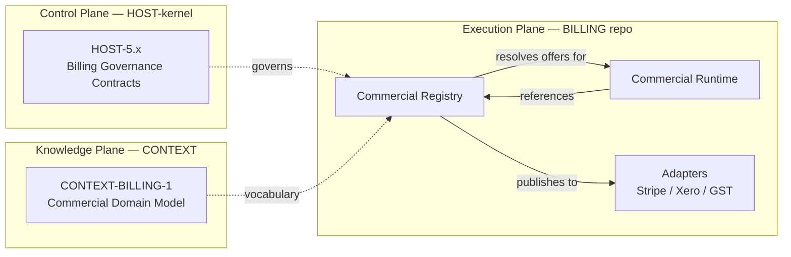
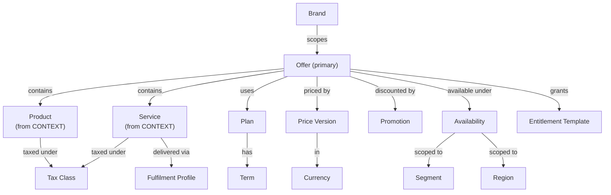
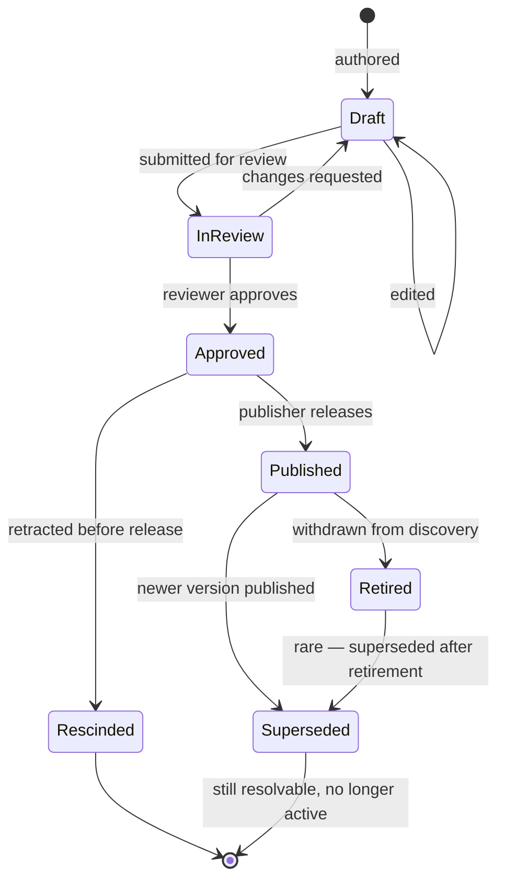

# HOST Commercial Registry — Architecture & Domain Design

## Governance Metadata

| Field | Value |
| --- | --- |
| Document Type | Domain Architecture (pre-implementation) |
| Proposed Objective | OBJ-COMMREG (unallocated) |
| Proposed ADR | ADR-COMMREG-01 - Commercial Registry object model and publishing contract |
| Parent Objective | HOST-5.x Billing Foundation (proposed) |
| Peer Objectives | OBJ-COMMRUN Commercial Runtime, OBJ-COMMADP Commercial Adapters |
| Status | Draft for Review |
| Version | 0.1 |
| Owner | HOST (governance) / BILLING (implementation) |
| Last reviewed | 2026-07-14 |
| Constitution | [OBJ-000 Ecosystem Constitution](docs/constitution/ecosystem-constitution.md) |
| Governing Operating Model | [OBJ-002 HOST Kernel Operating Model](docs/kernel/operating-model.md) |
| Domain Source | [CONTEXT-BILLING-1 Commercial Domain Model](proposed) |
| Related | Adoption Review v0.1, [ADR-009 Integration Platform Baseline](docs/architecture/ADR-009-integration-platform-baseline.md), [OBJ-004 Context Domain Model](docs/context/context-domain-model.md) |

---

## Purpose

The **Commercial Registry** is the canonical, versioned publisher of what the HOST ecosystem is offering for sale at any given moment. It is the *source of commercial truth* for every product and every downstream runtime.

It is **not** a billing engine. It is **not** a payment provider. It is **not** an accounting system. It does not execute anything. It publishes.

The Registry answers one question, in many forms: **"What can a customer buy right now, and what would they get?"**

Every product in the ecosystem — MGRNZ Signal Audit, Maximised AI, Find Your Vertical, FunkMyFans, and every future product — asks the Registry that question by reference to canonical identifiers. No product ever invents a price or a plan.

### Position in the four-plane architecture

The Registry lives in the Execution Plane, inside the future BILLING repository, alongside the Commercial Runtime and the external-provider Adapters. Its dependencies span three planes:



---

## Executive Summary

The design rests on five load-bearing decisions. If any is rejected, the design must be reworked.

1. **Offer is the primary commercial object.** Not Product, not Service, not Plan, not SKU. Customers purchase Offers. Everything else is machinery in service of Offer construction.
2. **The Registry is publish-only from the perspective of applications.** Products read; they never write. All writes happen through the Registry's own governed publishing workflow.
3. **Immutable versioning is a first-class property.** Every published record is a version. References resolve to the current published version. Historical versions remain queryable forever.
4. **The Registry publishes; downstream systems subscribe.** The Commercial Runtime, adapters (Stripe, Xero), and product read-caches all sync from the Registry via canonical publication events — never by reaching around it.
5. **Registry ≠ Runtime.** These are different capabilities with different data shapes, access patterns, consistency requirements, and lifecycles. Conflating them destroys both.

---

## 1. Registry Purpose

### 1.1 Responsibilities

The Commercial Registry owns:

- **Publication.** Canonical commercial offerings become discoverable through it.
- **Resolution.** An unversioned identifier (`offer:mgrnz.signal-audit.standard`) resolves to the currently published version.
- **Versioning.** Every publication creates an immutable version record. Nothing is ever mutated in place.
- **History.** Every prior version remains queryable for the lifetime of any object that references it.
- **Notification.** State changes emit canonical events into the HOST-4.6 event bus.
- **Discovery.** Consumers can enumerate published offerings scoped by brand, segment, region, and availability.

### 1.2 Non-responsibilities

The Registry does **not** own:

- **Transaction execution** — that is the Commercial Runtime's job.
- **Payment processing** — that belongs to Adapters and their upstream providers.
- **Customer state** — customer accounts, subscriptions, and invoices live in the Runtime and CONTEXT.
- **Accounting entries** — Xero owns the ledger; the Xero Adapter exports records into it.
- **The domain vocabulary itself** — that is CONTEXT-BILLING-1's job. The Registry consumes definitions; it does not define terms.
- **Pricing decisions** — those are commercial-operations decisions made by MGRNZ, expressed through the Registry's publishing workflow, but the Registry itself has no opinion on what a price should be.

### 1.3 Ownership

- **Governance ownership:** HOST (via HOST-5.x contracts).
- **Implementation ownership:** BILLING repository.
- **Content ownership:** MGRNZ commercial operations, with brand-scoped delegated authorship for each brand's operators.
- **Domain vocabulary ownership:** CONTEXT (via CONTEXT-BILLING-1).

### 1.4 Lifecycle

Reads and writes have very different rhythms and must be treated separately:

- **Reads** are hot-path, high-volume, latency-sensitive. Every product page load, every checkout initiation, every subscription-renewal calculation is a Registry read. Must be fast, must be predictable, must be highly available.
- **Writes** are infrequent, human-in-the-loop, and governed. A new price version might happen once per week per brand. A new offer might happen once per month. Writes proceed through a full publishing workflow (§4).

### 1.5 Consumers

| Consumer | Purpose | Access pattern |
| --- | --- | --- |
| Products (Find Your Vertical, FunkMyFans, Maximised AI, MGRNZ properties, future) | Render offer details to customers; construct checkout intents | Read-only. Discover, get, resolve. |
| Commercial Runtime | Snapshot offer version at moment of purchase; resolve entitlement templates at grant time | Read-only. Get by ID+version. |
| Stripe Adapter | Mirror published catalogue into Stripe Product/Price objects | Read-only + subscribe to publication events. |
| Xero Adapter | Mirror published catalogue into Xero item catalogue | Read-only + subscribe to publication events. |
| Cockpit (operator interface) | Operator visibility into current and pending publications | Read-only. Full history. |
| Marketplace (future) | Discover offers from all brands | Read-only. Cross-brand discovery. |

Products never call each other for pricing. The Registry is the single hop.

### 1.6 Why the Registry exists separately from the Runtime

Five properties distinguish them, each on its own sufficient to justify separation:

- **Data shape.** Registry data is a definitional graph (an Offer references a Plan references a Price Version). Runtime data is an event stream (Order created, Payment authorised, Subscription renewed).
- **Access pattern.** Registry is read-heavy with rare governed writes. Runtime is write-heavy with concurrent reads.
- **Consistency model.** Registry is strongly consistent within a version; new versions replace prior versions atomically. Runtime is eventually consistent across the payment provider boundary.
- **Governance rhythm.** Registry writes proceed through explicit human-in-the-loop approval. Runtime writes happen thousands of times a day driven by customer action.
- **Lifecycle.** Registry entries live forever (never deleted, only retired). Runtime entries live for the duration of a business relationship and then archive.

Coupling them into one system means one of the two properties dominates and the other suffers. Splitting them means each can be operated on its own terms.

---

## 2. Canonical Registry Objects

The following object model is proposed. Objects marked *core* are load-bearing and must be present. Objects marked *derived* are convenience aggregations. Objects marked *deprecated* are in the brief's example list but should not exist as separate objects — their responsibilities are absorbed elsewhere.

### 2.1 Core objects

**Brand** *(core)*
The commercial identity a customer sees. MGRNZ, Maximised AI, Find Your Vertical, FunkMyFans. Brands are containers, not billing entities — revenue always belongs to MGRNZ. Brands scope authorship permissions and public presentation.

**Product** *(core, referenced from CONTEXT)*
A capability the customer receives. Software, data access, or a purely digital deliverable. Sourced from CONTEXT-BILLING-1's Commercial Domain Model — the Registry references Product IDs; it does not redefine Products.

**Service** *(core, referenced from CONTEXT)*
A delivered capability requiring human or scheduled fulfilment. Signal Audit, Advisory session, Managed Service engagement. Sourced from CONTEXT.

**Plan** *(core)*
The billing rhythm and term of engagement. Not a price. A Plan describes: is this a one-off, a recurring subscription, a project with milestones, a retainer, a usage-based arrangement? What is the term? What is the renewal policy? What is the cancellation policy? A Plan is *how* the commercial engagement flows through time. It does not carry money.

**Offer** *(core, primary object — see §8)*
The primary purchasable object. An Offer is a package: `{Brand, Product-or-Service, Plan, Price Version, Entitlement Template, Availability, Segment, Term}`. Everything a customer needs to know about *"what am I buying and what do I get"* resolves through the Offer.

**Bundle** *(core)*
A compound Offer that includes multiple Products or Services under a single commercial package. Bundles are Offers that reference multiple Products — not a separate top-level object. A "Signal Audit + Website Redesign" bundle is one Offer whose contents field lists two Products.

**Price Version** *(core, immutable)*
A specific priced amount in a specific Currency with a specific Tax Class, effective from a specific date. Price Versions are *never* mutated. A price change produces a new Price Version. Existing Offers may reference a specific Price Version explicitly or float to the current version, but historical purchases always snapshot the Price Version at time of purchase.

**Currency** *(core)*
Supported currency codes (NZD, USD, AUD, etc.). Reference data. New currencies are additions, never modifications.

**Tax Class** *(core)*
Taxation category for a Product/Service, jurisdiction-independent. The Tax Class plus the customer's jurisdiction produces the actual tax rate at time of purchase — that logic lives in the Runtime's tax service (GST etc.), not in the Registry.

**Promotion** *(core)*
A discount rule. Percentage off, fixed off, X-for-Y, first-N-periods discount, etc. Promotions are attached to Offers and to Availability windows. They are versioned like Prices.

**Availability** *(core)*
The rules that determine when and to whom an Offer is available. Includes: effective-from date, effective-to date, Region, Segment (Individual, Creator, Agency, Business, Enterprise, Government, Partner), maximum quantity, per-customer limits. Availability is what turns a defined Offer into a purchasable Offer at a given moment.

**Term** *(core)*
The duration and renewal rules of a Plan. Included in Plan reference or overridden per Offer. A Plan can be "annual with monthly billing" or "quarterly with automatic renewal" — Term captures this shape.

**Segment** *(core)*
Customer type eligibility for an Offer. Individual, Creator, Agency, Business, Enterprise, Government, Partner. Segments scope Offer availability. The same Product may be sold under different Offers to different Segments at different prices.

**Region** *(core)*
Geographic or jurisdictional scope of availability. NZ, AU, US, "APAC", "EU", "Global". Regions and Segments together define the market for an Offer.

**Entitlement Template** *(core)*
The set of platform capabilities a purchase grants. Entitlement Templates are the bridge to the platform-level Entitlement service — they define *what would be granted* if this Offer were purchased. The actual grant happens in the Runtime at purchase time.

### 2.2 Deprecated objects

**SKU** *(deprecated)*
Absorbed into Offer. An Offer *is* a purchasable SKU-equivalent. Retaining a separate SKU object would be duplication with no additional expressive power. The Offer ID *is* the SKU.

**Discount** *(deprecated)*
Absorbed into Promotion-plus-application. A "Discount" applied to an Order is just a Promotion instance recorded on the Order at Runtime time. The Registry has Promotions (the rules); the Runtime has Discounts (the applied rules on transactions). This preserves history without duplicating models.

### 2.3 Recommended additions

The brief did not name these; they are essential to the model:

**Offer Content** *(core, sub-object of Offer)*
The list of Products/Services included in an Offer. For a simple Offer, one entry; for a Bundle, multiple entries with quantities.

**Fulfilment Profile** *(core)*
For Services, the fulfilment shape — how the delivery is scheduled, who delivers, expected duration. Not the fulfilment itself (that lives in the product repository or in a future Fulfilment capability); just the descriptor.

**Publication Record** *(core, versioning primitive)*
Every state transition on an Offer, Plan, Price Version, or Promotion emits a Publication Record. This is the immutable audit trail. Registry history *is* the sequence of Publication Records.

### 2.4 Summary object catalogue

| Object | Type | Immutable? | Referenced by |
| --- | --- | --- | --- |
| Brand | Core | No (long-lived) | Offer, permissions |
| Product | Core (CONTEXT) | See CONTEXT | Offer content |
| Service | Core (CONTEXT) | See CONTEXT | Offer content |
| Plan | Core | Versioned | Offer |
| **Offer** | **Core (primary)** | Versioned | Runtime, Products |
| Bundle | Core (Offer subtype) | Versioned | — |
| Price Version | Core | Yes | Offer |
| Currency | Reference | Yes (additions only) | Price Version |
| Tax Class | Reference | Rarely changes | Product, Service |
| Promotion | Core | Versioned | Offer, Availability |
| Availability | Core | Versioned | Offer |
| Term | Core (Plan sub-object) | Versioned | Plan |
| Segment | Reference | Rarely changes | Offer, Availability |
| Region | Reference | Rarely changes | Availability |
| Entitlement Template | Core | Versioned | Offer |
| Offer Content | Sub-object of Offer | Versioned with Offer | — |
| Fulfilment Profile | Core (Service metadata) | Versioned | Service |
| Publication Record | Core (audit) | Yes | All above |

---

## 3. Relationships

The brief proposed a strict hierarchy `Brand → Product → Offer → Plan → Price Version → Entitlement Template`. That hierarchy is not correct because it makes Product the parent of Offer, when in fact **Offer references Products** (many-to-one or many-to-many for Bundles), not the reverse. It also implies Plan is a child of Offer, when in reality a Plan can be reused across many Offers.

The correct model is a **graph**, not a tree.



### 3.1 Why Offer is the hub

Every purchasable question resolves to an Offer:

- *"How much does it cost?"* → Offer → Price Version.
- *"What does it include?"* → Offer → Content (Products / Services).
- *"How am I billed?"* → Offer → Plan → Term.
- *"What do I get access to?"* → Offer → Entitlement Template.
- *"Can I buy this?"* → Offer → Availability → Segment + Region.
- *"Is there a discount?"* → Offer → Promotion.
- *"Whose brand is this?"* → Offer → Brand.

If any of these has to travel via a different central object, the model is wrong.

### 3.2 Reuse patterns

The graph model enables reuse without duplication:

- **Same Plan, many Offers.** An "annual subscription with monthly billing" Plan can back MGRNZ's Consulting Retainer, Maximised AI Managed Service, and FunkMyFans Agency Plan.
- **Same Product, many Offers.** Signal Audit is one Product with distinct Offers for Individual, Agency, and Enterprise segments — different prices, different entitlements, same underlying capability.
- **Same Price, many Offers.** A NZD-999 Price Version can be reused across multiple bundled offers in the same segment.
- **Same Entitlement Template, many Offers.** "Basic Signal Audit entitlement" grants the same access whether purchased as Offer A or Offer B.

This is only possible if the graph relationship is respected. A strict hierarchy would force duplication.

### 3.3 Bundles as compound Offers

A Bundle is not a separate top-level object. It is an Offer whose Content field lists more than one Product or Service, with a Bundle price that may differ from the sum of the component prices. Everything else about a Bundle behaves like a regular Offer.

---

## 4. Publishing Workflow

The brief proposed: `Draft → Review → Approved → Published → Consumed → Synced to Runtime → Synced to Stripe`.

That is roughly right but conflates state transitions with side-effects. The Registry state machine should be crisp; the sync-out is a consequence of Published, not a state.

### 4.1 Recommended state machine



### 4.2 State definitions and rules

| State | Meaning | Discoverable | Resolvable | Editable |
| --- | --- | --- | --- | --- |
| Draft | Being authored | No | No | Yes |
| InReview | Submitted for reviewer approval | No | No | Locked to author |
| Approved | Ready to release; not yet live | No | No | No |
| Published | Live and discoverable | Yes | Yes | No |
| Retired | Withdrawn from discovery; existing references still valid | No | Yes (by ID) | No |
| Superseded | Replaced by a newer version | No | Yes (by ID + version) | No |
| Rescinded | Cancelled between Approved and Published | No | No | No |

Once a record leaves Draft, it is **never mutated in place**. Every subsequent change produces a new version whose predecessor moves to Superseded.

### 4.3 Side-effects of Publish

When a version reaches Published, the Registry emits a canonical event on the HOST-4.6 event bus:

- `commercial.offer.published`
- `commercial.price-version.published`
- `commercial.promotion.published`
- `commercial.availability.changed`

Downstream systems subscribe:

- **Commercial Runtime** updates its snapshot cache.
- **Stripe Adapter** reconciles the Stripe Product/Price catalogue.
- **Xero Adapter** updates the item catalogue.
- **Products** invalidate their cached offer views.

These are *consequences of* the publication, not preconditions of it. If the Stripe Adapter fails to sync, the Registry publication remains valid — the Adapter retries and reconciles independently. This isolation is essential for adapter-neutrality.

### 4.4 Retirement and versioning of live subscriptions

When an Offer is Retired, existing subscriptions and orders that reference the Retired Offer version continue to function under the terms they were purchased under. The Retirement removes discoverability, not resolvability. Only Superseded terminates active references, and even then old references remain resolvable (they simply point to a version marked Superseded).

### 4.5 Emergency withdrawal

For legal or compliance reasons, an Offer may need to be withdrawn immediately. This is handled by an accelerated Retirement path — the review step is bypassed but the audit trail (via Publication Record) captures the emergency justification. Emergency withdrawal cannot mutate history; it can only add new state.

---

## 5. Versioning Strategy

Immutability is the animating principle. Commercial history must be preservable, auditable, and reversible-by-adding rather than by mutating.

### 5.1 Identifier scheme

Every versioned object has two forms of identifier:

- **Canonical ID** — stable, human-readable, unversioned. Example: `offer:mgrnz.signal-audit.standard`.
- **Version ID** — the canonical ID plus a version suffix. Example: `offer:mgrnz.signal-audit.standard@v7`.

Applications reference canonical IDs when expressing commercial intent (e.g. "put Signal Audit Standard in the checkout"). The Registry resolves the canonical ID to the current Published version. Historical references (an Order created six months ago) carry the version ID at the time of purchase.

### 5.2 Version resolution rules

- `offer:X` alone → currently Published version.
- `offer:X@v7` → that specific version regardless of state.
- `offer:X@current` → alias for the current Published version at query time.
- `offer:X@as-of(2026-06-01)` → the version that was Published on that date.

The Registry never returns Draft or InReview versions to a canonical ID lookup.

### 5.3 Effective-dating

Some publications should not activate immediately. A price change scheduled for the start of the next quarter, a promotional offer that begins on Black Friday. Publications may carry an `effective-from` date:

- Approved version with future `effective-from` sits in a scheduled state.
- Registry automatically transitions to Published at the effective date.
- Before the effective date, the current Published version remains active.

### 5.4 Historical subscription grandfathering

When a Price Version is Superseded, existing subscriptions continue on their original Price Version until:

- Natural end of subscription term, or
- Renewal, at which point Runtime re-resolves the canonical Offer ID and may pick up the new Price Version (subject to renewal policy in the Plan).

This gives commercial operators the ability to introduce new pricing without breaking existing customer relationships, and gives customers stable pricing within their term.

### 5.5 Retention

**All versions are retained indefinitely.** There is no purge policy for Registry data. Storage cost is trivial compared to the audit and legal value.

### 5.6 Best-practice checklist

- One version record per state transition.
- No in-place edits after Draft.
- Canonical IDs stable across versions.
- Effective-dating for scheduled changes.
- Grandfathering enforced by Runtime resolution rules.
- Full history queryable by any consumer.
- Publication Record captures who, when, why for every transition.

---

## 6. Application Consumption

Products consume the Registry. They must **never** own commercial values. The consumption model below is deliberately restrictive — restriction is the entire point.

### 6.1 The consumption contract

Products may:

- Read Offer definitions by canonical ID.
- Discover Offers filtered by brand, segment, region, availability.
- Retrieve entitlement template previews ("what would this grant?").
- Subscribe to publication events for cache invalidation.

Products may **not**:

- Store prices locally except as short-lived caches with explicit TTL and version pinning.
- Compute prices, discounts, taxes, or entitlements independently.
- Reference Offer versions directly except for display of historical purchases.
- Bypass the Registry to reach Stripe, Xero, or any adapter directly.
- Author Registry entries.

### 6.2 Checkout interaction pattern

A product initiates a purchase by expressing intent as an unversioned Offer reference:

```
customer intent → product creates checkout intent { offerId: "offer:mgrnz.signal-audit.standard" }
  → Runtime resolves offer ID → captures version snapshot → freezes price/entitlements for the transaction
```

The version snapshot is what allows Runtime to guarantee price stability from checkout initiation to completion, even if a new version is published in between.

### 6.3 Cache guidance

Products may cache Offer views for UI performance, subject to:

- **TTL** of no more than 15 minutes for pricing-sensitive views.
- **Version-pinned** — cache the version ID retrieved, not just the canonical ID.
- **Invalidated by publication events** — subscribers to `commercial.*.published` events invalidate on receipt.
- **Never authoritative** — at checkout time, always re-resolve.

### 6.4 Handling offer changes gracefully

When an Offer is Superseded between a customer's browsing session and their checkout:

- Product renders "This offer has been updated" and re-displays the current version.
- Never silently substitutes prices.
- Customer explicitly re-affirms the new terms.

When an Offer is Retired between browsing and checkout:

- Product surfaces "This offer is no longer available."
- Optionally offers a related Offer via Registry recommendation (if the Registry supports it — future capability).

### 6.5 Product-per-brand consumption

Each brand-product presents Registry contents in its own voice:

- Find Your Vertical renders offers under FYV branding.
- FunkMyFans renders offers under FMF branding.
- Maximised AI renders offers under MaxAI branding.

All three read from the same Registry. Presentation is per-brand; commercial truth is central.

---

## 7. Registry Governance

Registry writes are governed. The governance model integrates with HOST OBJ-002 without requiring a full ADR for every price change.

### 7.1 Roles

| Role | Scope | Permissions |
| --- | --- | --- |
| Author | Brand-scoped | Create Draft, edit own Drafts, submit for review |
| Reviewer | Brand-scoped or cross-brand | Approve or request changes on InReview items |
| Publisher | Brand-scoped | Release Approved items to Published; retire Published items |
| Auditor | Cross-brand, read-only | Read all states including Draft; export change history |
| Commercial Steward | MGRNZ-level | Cross-brand approval authority; owns Price Version publication policy |

### 7.2 Approval matrix

| Change type | Author | Reviewer | Publisher |
| --- | --- | --- | --- |
| New Offer, existing Plan and Price Version | Brand Author | Brand Reviewer | Brand Publisher |
| New Price Version (single brand) | Brand Author | Brand Reviewer + Commercial Steward | Brand Publisher |
| New Plan | Brand Author | Commercial Steward | Commercial Steward |
| New Entitlement Template | Brand Author | HOST governance review | Commercial Steward |
| Cross-brand Bundle | Cross-brand Author | Commercial Steward | Commercial Steward |
| Retirement | Brand Author | Brand Reviewer | Brand Publisher |
| Emergency withdrawal | Any Publisher | Post-hoc Commercial Steward | Immediate |

### 7.3 Auditing

Every state transition on every Registry object emits a Publication Record containing:

- Object ID and version
- Prior state and new state
- Actor (user or agent) with role
- Timestamp
- Justification (free text, required for retirements and emergency actions)
- Governance reference (Objective, ADR, or Change Request ID)

Publication Records are themselves immutable and indefinitely retained.

### 7.4 Rollback

Rollback is achieved by **publishing a new version that restores prior content**, not by editing. If yesterday's Price Version was in error, today the Registry publishes a new Price Version with the corrected content (which may be identical to the version before yesterday's mistake). The mistaken version remains in history as Superseded.

This makes rollback safe and traceable. In-place mutation makes rollback lossy.

### 7.5 Governance integration with HOST

Registry activity does not require a full ADR for routine publications. However:

- **Structural changes** (new object types, new relationships, new state transitions) require an ADR and follow the OBJ-002 governance workflow.
- **Policy changes** (approval matrix, retention policy, effective-dating rules) require an ADR.
- **Routine publications** (new Offers, new Prices, new Promotions) use the internal approval matrix without a full ADR.

The Registry maintains its own change log under OBJ-COMMREG.

---

## 8. The Offer as Primary Object

This section is a deep-dive on the load-bearing decision from §Executive Summary #1.

### 8.1 What customers actually purchase

A customer does not purchase a Product. They purchase an *arrangement* to receive Product capability under specific commercial terms. That arrangement is the Offer.

Consider the same underlying Product — Signal Audit — sold four ways:

| Offer | Segment | Plan | Price | Entitlements |
| --- | --- | --- | --- | --- |
| `offer:mgrnz.signal-audit.individual` | Individual | One-off | NZD 199 | Standard Signal Audit report, 30-day access |
| `offer:mgrnz.signal-audit.agency-annual` | Agency | Annual subscription | NZD 4,999/year | Up to 12 audits, priority support |
| `offer:mgrnz.signal-audit.enterprise-retainer` | Enterprise | Quarterly retainer | NZD 15,000/quarter | Unlimited audits, dedicated advisory |
| `offer:mgrnz.signal-audit.partner-referral` | Partner | Referral fee | NZD 0 to purchaser + revenue share | Standard entitlements + partner attribution |

All four reference the same underlying Product. All four are different purchases with different economics, entitlements, and lifecycles. Modelling this as a single Product with four "SKUs" fights the ecosystem's actual shape. Modelling it as four Offers matches reality.

### 8.2 The distinction between Product, Service, Plan, Offer, and Bundle

| Object | Answers | Belongs to |
| --- | --- | --- |
| Product / Service | What capability exists? | Capability space — owned by CONTEXT |
| Plan | How does the commercial engagement flow through time? | Commercial rhythm — owned by Registry |
| Price Version | How much money changes hands and in what currency? | Commercial amount — owned by Registry |
| Entitlement Template | What platform capabilities does a purchase grant? | Access grant space — owned by Registry, resolved by Entitlement service |
| **Offer** | **What is on sale, to whom, on what terms?** | **Commercial space — the purchase object** |
| Bundle | A compound Offer with more than one Product | Commercial space (Offer subtype) |

The Offer is the join point. It ties capability, timing, money, and grants into a single purchasable thing.

### 8.3 Why not make Product the primary?

Because Products are stable and capability-shaped. They change slowly. They are not what customers see; they are what the platform does. Making Product primary forces every commercial variation into a Product attribute and pollutes the capability model with commercial noise.

### 8.4 Why not make Plan the primary?

Because Plans are reusable across many capabilities. A "monthly subscription" Plan is the same shape whether it's backing Signal Audit or a Maximised AI Managed Service. Making Plan primary destroys the reuse.

### 8.5 Why not make Price the primary?

Because Prices are the smallest, most volatile object. A new Price Version might publish weekly. Making Price primary means the entire commercial identity of a purchase resolves through the most-changing object.

### 8.6 Offer as the join point

Offers are stable enough to be identifiable ("customer bought Signal Audit Standard") and expressive enough to capture the full commercial context. They change less than Prices, more than Products, and match the human-language shape of what customers actually purchase.

**Recommendation: Offer is the primary commercial object of the HOST ecosystem.**

---

## 9. Logical API Capabilities

The Registry exposes logical capabilities to consumers. Implementation shape (REST, GraphQL, gRPC, MCP) is out of scope of this document. Below is the logical surface.

### 9.1 Discovery capabilities

- **Enumerate published offers** — filtered by brand, segment, region, availability window, promotion status.
- **Enumerate offers by Product / Service** — "all Offers that include Signal Audit."
- **Enumerate offers by Plan** — "all Offers using the annual-subscription Plan."
- **Enumerate offers by Segment** — "all Offers available to Agencies."
- **Enumerate offers with active Promotions** — "all discounted Offers right now."

### 9.2 Resolution capabilities

- **Resolve canonical ID to current version.**
- **Resolve canonical ID as-of a date.**
- **Retrieve a specific version by version ID.**
- **Retrieve version history for a canonical ID.**
- **Retrieve the entitlement preview** — "what would this Offer grant if purchased?"
- **Retrieve the pricing preview** — "what would this Offer cost right now for this Segment and Region, with which Promotions applying?"

### 9.3 Object retrieval capabilities

- **Retrieve Offer by canonical ID.**
- **Retrieve Plan by canonical ID.**
- **Retrieve Price Version by version ID.**
- **Retrieve Promotion by canonical ID.**
- **Retrieve Brand.**
- **Retrieve Entitlement Template.**
- **Retrieve Publication Record.**

### 9.4 Subscription / notification capabilities

- **Subscribe to publication events** — canonical event bus (HOST-4.6) namespace `commercial.*`.
- **Subscribe to specific canonical ID changes** — targeted feed for a specific Offer or Price Version.
- **Health / catalogue signature** — a hash of the current catalogue state, so Adapters can detect drift.

### 9.5 Author capabilities (governed, non-public)

- **Draft** — create a new draft version of any object.
- **Edit Draft** — mutate a Draft.
- **Submit for Review** — transition Draft to InReview.
- **Approve / Request Changes** — reviewer actions.
- **Release** — publisher transition to Published.
- **Retire** — publisher transition to Retired.
- **Emergency Withdraw** — accelerated retirement, publisher-only.
- **Rescind** — cancel between Approved and Published.

Author capabilities are role-scoped per §7.

### 9.6 Governance capabilities (auditor)

- **Query change history** for any object.
- **Export publication records** for compliance.
- **Snapshot the catalogue as-of a date** for external audit.

### 9.7 What the Registry deliberately does not expose

- No purchase capability. No checkout. No payment. Those live in Runtime.
- No customer-specific views. The Registry does not know about individual customers. Personalised offers, if introduced later, are computed by a separate personalisation service that queries the Registry as a data source.
- No pricing calculation for a specific customer beyond Segment+Region resolution. Customer-specific discounts (loyalty, contract) are Runtime concerns, not Registry concerns.

---

## 10. Future Evolution

The Registry is designed today for MGRNZ's four-brand ecosystem. It must accommodate growth without structural rework.

### 10.1 Multi-brand at scale

Already core. Adding brands is adding Brand records and their scoped authorship permissions. No schema change. As brand count grows, Cockpit surfaces to filter and organise become more important.

### 10.2 Regional pricing

Already core via Availability + Region. To add EU support: introduce EU-scoped Availability + Price Versions in EUR. No schema change. Governance question: who is the Commercial Steward for a new region?

### 10.3 Multi-currency

Already core via Price Version + Currency. Extension considerations:
- FX handling for cross-currency purchases is a Runtime concern, not Registry.
- Currency-specific rounding and display is a Product / UX concern, not Registry.
- The Registry only publishes what price applies in what Currency.

### 10.4 Partner pricing

Partner Segment already core. Extensions:
- Partner-specific Offers with Segment = Partner.
- Revenue-share terms may need a Partner Attribution field on Offers (future addition).
- Cross-brand partner arrangements may need multi-brand Bundle support (already core).

### 10.5 Agency pricing

Agency Segment already core. Extensions:
- Agency Offers may include seat counts, sub-account allowances — could require a new Offer field for capacity dimensions.
- Sub-account management is a Runtime + Identity concern.

### 10.6 Promotional campaigns

Promotion + Availability already core. Extensions for campaign management:
- Group Promotions into named Campaigns (future object).
- Campaigns have their own lifecycle (planned → active → concluded).
- Campaign attribution flows through to Publication Records.

### 10.7 AI-generated commercial offers

An AI-generated Offer follows the same publishing workflow as a human-authored Offer. It enters as a Draft, may require enhanced Review (perhaps a specific AI-Generated flag that mandates Commercial Steward approval), and is published under the same governance model. The Registry treats AI-authored and human-authored Offers identically — governance is what makes it safe, not filtering out AI authorship.

Considerations:
- AI-authored Offers should carry provenance metadata (which model, which prompt, which human sponsor).
- Rate limits on AI publication requests to prevent catalogue explosion.
- Automatic Retirement rules — AI Offers with zero purchases within N days auto-retire.

### 10.8 Marketplace products

For a multi-vendor marketplace (vendors other than MGRNZ brands), the Registry needs:
- **Vendor** as a first-class object (peer to Brand, but with distinct governance).
- **Vendor Attribution** on Offers — revenue owner may not be MGRNZ for vendor Offers.
- **Vendor-scoped authorship permissions**.
- **Marketplace-specific approval flow** (higher scrutiny for external vendors).
- Revenue attribution model extended to handle vendor-cut splits.

This is the largest future extension and would warrant its own ADR.

### 10.9 Contracted / enterprise custom pricing

Enterprise customers often negotiate custom pricing. Two possible approaches:
- **Custom Offers per customer** — a bespoke Offer with limited Availability keyed to a specific customer. Simple but explodes Offer count.
- **Contract objects** — a new Contract layer above Offer that overlays customer-specific terms on a base Offer. Cleaner but adds complexity.

**Recommendation:** Defer this decision. In v1, use bespoke Offers with custom Availability. If Enterprise volume grows, introduce Contract as a v2 object.

### 10.10 Rate-based and usage-based pricing

Usage-based pricing is a distinct Plan variant. The Registry publishes the *rate* and the *metric* — the Runtime meters usage and computes charges. Registry additions:
- Usage Metric — canonical measure (API call, GB stored, minute of service).
- Rate Card — Price Version variant that carries per-unit pricing.

Deferred to a future OBJ once the first usage-priced Offer is on the roadmap.

---

## Open Questions & Assumptions

| ID | Item | Type | Impact |
| --- | --- | --- | --- |
| Q1 | Do canonical IDs use structured namespacing (`offer:brand.product.variant`) or opaque IDs? | Question | Discoverability, human readability |
| Q2 | Are Products and Services different types or a single type with mode field? | Question | Domain model shape (CONTEXT question) |
| Q3 | Should Bundle be an Offer subtype or a separate top-level object? Recommendation is subtype. | Question | Model complexity |
| Q4 | Does the Registry own Currency and Tax Class, or does it consume them from CONTEXT? | Question | Vocabulary ownership |
| Q5 | Should Term be a Plan sub-object or a first-class object? Recommendation is Plan sub-object. | Question | Model shape |
| Q6 | What is the maximum acceptable read latency? | Question | Implementation constraint |
| Q7 | How is Draft state isolated? Per-author sandbox, or shared brand-scoped workspace? | Question | Author UX |
| Q8 | How does the Registry integrate with the future Identity capability for role checks? | Question | Governance implementation |
| Q9 | Do Promotions attach to Offers, to Availability windows, or both? Recommendation is both, via a Promotion Application record. | Question | Model shape |
| Q10 | Is there a maximum retention period for retired Offers, or truly indefinite? Recommendation is indefinite. | Question | Storage policy |
| A1 | The Runtime is a peer capability, developed alongside the Registry. | Assumption | Sequencing |
| A2 | HOST-4.6 event bus is the canonical channel for publication events. | Assumption | Integration |
| A3 | CONTEXT-BILLING-1 will define Product, Service, and Customer shapes before Registry needs them. | Assumption | Sequencing |
| A4 | Cockpit will provide the operator UI for authoring, review, and publication. | Assumption | Tool surface |
| A5 | Stripe and Xero Adapters read from the Registry via publication events, not via direct queries into Stripe/Xero. | Assumption | Adapter design |

---

## Change Log

| Version | Date | Notes |
| --- | --- | --- |
| 0.1 | 2026-07-14 | Initial draft for review. |
