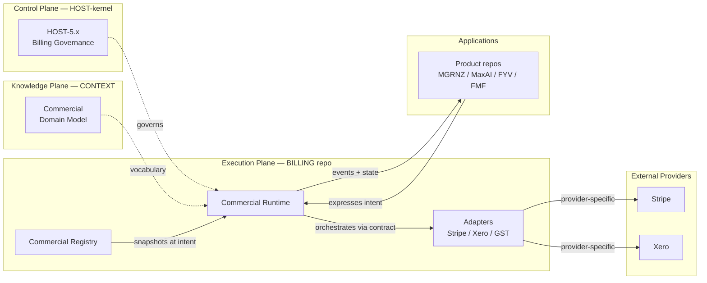
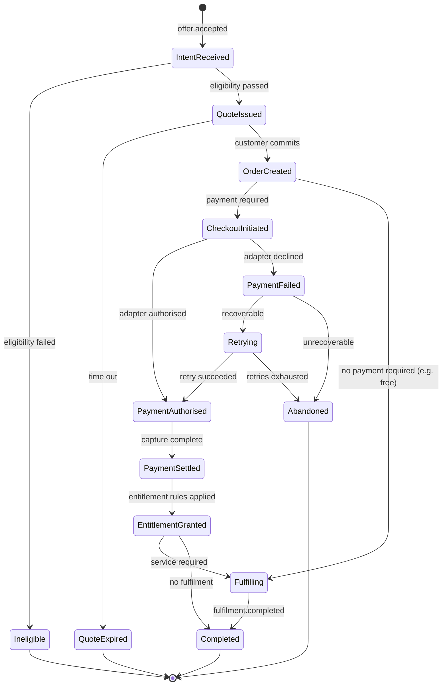
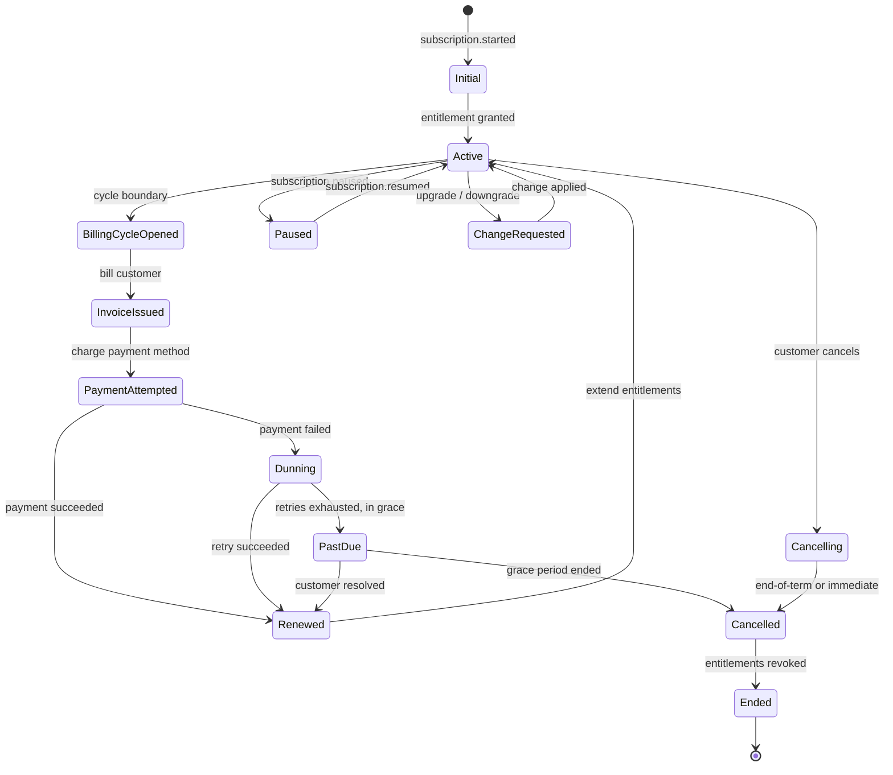
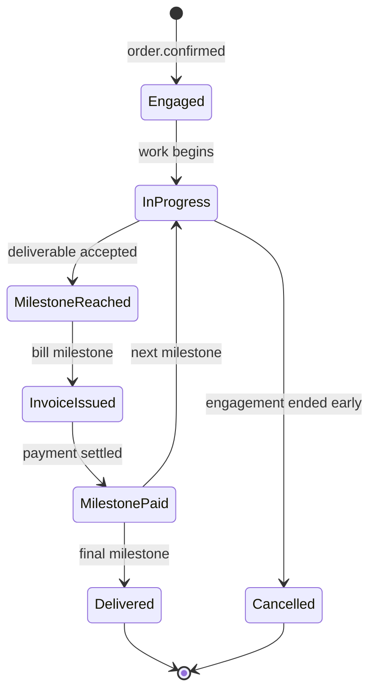
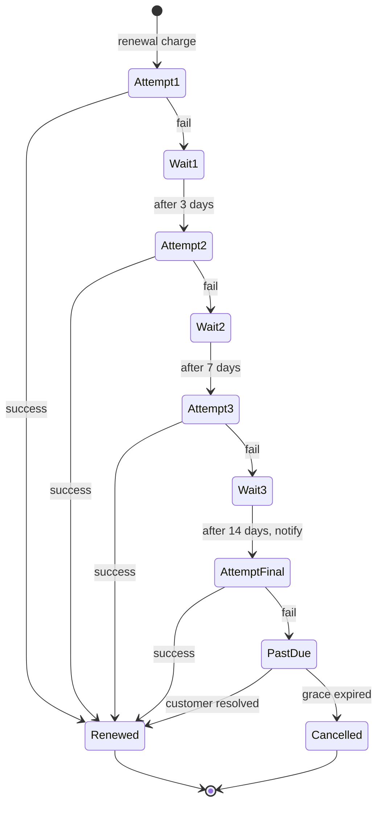

# HOST Commercial Runtime — Architecture & Execution Model

## Governance Metadata

| Field | Value |
| --- | --- |
| Document Type | Execution Architecture (pre-implementation) |
| Proposed Objective | OBJ-COMMRUN (unallocated) |
| Proposed ADR | ADR-COMMRUN-01 - Commercial Runtime lifecycle, event vocabulary, and adapter contract |
| Parent Objective | HOST-5.x Billing Foundation (proposed) |
| Peer Objectives | OBJ-COMMREG Commercial Registry, OBJ-COMMADP Commercial Adapters |
| Status | Draft for Review |
| Version | 0.1 |
| Owner | HOST (governance) / BILLING (implementation) |
| Last reviewed | 2026-07-14 |
| Depends on | HOST-4.6 Event Contract, HOST-4.7 Workflow Runtime, HOST-4.8 Execution Runtime, HOST-4.9 Durable Execution Persistence, HOST-4.10 Integration Platform Baseline |
| Constitution | [OBJ-000 Ecosystem Constitution](docs/constitution/ecosystem-constitution.md) |
| Related | Commercial Registry Design v0.1, Adoption Review v0.1, [ADR-009 Integration Platform Baseline](docs/architecture/ADR-009-integration-platform-baseline.md) |

---

## Purpose

The **Commercial Runtime** is the canonical execution engine for every commercial transaction across the HOST ecosystem.

It consumes published commercial assets from the Commercial Registry and converts customer intent into commercial outcomes. It orchestrates the payment ceremony, drives subscription lifecycles, coordinates external providers via Adapters, grants and revokes Entitlements, and records the immutable commercial history that satisfies audit, tax, and reconciliation obligations.

The Runtime answers one question. **A customer has decided to accept an Offer. What happens next?**

Everything downstream of that decision — the priced Quote, the committed Order, the payment ceremony, the invoice, the subscription's ongoing life, the grant of platform Entitlements, the eventual refund or dispute, the recording of all of it — is the Runtime's job.

### Position in the four-plane architecture

The Runtime lives in the Execution Plane, inside the BILLING repository, as the peer of the Commercial Registry and the sibling of the Commercial Adapters.



---

## Executive Summary

The design rests on six load-bearing decisions.

1. **The Runtime executes; it does not define.** All commercial definitions come from the Registry. All governance rules come from HOST-5.x. The Runtime interprets and applies; it never invents.
2. **Every Runtime state transition is an event.** The Runtime is event-sourced. Current state of any Order or Subscription is a projection over the immutable commercial event log. History is not overwritten; it accretes.
3. **Adapters are contract-shaped, not provider-shaped.** The Runtime knows nothing about Stripe's API, Xero's API, or any specific provider. It knows only the adapter contract. Stripe and Xero are replaceable.
4. **Commercial history is durable via HOST-4.9.** Every commercial event lands in the durable execution persistence layer. Recovery is deterministic. Reconciliation is possible against any past state.
5. **Failure is compensated, not rolled back.** A mistaken payment is refunded by a new event, not by mutating the payment record. The event log is append-only.
6. **Runtime state is queried, not authoritative in applications.** Applications express intent; the Runtime maintains authoritative state; applications subscribe to events and query current state. Applications never mirror commercial state as their own truth.

---

## 1. Runtime Responsibilities

### 1.1 What the Runtime owns

**Intent processing.** Turning customer intent (expressed as an Offer canonical ID plus customer identity) into a committed Order.

**Eligibility validation.** Confirming the customer belongs to the Offer's Segment, that the Offer is currently Published, that the Region is served, that any per-customer limits are satisfied, that regulatory prerequisites (KYC, tax jurisdiction) are met.

**Quote generation.** Producing a priced, time-bounded, customer-specific view of an Offer — with any customer-specific adjustments (contract pricing, applied Promotions, loyalty credits) resolved to a final displayable amount.

**Order creation.** Recording the customer's commitment to purchase, snapshotting the Offer version at commitment time.

**Checkout coordination.** Orchestrating the payment ceremony — creating checkout sessions, coordinating with Payment adapters, managing state through authorization, capture, and settlement.

**Payment orchestration.** Driving the Payment adapter to authorize, capture, or refund. Handling adapter callbacks and translating them into commercial events.

**Subscription lifecycle.** From creation through the recurring rhythm of billing cycles, invoice issuance, renewal, upgrade, downgrade, pause, resume, and eventual cancellation or expiry.

**Invoice generation and dispatch.** Producing invoices at the right moments (checkout completion, subscription cycle, milestone reached), routing them through the Invoicing adapter (Xero), tracking payment status.

**Entitlement granting and revocation.** Translating commercial events into platform capability grants. When a customer pays, they receive the Entitlements described by the Offer's Entitlement Template. When they cancel or lapse, Entitlements are revoked (or scheduled for revocation at end-of-term).

**Refund and credit management.** Orchestrating refunds through the Payment adapter. Managing Credit balances for non-cash consideration (courtesy credits, promotional grants, gift cards).

**Dunning.** Retrying failed subscription renewals per configured policy, with escalating notifications, until either the payment succeeds or the subscription enters cancellation.

**Fulfilment coordination.** For Services requiring human or scheduled delivery, tracking fulfilment tasks from scheduling through completion, without owning the delivery itself.

**Commercial event publication.** Emitting canonical events on the HOST-4.6 bus, in the `commercial.*` namespace, for every state transition.

**Immutable transaction history.** Recording every commercial event permanently, satisfying audit and reconciliation obligations.

### 1.2 What the Runtime does not own

**Commercial definitions.** The Registry owns Offer, Plan, Price Version, Promotion, Entitlement Template. Runtime consumes these; it never mutates.

**Pricing decisions.** Runtime applies pricing per Registry-published rules. It does not decide *what price should be*.

**Provider-specific communication.** Runtime speaks to Adapters via a provider-neutral contract. Provider-specific HTTP, retry semantics, and API quirks live in each Adapter.

**Accounting ledger.** Xero owns the ledger. The Xero Adapter mirrors invoice and payment events out; Xero itself is the accounting source of truth.

**Customer identity.** Runtime references customer identifiers but does not manage authentication, credentials, or profile data. That lives in the future Identity capability (or, until then, in a documented interim scheme).

**Product access enforcement.** Products query the Entitlement service to check access; the Runtime grants Entitlements but does not enforce them at request time.

**Consent capture and legal compliance.** Runtime records that consent was captured at Order time and stores its reference, but does not itself present or manage consent flows.

### 1.3 Recommended additions to the brief's list

The brief listed nine Runtime responsibilities. Add the following as first-class:

- **Dunning management.** Explicit responsibility distinct from payment orchestration.
- **Credit balance management.** First-class alongside Refund handling.
- **Reconciliation with Adapters.** Periodic drift detection is a Runtime responsibility.
- **Fulfilment coordination.** For Services, the Runtime tracks fulfilment status even if it does not deliver.
- **Attribution enforcement.** Every commercial event carries the HOST-5.0 attribution invariants (revenue owner, brand, product, journey, campaign, customer). Runtime enforces this at write time.

---

## 2. Runtime State Machine

The brief proposed a single linear lifecycle. In reality the Runtime coordinates multiple concurrent state machines. Each of them shares primitives but progresses differently.

### 2.1 One-off purchase lifecycle



### 2.2 Subscription lifecycle

A subscription is a compound state machine that includes the one-off lifecycle for its initial purchase, then enters a recurring loop:



### 2.3 Consulting / project lifecycle

Consulting and implementation projects follow a milestone shape rather than a payment-then-fulfil shape:



### 2.4 Retainer lifecycle

Retainers are subscription-shaped but with a usage allowance and different reconciliation behaviour:

- Fixed periodic invoicing (monthly/quarterly).
- Allowance tracked against usage.
- Overage handled per Plan policy (block, invoice-and-continue, roll-into-next-period).
- Non-usage period does not refund (allowance-based).

The state shape matches Subscription but includes an Allowance dimension.

### 2.5 Common lifecycle primitives

Across all four shapes above, these primitives recur and must be shared:

- **Intent** — customer expresses intent via `offer.accepted`.
- **Eligibility** — Runtime validates against Registry Availability rules.
- **Quote** — priced view for customer, optionally shown or auto-committed.
- **Order** — customer commitment; Registry Offer version snapshotted.
- **Payment** — money movement, always via Payment adapter.
- **Invoice** — bill record, always via Invoicing adapter (Xero).
- **Entitlement transition** — grant, extend, revoke, expire.
- **Fulfilment task** — for Services, tracked but not owned by Runtime.
- **Terminal states** — Completed, Cancelled, Ineligible, Abandoned. All terminal.

---

## 3. Runtime Objects

### 3.1 Core objects

**Quote**
A priced, customer-specific, time-bounded view of an Offer. Includes: Offer canonical ID + version snapshot, Customer, Segment applied, Region applied, Promotions applied, final amounts (subtotal, tax, total), expiration timestamp, status (issued / viewed / expired / accepted / declined). Quotes are optional for simple purchases and mandatory for negotiated or contract-priced ones.

**Order**
The customer's committed intent to purchase. Immutable at creation. Includes: Offer version snapshot, Customer, Quote reference (if any), Segment, Region, Attribution (brand, product, journey, campaign — HOST-5.0 invariants), Content list, Amounts, and current state. All subsequent activity on an Order is expressed as events referencing the Order.

**Checkout Session**
The payment ceremony coordination record. Short-lived. Includes: Order reference, adapter reference, redirect/session tokens, timeouts, current state. Cleaned up after transition to Payment states.

**Payment**
Money-movement record. Immutable per attempt. Includes: Order reference, amount, currency, direction (inbound / outbound), state (authorised / captured / settled / refunded / failed / disputed), Adapter provider reference, timestamps. Every payment attempt is its own record; a failed attempt is not overwritten by a successful retry — both are recorded.

**Invoice**
Bill record. Includes: Order or Subscription reference, line items, amounts, tax computation, currency, due date, Adapter provider reference (Xero invoice ID), state (issued / viewed / paid / partially-paid / overdue / voided). Invoices may be paid at issuance (immediate charge) or later (accounts-receivable pattern).

**Subscription**
The recurring commercial relationship. Includes: initial Order reference, current Offer version reference (may float or be pinned), Plan reference, Term, current state, current billing cycle, next renewal date, cancellation policy applied. Subscriptions live for the duration of the relationship.

**Billing Cycle**
One iteration of a Subscription's billing period. Includes: Subscription reference, period start/end, generated Invoice, payment status. Historical Billing Cycles retained indefinitely.

**Refund**
Reverse money-movement record. Includes: original Payment reference, reason, amount (may be partial), Adapter reference, state. Refunds are commercial events; they do not mutate the original Payment record.

**Credit**
Non-cash consideration. Includes: Customer, amount, currency, source (courtesy / promotion / gift / adjustment), issuance date, expiry, applied state. Credits apply to future Invoices as part of Runtime pricing before Payment.

**Entitlement Grant**
Active capability grant tied to a commercial event. Includes: Entitlement Template reference, Customer, granting Order or Subscription, active period, revocation reason (if revoked). Consumed by products via the Entitlement service.

**Fulfilment Task**
For Services, the tracking record of delivery. Includes: Order reference, Fulfilment Profile reference (from Registry), assigned delivery party, scheduled window, current state, completion evidence. Fulfilment Task is a coordination record — the actual delivery lives outside the Runtime.

**Dispute**
Chargeback or payment dispute record. Includes: Payment reference, provider dispute ID, amount, status, evidence, resolution. Managed largely by external provider (Stripe); Runtime tracks state.

**Commercial Transaction**
Umbrella record tying an Order, its Payments, its Invoices, its Refunds, its Entitlement Grants, and its events into a single auditable unit. This is the entity that revenue reports, tax reports, and customer ledgers project from.

### 3.2 Derived / query projections

These are not primary objects but views the Runtime computes:

- **Customer Commercial Ledger** — all Commercial Transactions for a customer, ordered chronologically.
- **Order Timeline** — all events for a specific Order, ordered.
- **Subscription History** — all Billing Cycles for a Subscription with their outcomes.
- **Brand Revenue View** — all Commercial Transactions attributed to a brand within a period.
- **Reconciliation View** — Runtime state compared against Adapter state, showing drift.

### 3.3 Summary object catalogue

| Object | Mutability | Referenced by |
| --- | --- | --- |
| Quote | Terminal (issued → resolved) | Order |
| Order | Immutable after create; state-tracked via events | All commercial activity |
| Checkout Session | Short-lived, terminal | Payment |
| Payment | Immutable per attempt | Order, Invoice, Refund |
| Invoice | State-tracked via events; content immutable | Order, Subscription |
| Subscription | Long-lived; state-tracked via events | Billing Cycle, Entitlement Grant |
| Billing Cycle | Immutable | Subscription |
| Refund | Immutable | Payment |
| Credit | State-tracked (issued → applied → expired) | Invoice |
| Entitlement Grant | State-tracked; revoked, not deleted | Customer, Product queries |
| Fulfilment Task | State-tracked via events | Order |
| Dispute | State-tracked via events | Payment |
| Commercial Transaction | Aggregate; derived | Reports, audits |

### 3.4 Notes on the brief's list

- The brief listed "Commercial Transaction" — recommended as an aggregate identifier for audit purposes, not a separate primary storage object.
- Added: Billing Cycle, Fulfilment Task, Dispute.
- Confirmed: Quote, Order, Checkout Session, Invoice, Subscription, Payment, Refund, Credit, Entitlement Activation (renamed Entitlement Grant to match Registry's Entitlement Template).

---

## 4. Runtime Events

All Runtime events publish into the HOST-4.6 canonical event contract, in the `commercial.*` namespace. Events are immutable, deduplicated, and ordered per Order/Subscription.

### 4.1 Event vocabulary

**Intent and Quote**
- `commercial.offer.accepted` — customer intent captured
- `commercial.eligibility.evaluated` — result of eligibility check
- `commercial.quote.created`
- `commercial.quote.viewed`
- `commercial.quote.accepted`
- `commercial.quote.declined`
- `commercial.quote.expired`

**Order**
- `commercial.order.created`
- `commercial.order.confirmed`
- `commercial.order.cancelled`
- `commercial.order.completed`

**Checkout**
- `commercial.checkout.started`
- `commercial.checkout.completed`
- `commercial.checkout.abandoned`
- `commercial.checkout.expired`

**Payment**
- `commercial.payment.authorised`
- `commercial.payment.captured`
- `commercial.payment.settled`
- `commercial.payment.failed`
- `commercial.payment.disputed`

**Invoice**
- `commercial.invoice.issued`
- `commercial.invoice.dispatched`
- `commercial.invoice.viewed`
- `commercial.invoice.paid`
- `commercial.invoice.partially-paid`
- `commercial.invoice.overdue`
- `commercial.invoice.written-off`
- `commercial.invoice.voided`

**Subscription**
- `commercial.subscription.started`
- `commercial.subscription.billing-cycle-opened`
- `commercial.subscription.renewed`
- `commercial.subscription.upgraded`
- `commercial.subscription.downgraded`
- `commercial.subscription.paused`
- `commercial.subscription.resumed`
- `commercial.subscription.past-due`
- `commercial.subscription.cancelling`
- `commercial.subscription.cancelled`
- `commercial.subscription.ended`

**Refund and Credit**
- `commercial.refund.requested`
- `commercial.refund.approved`
- `commercial.refund.completed`
- `commercial.refund.rejected`
- `commercial.credit.issued`
- `commercial.credit.applied`
- `commercial.credit.expired`

**Entitlement**
- `commercial.entitlement.granted`
- `commercial.entitlement.extended`
- `commercial.entitlement.revoked`
- `commercial.entitlement.expired`

**Fulfilment**
- `commercial.fulfilment.scheduled`
- `commercial.fulfilment.assigned`
- `commercial.fulfilment.started`
- `commercial.fulfilment.completed`
- `commercial.fulfilment.blocked`

**Dispute**
- `commercial.dispute.opened`
- `commercial.dispute.evidence-submitted`
- `commercial.dispute.resolved`
- `commercial.dispute.lost`
- `commercial.dispute.won`

**Reconciliation**
- `commercial.reconciliation.started`
- `commercial.reconciliation.drift-detected`
- `commercial.reconciliation.resolved`
- `commercial.reconciliation.failed`

### 4.2 Event contract shape

Every commercial event carries:

- Event canonical name
- Event ID (unique, deterministic where possible)
- Timestamp
- Correlation ID (per HOST-3E)
- Order or Subscription reference
- Customer reference
- **Attribution set** (revenue owner, brand, product, journey, campaign) — HOST-5.0 invariant
- Actor (user, system, adapter)
- Payload (event-specific)

Attribution is required. An event without attribution is rejected by the event bus. This enforces the constitutional invariant that every commercial event is traceable.

### 4.3 Ordering guarantees

- **Per-Order** and **per-Subscription** events are strictly ordered.
- Across Orders, events may be delivered out of order.
- Consumers requiring ordered processing subscribe with `order-by: <order-id>` semantics via `integration-events`.

### 4.4 Idempotency

- Every intent operation (create Order, initiate Checkout, request Refund) accepts an idempotency key.
- Duplicate submissions with the same key return the original outcome.
- Adapter callbacks are deduplicated using provider-issued IDs plus internal correlation.

### 4.5 Consumers

- **Products** subscribe to events for their customers' Orders/Subscriptions to update UX.
- **Cockpit** subscribes to operational events for monitoring.
- **Xero Adapter** subscribes to Invoice and Payment events to sync outward.
- **Stripe Adapter** subscribes to Refund events to drive external refunds.
- **Reporting service** subscribes to all events for revenue attribution and audit projections.

---

## 5. Registry Interaction

The Registry is the source of commercial truth. The Runtime reads it; it never mutates it.

### 5.1 Read patterns

At three moments in the Runtime lifecycle, it consults the Registry:

**At intent time** — the Runtime resolves the customer's Offer canonical ID to the currently Published version. This becomes the Order snapshot.

**At renewal time** (for Subscriptions) — the Runtime re-resolves the canonical ID to determine whether a new Price Version or Offer version applies. The Plan's renewal policy determines whether to migrate: some Plans preserve original pricing across renewals, some upgrade automatically, some prompt the customer.

**At entitlement grant time** — the Runtime resolves the Entitlement Template referenced in the Order snapshot to determine what capabilities to grant.

### 5.2 Snapshot semantics

An Order records the **exact Version ID** of the Offer, Price Version, Plan, Promotion(s), and Entitlement Template at moment of commitment. Subsequent Registry changes do not affect the Order.

An in-flight Checkout Session that spans a Registry publication event resolves to the Version ID recorded at Order creation. Even if the Offer was Superseded five seconds after Order creation, the Checkout completes on the original version.

### 5.3 Cache and freshness

The Runtime maintains a local cache of hot Registry entries, invalidated by `commercial.registry.*` publication events subscribed via HOST-4.6. Cache TTL is short; the source of truth remains the Registry. At Order creation, the Runtime performs a fresh resolution to avoid stale-cache drift on the critical path.

### 5.4 What Runtime never does with the Registry

- **Never writes.** The only write path to the Registry is through the Registry's own governed publishing workflow.
- **Never bypasses Registry to compute prices.** Even for "obvious" cases like tax on a fixed-price Offer, the Runtime consults the Registry-published Tax Class and Price Version.
- **Never assumes a canonical ID is stable across versions in payload.** Runtime uses Version IDs internally for snapshots; canonical IDs are for customer-facing operations.

---

## 6. Application Interaction

Applications are thin. They present, they capture intent, they subscribe to events. The Runtime does everything else.

### 6.1 The intent contract

An application initiates a commercial interaction by submitting an intent:

```
POST commercial-intent {
  intentType: "accept-offer",
  offerId: "offer:mgrnz.signal-audit.standard",
  customerId: "customer:...",
  attribution: { brand, product, journey, campaign },
  idempotencyKey: "..."
}
```

The Runtime responds with an Order ID and (if a payment ceremony is required) a Checkout Session token.

Applications never invent Order IDs, price amounts, entitlement lists, or invoice numbers. They receive them from the Runtime.

### 6.2 Presentation

Applications render Order state and events for their customers. Rendering rules:

- **Read-only.** Applications may not mutate Runtime state via the presentation surface.
- **Event-driven refresh.** Applications subscribe to events for a specific Order/Subscription/Customer and update views on receipt.
- **State snapshot queries.** Applications may query current state via idempotent read APIs; the answer is authoritative from the Runtime.

### 6.3 Checkout completion

For an interactive checkout (customer entering card details), the application:

1. Receives Checkout Session token from Runtime.
2. Hands off to the Payment Adapter's hosted flow (e.g. Stripe Checkout).
3. Receives completion callback from Adapter.
4. Notifies Runtime of completion (or Runtime discovers via Adapter webhook — both paths must be idempotent).
5. Renders success/failure to the customer using Runtime's authoritative state.

Applications do not attempt to interpret Payment provider responses. Runtime translates them into commercial events.

### 6.4 Cross-brand transitions

When a customer transitions across brands (FYV → FunkMyBrand → FunkMyFans, or Signal Audit → Managed Services), each brand-application initiates its own Runtime intent for its own Offer. The Runtime records the journey in the Attribution set of each event. Cross-brand transitions are visible in the Customer Commercial Ledger via Attribution filters.

---

## 7. Adapter Interaction

The Runtime orchestrates. Adapters implement. This split is the foundation of provider neutrality.

### 7.1 Adapter contract categories

**Payment adapters** — inbound money movement.
- Operations: `authorize`, `capture`, `refund`, `void`, `reconcile`.
- Callbacks: `payment.authorised`, `payment.captured`, `payment.settled`, `payment.failed`, `payment.disputed`.
- Provider examples: Stripe, future NZ-specific providers, future international providers.

**Invoicing adapters** — invoice issuance and tracking.
- Operations: `issue`, `dispatch`, `void`, `reconcile`.
- Callbacks: `invoice.dispatched`, `invoice.viewed`, `invoice.paid`.
- Provider examples: Xero, future accounting systems.

**Accounting adapters** — ledger posting.
- Operations: `post-transaction`, `categorise`, `reconcile-with-bank`.
- Callbacks: `transaction.posted`, `reconciliation.completed`.
- Provider examples: Xero (may be same adapter surface as invoicing), future systems.

**Tax adapters** (optional, for complex jurisdictions).
- Operations: `compute-tax`, `report-return`.
- Provider examples: local GST service (in-house initially, adapter-shaped from day one).

**Outbound payment adapters** (future — for creator payouts, partner revenue share).
- Operations: `authorize-payout`, `settle-payout`, `reconcile-payout`.
- Provider examples: Stripe Connect, future payout providers.

### 7.2 Orchestration pattern

For a typical checkout:

```
Runtime creates Order
  → Runtime creates Checkout Session in Payment Adapter
  → customer completes payment ceremony via Adapter's hosted flow
  → Payment Adapter emits payment.authorised via integration-events
  → Runtime receives event, transitions Order state, emits commercial.payment.authorised
  → Runtime requests Payment Adapter capture
  → Payment Adapter captures, emits payment.captured
  → Runtime emits commercial.payment.captured
  → Runtime asks Invoicing Adapter to issue invoice
  → Invoicing Adapter issues, returns provider invoice ID
  → Runtime emits commercial.invoice.issued
  → Runtime grants Entitlements per Order's Entitlement Template
  → Runtime emits commercial.entitlement.granted
  → Runtime emits commercial.order.completed
```

At every step, if the Adapter fails, the Runtime handles per the Failure Model (§8).

### 7.3 Adapter neutrality invariants

- Runtime code contains no provider-specific imports or references.
- Adapter contracts express operations in commercial terms, not provider terms ("authorize a payment," not "create a PaymentIntent").
- Provider-specific webhooks are received by each Adapter and translated into standard commercial events before crossing the Runtime boundary.
- Adapter contract version is managed like any HOST contract — changes require an ADR.

### 7.4 Adapter registration

Adapters are registered via the HOST-4E Integration Foundation. Runtime discovers available Adapters via `kernel-registry` and selects per configuration (e.g. "primary payment adapter is Stripe" is a configuration decision, not a code decision).

Adding a new payment provider is: implement the Payment Adapter contract, register in HOST-4E, update configuration. No Runtime code changes.

### 7.5 Reconciliation

The Runtime runs periodic reconciliation against each active Adapter:

- Fetch Adapter's view of the state (Stripe's Payments, Xero's Invoices).
- Compare with Runtime's authoritative state.
- Emit `commercial.reconciliation.drift-detected` for any mismatch.
- Resolve via automated correction (if safe) or Cockpit operator intervention.

Reconciliation frequency configurable per Adapter. Daily is a reasonable default.

---

## 8. Failure Model

Failure is normal. The Runtime treats it as such.

### 8.1 Failure categories

**Pre-commit failures** — Runtime rejects the intent before creating an Order.
Examples: Eligibility fails (Segment mismatch, Region unserved, per-customer limit exceeded), Offer expired between resolution and commit, Registry unreachable, Idempotency-key collision on non-matching payload.
Response: `commercial.eligibility.evaluated` with rejection reason; no Order created; application surfaces reason to customer.

**Payment failures** — Adapter reports payment could not proceed.
Examples: Card declined, insufficient funds, 3DS challenge failed, adapter timeout, network partition.
Response: `commercial.payment.failed` with reason code. For interactive checkouts, application re-prompts. For subscription renewals, enter Dunning.

**Fulfilment failures** — Service delivery blocked or refused.
Examples: Delivery party unavailable, dependency missing, customer non-responsive to fulfilment prerequisites.
Response: `commercial.fulfilment.blocked` with reason; operator alerted via Cockpit; per-Plan refund policy applied if unrecoverable.

**Renewal failures** — Subscription cycle payment fails.
Response: Enter Dunning state, retry per configured policy with increasing gaps, escalating notifications, until either payment succeeds or grace period ends.
Terminal outcome: `commercial.subscription.past-due` → `commercial.subscription.cancelled` if grace exhausted.

**Sync failures** — Adapter is unavailable or drift is detected.
Examples: Xero API is down, webhook missed, adapter returns different state than Runtime holds.
Response: Runtime remains authoritative. Retry via `integration-execution-persistence` durable retry. Emit `commercial.reconciliation.drift-detected` if resolution fails. Escalate to operator.

**Compliance failures** — regulatory prerequisites not met.
Examples: KYC required for high-value purchase, tax jurisdiction change requires new consent, sanctioned party detected.
Response: Hold the Order in a Compliance-Hold state, do not proceed to payment, notify operator.

### 8.2 Recovery principles

**No silent failure.** Every failure emits an event. The commercial event log tells the whole story.

**Idempotent operations.** Every intent, every retry, every callback is idempotent. Duplicate submissions produce the original outcome, not a duplicate side-effect.

**Compensating actions, not rollback.** A mistaken payment is reversed by a Refund event. An incorrect Order is not deleted; it is Cancelled by a subsequent event.

**Configurable retry policy.** Per Adapter and per failure category. Runtime does not hardcode retry logic.

**Escalation over silent-loss.** When automated recovery is exhausted, escalate to Cockpit for operator action rather than silently dropping the transaction.

**Graceful degradation on Adapter outage.** Runtime queues operations against a temporarily unavailable Adapter. Customer-facing flows may pause (checkout cannot complete without payment authorization) but authoritative state remains intact.

### 8.3 Dunning workflow

Subscription renewals that fail enter Dunning:



Notifications sent at each attempt via the future Notification capability (or interim email/SMS scheme). Retry intervals configurable per Plan.

### 8.4 Manual operator actions

Some situations require operator intervention via Cockpit:

- Force-complete a stuck Order after external verification.
- Issue a courtesy Refund outside the standard refund window.
- Apply a Credit as goodwill adjustment.
- Resolve a reconciliation drift with a manual reconciliation event.

Every operator action is a commercial event with operator identity in the actor field. The event log preserves the intervention.

---

## 9. Audit Model

Commercial execution is fully auditable. This is a constitutional requirement (HOST-5.0), not a nice-to-have.

### 9.1 Event sourcing

The Runtime is event-sourced. Current state of any Order, Subscription, Payment, Invoice, or Entitlement Grant is a projection over the immutable commercial event log.

Events are:

- **Append-only.** Never mutated after emission.
- **Ordered per aggregate.** Per-Order events strictly ordered.
- **Durable.** Persisted via HOST-4.9 durable execution persistence.
- **Attributed.** Every event carries the HOST-5.0 attribution invariants.

Reconstructing the state of an Order as it was at any past moment is a matter of replaying its events up to that timestamp.

### 9.2 Reconciliation

Two reconciliation types:

**Internal reconciliation** — the Runtime's own state is derived correctly from its event log. Automated. Any drift between projection and events is a bug that flags immediately.

**External reconciliation** — the Runtime's state matches the Adapters' state. Runtime periodically fetches Adapter state and compares. Any drift emits `commercial.reconciliation.drift-detected`. Resolution is either automated (safe corrections) or operator-driven (via Cockpit).

Reconciliation records are themselves events, preserving the audit trail of what was checked and when.

### 9.3 Traceability

Every commercial event carries the constitutional attribution set:

- Revenue owner (MGRNZ)
- Originating brand
- Originating product
- Customer journey
- Campaign (where applicable)
- Customer
- Accounting reference (Xero invoice ID, etc.)
- Payment provider reference (Stripe payment ID, etc.)

This is enforced at write time — an event without a complete attribution set is rejected by the event bus.

Attribution is what enables:

- Brand-level revenue attribution (all events with brand = X).
- Journey attribution (all events where journey references a specific acquisition).
- Campaign ROI (all events tagged with a campaign).
- Cross-brand transition analysis (customer with events across multiple brands).

### 9.4 Query capabilities

The Runtime exposes read-only query interfaces (implementation shape out of scope):

- **Order timeline** — all events for a specific Order.
- **Customer ledger** — all Commercial Transactions for a customer.
- **Subscription history** — all Billing Cycles and events.
- **Brand revenue** — Commercial Transactions filtered by brand and period.
- **Journey analytics** — journey-attributed events.
- **Reconciliation report** — drift and resolution events over a period.
- **Adapter activity** — Adapter operations for troubleshooting.
- **As-of state** — state of any aggregate at any past timestamp.

### 9.5 Retention

Indefinite. Commercial event history is never purged. Storage cost is trivial against audit and legal value.

### 9.6 Immutability enforcement

The constitutional rule *"commercial history is immutable; adjustments occur through new commercial events"* is enforced at the persistence layer, not at the application layer. Once a commercial event is durably persisted, no write path can modify it. Corrections proceed via compensating events.

### 9.7 External audit access

For statutory audit (annual accounts, tax audit, regulatory review), the Runtime exposes:

- **Export by period** — all commercial events within a date range.
- **Cryptographic manifest** — hash of the exported set for tamper-evidence.
- **Reconciliation attestation** — proof that Runtime state matches Adapter state at export time.

---

## 10. Future Evolution

### 10.1 Marketplace transactions

When the ecosystem extends to multi-vendor sales (vendors other than MGRNZ brands):

- Order carries a Vendor reference alongside Brand.
- Attribution extends: revenue owner may be Vendor + MGRNZ split.
- New event type: `commercial.settlement.vendor-payout` (outbound to vendor).
- Payout schedule per Vendor agreement.
- Requires outbound payment adapters.
- Revenue attribution reports separate Vendor cut, MGRNZ cut, and platform fee.

### 10.2 Partner revenue sharing

Partners refer customers and share revenue.

- Order references Partner via Attribution.
- Runtime computes partner share per Registry-published rules.
- New Subscription cycle emits `commercial.partner-share.accrued` events.
- Periodic partner settlement via outbound payment adapter.
- Partner ledger view is a projection over partner-attributed events.

### 10.3 Agency billing

Agencies purchase on behalf of client accounts.

- Agency Account concept: a Customer with sub-Customer relationships.
- Orders may be Agency-billed but Client-fulfilled.
- Attribution captures both Agency and Client.
- Invoice routing to Agency, Entitlement grants to Client.

### 10.4 Creator payouts

For FunkMyFans and future creator platforms, payouts to creators are outbound money movement.

- Creator Account with earnings ledger.
- New event types: `commercial.payout.scheduled`, `commercial.payout.executed`, `commercial.payout.failed`.
- Outbound payment adapter (Stripe Connect or equivalent).
- Creator-specific tax reporting (creator receives income; requires 1099-equivalent).

### 10.5 Usage billing

Usage-based pricing bills for consumption metered over a period.

- Usage Metric events from products.
- Runtime meter aggregates usage per Subscription per period.
- Billing Cycle computes usage-based charges using Registry-published Rate Card.
- Invoice combines base subscription + usage overage.
- No structural change to the state machine; a new Billing Cycle sub-type.

### 10.6 AI consumption billing

Same shape as usage billing, but with per-model or per-token pricing dimensions:

- Usage Metric events carry model, token count, other dimensions.
- Rate Card carries per-dimension pricing.
- Aggregation supports high-cardinality metrics.
- Potential need for near-real-time cost feedback (customer wants to know current spend before renewal).

### 10.7 Multi-currency

- Order records currency at commitment.
- Payment records currency and FX rate at settlement (if converted).
- Runtime does not perform FX; the Payment Adapter or a Currency Adapter does.
- Invoicing in different currency than Payment supported (some enterprise arrangements).

### 10.8 Regional execution

Data residency or performance may require regional Runtime deployments.

- Runtime instances per region.
- Shared canonical Registry (or federated Registry).
- Cross-region reconciliation and reporting.
- Customer's region determined at Order creation.

### 10.9 Contracted / enterprise custom pricing

- Contract object above Order, if introduced in Registry (deferred per Registry design).
- Runtime applies Contract overrides on top of published Offer.
- Contract expiry, renegotiation, and amendment events.

### 10.10 Advanced dunning and win-back

- Dunning outcomes feed a customer-lifecycle service that runs win-back campaigns.
- Reactivation of Cancelled subscriptions with promotional offers.
- Runtime supports; the marketing capability drives.

---

## Open Questions & Assumptions

| ID | Item | Type | Impact |
| --- | --- | --- | --- |
| Q1 | Are Quotes mandatory before Orders, or only for negotiated purchases? | Question | State machine complexity |
| Q2 | How is Customer identity carried during the interim before Identity capability lands? | Question | Identity dependency |
| Q3 | Does the Runtime maintain its own read model, or does it always query the event store? | Question | Performance / complexity trade-off |
| Q4 | What is the durability guarantee for events between Runtime emission and event bus persistence? | Question | Reliability contract |
| Q5 | Are Refunds allowed against Superseded Offer versions? | Question | Historical integrity |
| Q6 | Do Subscription renewals bill at start of cycle (advance) or end of cycle (arrears) by default? | Question | Cash flow / customer UX |
| Q7 | How is Adapter selection configured — global, per-Brand, per-Region, or per-Offer? | Question | Configuration surface |
| Q8 | What is the maximum acceptable lag between Adapter callback and commercial event emission? | Question | UX responsiveness |
| Q9 | Do disputed Payments block subsequent Entitlement grants, or only affect the disputed transaction? | Question | Risk policy |
| Q10 | How are refunds handled when Entitlements have been partially consumed? | Question | Policy question |
| A1 | HOST-4.9 durable execution persistence is the storage substrate for commercial events. | Assumption | Sequencing |
| A2 | HOST-4.6 event bus carries the `commercial.*` namespace. | Assumption | Integration |
| A3 | The Commercial Registry is the source of truth for all commercial definitions consumed by Runtime. | Assumption | Boundary |
| A4 | Adapters are registered via HOST-4E Integration Foundation. | Assumption | Integration |
| A5 | Cockpit provides operator surfaces for manual intervention. | Assumption | Tool surface |
| A6 | Identity capability provides Customer identity resolution; interim scheme documented until then. | Assumption | Dependency |
| A7 | Entitlement service (as a Shared Platform Service) queries Entitlement Grants from Runtime. | Assumption | Integration |

---

## Change Log

| Version | Date | Notes |
| --- | --- | --- |
| 0.1 | 2026-07-14 | Initial draft for review. |
