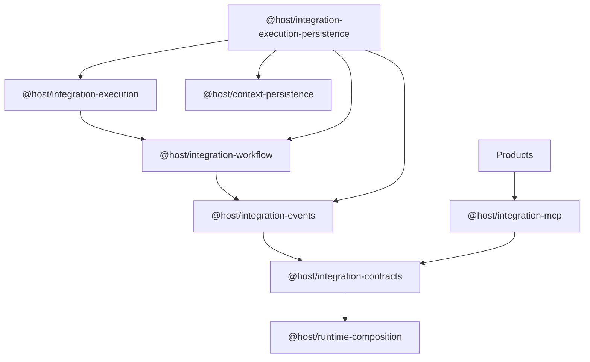
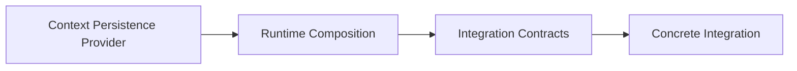
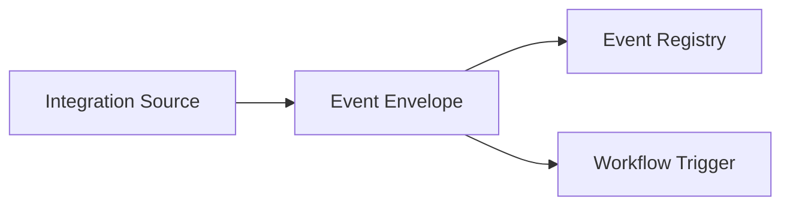

# Integration Platform

## Purpose

This document records HOST-4.10 as the Integration Platform Release Baseline.

It freezes HOST-4 as Baseline v1.0 and becomes the canonical architecture document for:

- `@host/integration-contracts`
- `@host/integration-events`
- `@host/integration-workflow`
- `@host/integration-execution`
- `@host/integration-execution-persistence`
- `@host/integration-mcp`

It does not introduce new runtime capability.
It records the stable package catalogue, execution model, persistence model, recovery model, and extension rules that HOST-5 must inherit.

## Baseline Declaration

HOST-4 Baseline v1.0 is now frozen for:

- Integration Contracts
- Integration Registry
- MCP Runtime
- Event Model
- Workflow Runtime
- Execution Runtime
- Execution Persistence
- Recovery Model

These are stable architectural surfaces.

## Package Catalogue

### `@host/integration-contracts`

Responsibilities:

- integration lifecycle contracts
- integration registry
- capability discovery contracts
- configuration contracts
- deterministic bootstrap

Depends only on:

- `@host/runtime-composition`

### `@host/integration-events`

Responsibilities:

- immutable event envelope
- event registry
- publish and subscribe contracts
- workflow trigger primitives
- deterministic event metadata defaults

Depends only on:

- `@host/integration-contracts`

### `@host/integration-workflow`

Responsibilities:

- immutable workflow definitions
- workflow registry
- workflow execution context
- workflow execution state
- deterministic workflow lifecycle transitions
- retry, idempotency, and compensation metadata

Depends only on:

- `@host/integration-events`

### `@host/integration-execution`

Responsibilities:

- immutable execution instances
- execution registry
- execution coordinator
- dispatch coordination
- execution context propagation
- deterministic execution lifecycle transitions

Depends only on:

- `@host/integration-workflow`

### `@host/integration-execution-persistence`

Responsibilities:

- workflow definition persistence
- workflow instance persistence
- execution instance persistence
- dispatch history persistence
- event history persistence
- deterministic recovery
- optimistic concurrency
- immutable dispatch and event history enforcement

Depends only on:

- `@host/integration-execution`
- `@host/integration-workflow`
- `@host/integration-events`
- `@host/context-persistence`

### `@host/integration-mcp`

Responsibilities:

- concrete MCP runtime registration
- lifecycle and health exposure
- MCP tool exposure
- read-only MCP resources
- deterministic API Host to MCP error mapping

Depends only on:

- `@host/integration-contracts`

## Dependency Graph



Canonical direction:

```text
products
  ->
integration implementations
  ->
integration-mcp or integration-execution-persistence or future approved integration packages
  ->
integration-execution
  ->
integration-workflow
  ->
integration-events
  ->
integration-contracts
  ->
runtime-composition
  ->
rest-runtime-host
  ->
transport-rest
  ->
api-host
  ->
context-service
  ->
context-persistence
```

## Layering Rules

Allowed:

- integration packages may depend only on the immediately approved lower integration boundary
- `@host/integration-execution-persistence` may additionally depend on `@host/context-persistence`
- concrete integrations may compose only through the canonical Integration Foundation

Forbidden:

- reverse dependencies from execution, application, transport, runtime-edge, or kernel packages into integration packages
- provider SDK dependencies inside integration packages
- direct integration dependencies on `@host/api-host`
- direct integration dependencies on `@host/context-service`
- direct integration dependencies on provider packages
- product-specific coupling inside shared integration packages

## Lifecycle

The Integration Platform lifecycle is:

1. Runtime composition is supplied by `@host/runtime-composition`.
2. Integration registration is performed through `@host/integration-contracts`.
3. Event types and workflows are registered through `@host/integration-events` and `@host/integration-workflow`.
4. Execution instances are coordinated through `@host/integration-execution`.
5. Durable state is persisted through `@host/integration-execution-persistence`.
6. Recovery may restore persisted execution state after reconnect or restart.

Recovery ends with state restoration only.
Recovery does not schedule, replay, resume, or dispatch automatically.

## Runtime Composition Flow



Runtime composition remains below the Integration Platform.
Integration packages consume it but do not redefine it.

## Execution Flow


Execution remains deterministic and immutable.
Durability is a separate concern layered above execution state modeling.

## Event Flow



The event model remains transport-neutral and broker-neutral.

## Persistence Flow


Durable execution state uses the canonical persistence framework only.
No storage SDK, provider bypass, or provider-specific scheduling contract is introduced.

## Recovery Flow


Recovery restores:

- workflow definition
- workflow instance
- execution instance
- execution context
- execution status
- dispatch history
- event history

Recovery does not:

- resume execution
- replay events
- enqueue work
- elect leaders
- schedule timers

## Execution Boundaries

The Integration Platform is:

- provider-neutral
- runtime-neutral
- transport-neutral
- persistence-neutral at the contract boundary
- product-neutral

`@host/integration-mcp` is the first concrete integration runtime.
It proves the integration boundary without weakening the shared platform contract.

## Hermes Readiness Review

The current Hermes readiness position is:

| Capability | Provided by HOST | Status | Notes |
| --- | --- | --- | --- |
| Runtime Composition | `@host/runtime-composition` | Ready | Canonical bootstrap boundary is stable. |
| MCP | `@host/integration-mcp` | Ready | Reference integration runtime is implemented and bounded. |
| Eventing | `@host/integration-events` | Ready | Canonical event model and registry are stable. |
| Workflows | `@host/integration-workflow` | Ready | Deterministic workflow modeling is stable. |
| Durable Execution | `@host/integration-execution-persistence` | Ready | Durable state and deterministic recovery are stable. |
| Persistence | `@host/context-persistence` plus providers | Ready | Provider-neutral persistence boundary is stable. |
| Recovery | `@host/integration-execution-persistence` | Ready | Recovery restores state only, not replay. |
| Transport | `@host/transport-rest` and `@host/rest-runtime-host` | Ready | REST runtime path is stable and reusable. |
| API Host | `@host/api-host` | Ready | Frozen HOST-3 protocol remains intact. |

Hermes should still wait for capabilities outside HOST-4 Baseline v1.0 if it requires:

- scheduling or timers
- queued or distributed dispatch
- automatic replay or resume semantics
- authentication provider integrations
- model routing or AI runtime concerns
- product-specific orchestration policy

## Compatibility Expectations

HOST-4 Baseline v1.0 is stable.

Expected evolution model:

- additive contract extension only within the frozen HOST-4 package boundaries
- new behavior must preserve existing dependency direction
- new infrastructure capabilities must not be introduced under existing stable contracts without a new Objective and ADR
- HOST-5 may compose this baseline but should not retroactively weaken it
