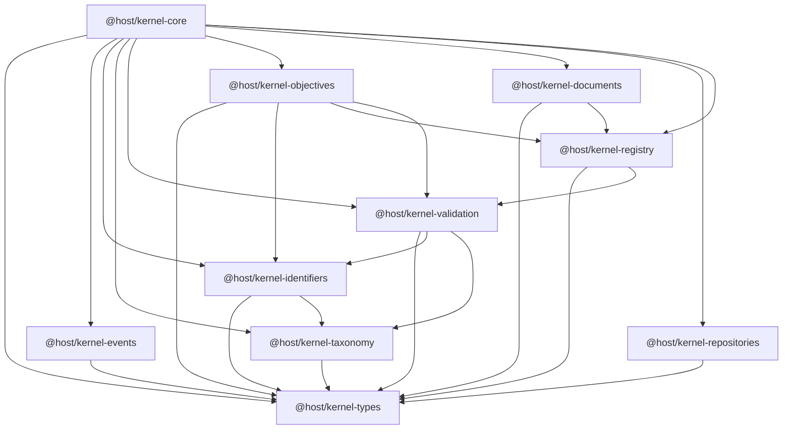

# Kernel Package Dependency Graph

The graph is intentionally acyclic. Shared types sit at the bottom, and the core package composes upward without feeding back into lower layers. The runtime composition package no longer depends on test utilities.
