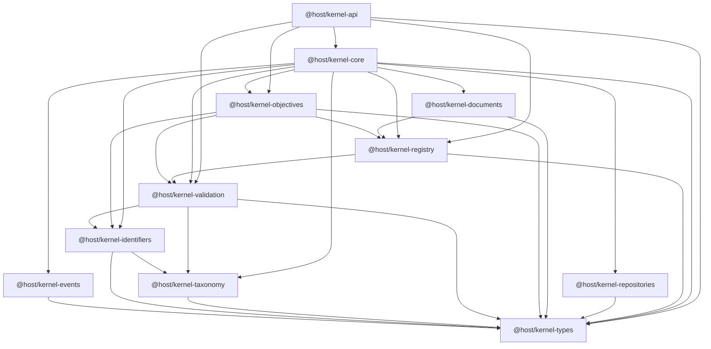

# Kernel Package Dependency Graph

The graph is intentionally acyclic. Shared types sit at the bottom, `kernel-core` composes the runtime, and `kernel-api` sits above that runtime as a facade without feeding logic back into lower layers. The runtime composition package no longer depends on test utilities.
