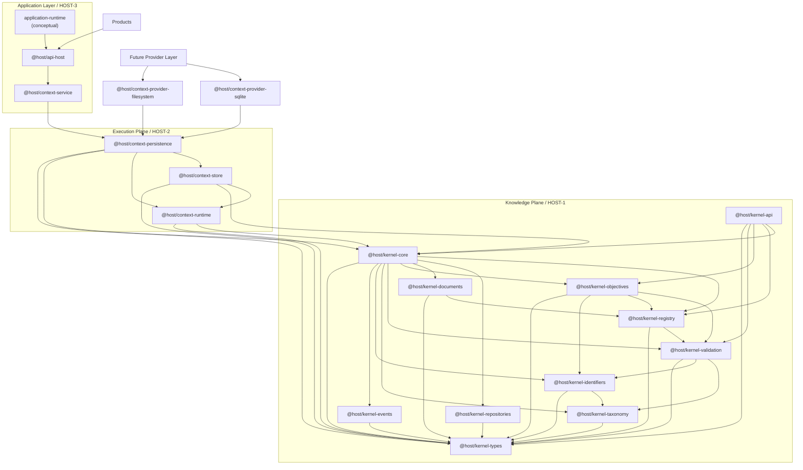

# HOST Package Dependency Graph



## Canonical Layering

```text
Knowledge Plane

kernel-types
kernel-core
kernel-taxonomy
kernel-validation
kernel-api

↓

Execution Plane

context-runtime
context-store
context-persistence

↓

Future Provider Layer

filesystem
sqlite
postgres
supabase
graph

↓

Application Layer

@host/context-service
@host/api-host
application-runtime

↓

Products
```

## Frozen Rules

- The graph is intentionally acyclic.
- `kernel-types` and HOST-1 packages remain independent of execution packages.
- `context-runtime` depends downward on HOST-1 only.
- `context-store` may depend on `context-runtime` but must not be bypassed by future provider packages.
- `context-persistence` remains the top of the execution plane and the canonical entry point for future provider packages.
- `@host/context-provider-filesystem` and `@host/context-provider-sqlite` are concrete provider-layer implementations and depend downward only.
- Future provider packages must depend on `@host/context-persistence` and must not depend on applications.
- Application packages must remain above the provider layer and below products.
- Application packages may compose execution abstractions and bind approved provider packages only at application composition roots.
- Persistence-backed APIs begin in the Application Layer and must not be introduced into `kernel-api`.
- `@host/context-service` is the first implemented HOST-3 package and may depend only on `@host/context-persistence`.
- `@host/api-host` is the canonical HOST-3 protocol dispatch boundary and may depend only on `@host/context-service`.
- `@host/api-host` owns the frozen HOST-3.3 operation registry, request envelope, response envelope, error taxonomy, and transaction contract.

## HOST-3 Conceptual Responsibilities

The Application Layer baseline currently contains two implemented packages and one conceptual package responsibility:

- `@host/context-service` for persistence-backed orchestration, transactions, and application-layer error translation
- `@host/api-host` for canonical API contract handling, operation dispatch, and stable API error translation
- `application-runtime` for broader composition roots and asynchronous workflow coordination

The repository verifier in [scripts/verify-package-graph.mjs](../../scripts/verify-package-graph.mjs) now enforces the implemented `@host/context-service` and `@host/api-host` dependency rules and still reserves `@host/app-` and `@host/product-` prefixes for future HOST-3 package enforcement.
