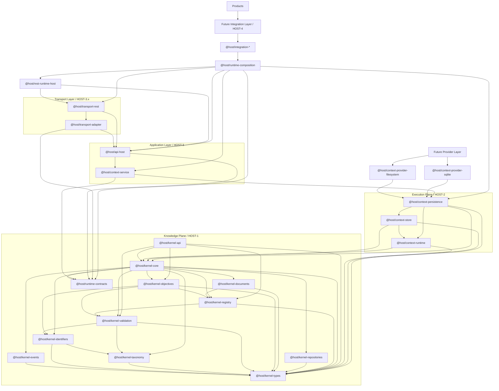

# HOST Package Dependency Graph



## Canonical Layering

```text
Knowledge Plane

kernel-types
runtime-contracts
kernel-core
kernel-taxonomy
kernel-validation
kernel-api

↓

Execution Plane

context-runtime
context-store
context-persistence

↓

Future Provider Layer

filesystem
sqlite
postgres
supabase
graph

↓

Application Layer

@host/context-service
@host/api-host

↓

Transport Layer

@host/transport-adapter
@host/transport-rest

↓

Runtime Edge

@host/rest-runtime-host
@host/runtime-composition

↓

Future Integration Layer

@host/integration-*

↓

Products
```

## Frozen Rules

- The graph is intentionally acyclic.
- `kernel-types`, `runtime-contracts`, and HOST-1 packages remain independent of execution packages.
- `context-runtime` depends downward on HOST-1 only.
- `context-store` may depend on `context-runtime` but must not be bypassed by future provider packages.
- `context-persistence` remains the top of the execution plane and the canonical entry point for future provider packages.
- `@host/context-provider-filesystem` and `@host/context-provider-sqlite` are concrete provider-layer implementations and depend downward only.
- Future provider packages must depend on `@host/context-persistence` and must not depend on applications.
- Application packages must remain above the provider layer and below the Transport Layer.
- Transport adapter packages must remain above the Application Layer and below the runtime edge.
- Runtime edge packages must remain above the Transport Layer and below the future Integration Layer.
- Future integration packages must remain above the runtime edge and below products.
- Application packages may compose execution abstractions and bind approved provider packages only at application composition roots.
- Persistence-backed APIs begin in the Application Layer and must not be introduced into `kernel-api`.
- `@host/context-service` may depend only on `@host/context-persistence` and `@host/runtime-contracts`.
- `@host/api-host` may depend only on `@host/context-service` and `@host/runtime-contracts`.
- `@host/api-host` owns the frozen HOST-3.3 operation registry, request envelope, response envelope, error taxonomy, and transaction contract.
- `@host/transport-adapter` is the sole canonical Transport Layer contract package and may depend only on `@host/api-host` and `@host/runtime-contracts`.
- `@host/transport-rest` is the first concrete transport translation package and may depend only on `@host/transport-adapter` and `@host/api-host`.
- `@host/rest-runtime-host` is the first runtime host package and may depend only on `@host/transport-rest` and `@host/api-host`.
- `@host/runtime-composition` is the canonical bootstrap package and may depend only on `@host/context-persistence`, `@host/context-service`, `@host/api-host`, `@host/transport-rest`, `@host/rest-runtime-host`, and `@host/runtime-contracts`.
- future `@host/integration-*` packages may depend only on `@host/runtime-composition`.
- transport adapters must not depend on execution packages, provider packages, or HOST-1 kernel internals.
- runtime edge packages must not introduce framework listeners, service locators, or vendor integrations.
- integration packages must not bypass `@host/runtime-composition` to depend directly on transport, application, execution, provider, or HOST-1 packages.
- application, execution, and provider packages must not depend upward on transport, runtime-edge, or integration packages.

## HOST Responsibilities

The Application Layer baseline currently contains two implemented packages plus one shared runtime contract package responsibility:

- `@host/context-service` for persistence-backed orchestration, transactions, and application-layer error translation
- `@host/api-host` for canonical API contract handling, operation dispatch, and stable API error translation
- `@host/runtime-contracts` for shared authentication, correlation, request context, logger, metrics, and tracer contracts

The Transport Layer baseline currently contains one implemented contract package and one implemented translation package responsibility:

- `@host/transport-adapter` for canonical adapter contracts, authentication context contracts, correlation and tracing metadata, and deterministic metadata defaults
- `@host/transport-rest` for stateless REST request and response translation, route registry mapping, query parameter mapping, and deterministic HTTP status translation

The runtime edge currently contains two implemented package responsibilities:

- `@host/rest-runtime-host` for injected `ApiHost` composition, reusable request handling, response shaping through `@host/transport-rest`, and deterministic runtime-level fallback errors
- `@host/runtime-composition` for provider-to-runtime-host bootstrap assembly and lifecycle-oriented runtime composition

The future Integration Layer currently reserves one package responsibility:

- `@host/integration-*` for reusable external integration bindings above runtime composition and below products

The repository verifier in [scripts/verify-package-graph.mjs](../../scripts/verify-package-graph.mjs) now enforces the implemented `@host/context-service`, `@host/api-host`, `@host/transport-adapter`, `@host/transport-rest`, `@host/rest-runtime-host`, and `@host/runtime-composition` dependency rules while reserving `@host/integration-*`, `@host/app-`, and `@host/product-` prefixes for future architecture enforcement.
