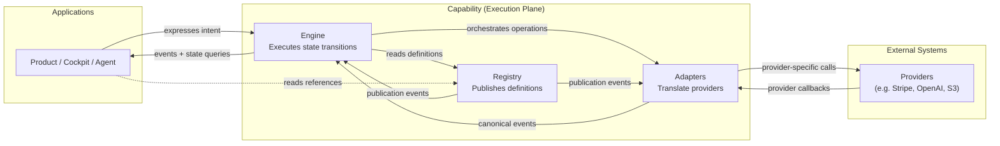

# HOST Execution Plane Reference Architecture
## The Registry–Engine–Adapter Pattern

## Governance Metadata

| Field | Value |
| --- | --- |
| Document Type | Constitutional Pattern (pre-ADR) |
| Proposed Objective | OBJ-REA (unallocated) &mdash; peer of OBJ-002 Operating Model |
| Proposed ADR | ADR-REA-01 - Adoption of Registry–Engine–Adapter as canonical execution pattern |
| Status | Draft for Review |
| Version | 0.1 |
| Owner | HOST |
| Last reviewed | 2026-07-14 |
| Constitution | [OBJ-000 Ecosystem Constitution](docs/constitution/ecosystem-constitution.md) |
| Governing Operating Model | [OBJ-002 HOST Kernel Operating Model](docs/kernel/operating-model.md) |
| Prior evidence | Commercial Registry Design v0.1, Commercial Runtime Design v0.1, HOST-4.10 Integration Platform Baseline (ADR-009), HOST-4.7 Workflow Runtime |
| Related | [ADR-009 Integration Platform Baseline](docs/architecture/ADR-009-integration-platform-baseline.md), [ADR-006 Application Layer Baseline](docs/architecture/ADR-006-application-layer-architecture-baseline.md) |

---

## Purpose

The Commercial architecture, developed in a series of design passes, naturally decomposed into three execution responsibilities: a Commercial Registry that publishes canonical commercial definitions, a Commercial Runtime that executes commercial transactions against those definitions, and Commercial Adapters that translate between the canonical model and external providers.

This decomposition was not designed in advance. It emerged from the responsibilities themselves.

This document asks whether that emergence describes a **reusable HOST architectural pattern** — one that should be formally adopted as the canonical execution architecture for the platform.

The claim under review:

> **Registry → Engine → Adapter is the canonical execution pattern for HOST. All future HOST execution capabilities should adopt it unless a compelling reason applies.**

The recommendation is **yes, adopt**, with the reasoning, rules, exceptions, and capability mapping below.

---

## Executive Recommendation

**Adopt Registry–Engine–Adapter (REA) as the constitutional execution pattern of HOST v1.0**, promoted to peer status with OBJ-002 (Operating Model). The pattern is not new — it is already latent in HOST-4.10 Integration Platform and HOST-4.7 Workflow Runtime. The Commercial architecture made it explicit. Formal adoption makes it universal.

**Key findings:**

- The pattern is not Commerce-specific. It is an architectural abstraction that fits every HOST capability requiring dynamic execution against external systems.
- Two currently-shipped Kernel capabilities (HOST-4.10, HOST-4.7) already conform. Two more (HOST-5.x Commercial, and the proposed Identity capability) will conform. Six additional future capabilities naturally decompose into REA.
- The pattern makes explicit what a well-architected HOST capability was going to have to look like anyway. Adoption is codification, not disruption.
- The pattern has clear anti-patterns whose prevention justifies constitutional force.
- It has clear limits — pure governance, pure vocabulary, and pure contract layers do not need the pattern.

**Constitutional principle proposed:**

> HOST platform capabilities that execute dynamically against external systems adopt the Registry–Engine–Adapter pattern. **Registries publish canonical definitions. Engines execute state transitions against those definitions. Adapters translate between the canonical model and external providers.** Capabilities that do not require dynamic execution (pure governance, pure vocabulary, pure contract) are exempt and may follow simpler shapes.

**Proposed ADR:** ADR-REA-01. Proposed Objective: OBJ-REA, peer of OBJ-002 in the constitutional hierarchy.

---

## 1. Pattern Validation

The question this section answers: is REA a genuine architectural abstraction, or is it a Commerce-specific accident?

### 1.1 Origin

REA emerged from four passes of Commercial architectural analysis:

- The Adoption Review recommended splitting Billing across three planes (Knowledge, Control, Execution) and, within Execution, into three sibling artefacts (Registry, Runtime, Adapters).
- The Registry design established the Registry as the publisher of canonical commercial truth, read-only for applications, immutably versioned.
- The Runtime design established the Runtime as the event-sourced execution engine that consumes Registry snapshots and orchestrates Adapters.
- The Adapter design (in progress) establishes the translation layer between canonical concepts and external providers.

At no point in this sequence was REA imposed. It fell out of the responsibilities.

### 1.2 Prior evidence — the pattern is already shipped

The most compelling evidence for REA is that **HOST has already been building it, without a name**.

**HOST-4.10 Integration Platform Baseline v1.0** (ADR-009):

- `integration-contracts` — the **Registry** for Integration definitions.
- `integration-events`, `integration-workflow`, `integration-execution`, `integration-execution-persistence` — the **Engine** that executes integration operations against those definitions.
- `integration-mcp` — the first concrete **Adapter**, translating between the canonical Integration Foundation and the MCP protocol.

The README describes this exactly: "@host/integration-contracts implements the canonical Integration Foundation... @host/integration-execution implements the canonical execution coordinator... @host/integration-mcp validates the layer as the first concrete reusable integration runtime."

That is Registry–Engine–Adapter, unnamed.

**HOST-4.7 Workflow Runtime**:

- Workflow Definitions — **Registry** entries.
- Workflow Execution Runtime — the **Engine**.
- External triggers and outputs — **Adapters** (implicit today).

**HOST-4.6 Event Contract Foundation**:

- Event Contract Definitions — **Registry**.
- Event Bus / Distribution — **Engine**.
- Webhook receivers, external event sinks — **Adapters**.

Three of the frozen Kernel baselines already follow the pattern. The pattern was inherent in the architecture before this document articulated it.

### 1.3 Forward evidence — where the pattern naturally fits

Every capability listed in the brief maps naturally to REA:

| Capability | Registry | Engine | Adapter |
| --- | --- | --- | --- |
| **Identity** | Identity Records, Roles, Credentials (schema) | Session lifecycle, auth events, role transitions | OIDC, SAML, LDAP, external IdP |
| **Communications** | Message Templates, Channels, Consent Records | Message dispatch lifecycle (queued, sent, delivered, bounced, opened) | SendGrid, Twilio, SES, push providers |
| **Notifications** | Notification Types, Delivery Rules, Priority Classes | Notification lifecycle, deduplication, batching | WebSocket, mobile push, email fallback |
| **AI Providers** | Available Models, Model Cards, Rate Limits, Capabilities | Request lifecycle, cost tracking, retry, fallback, streaming coordination | OpenAI, Anthropic, Google, local |
| **Storage** | Storage Classes, Bucket configs, Retention policies | File lifecycle, versioning, GC, replication | S3, GCS, Azure Blob, local filesystem |
| **Search** | Index definitions, Schema, Ranking rules | Query execution, result assembly, analytics | Elasticsearch, Meilisearch, Algolia, vector DBs |
| **Documents** | Document Types, Templates, Schema | Document lifecycle (draft → published → archived), rendering | Storage adapters, parsers, converters |
| **Workflow** | Workflow Definitions (already exists as HOST-4.7) | Workflow execution (already exists) | External systems triggered by workflows |
| **Scheduling** | Schedule Definitions, Cron, Time Zones | Scheduler tick, job dispatch, retry | External schedulers, cron services |
| **Integrations** | Integration Contracts (already exists as HOST-4E) | Integration Execution (already exists) | integration-mcp and future adapters |
| **Commercial** | Commercial Registry (proposed) | Commercial Runtime (proposed) | Payment, Invoicing, Accounting, Tax adapters |
| **Events** | Event Contract Definitions (HOST-4.6) | Event bus | Webhook receivers, external sinks |

Twelve capabilities. All fit. None require the pattern to be forced.

### 1.4 Where the pattern does not apply

The pattern is not universal. Capabilities that are **pure Control Plane governance**, **pure Knowledge Plane vocabulary**, or **pure contract packages** do not need REA and should not adopt it.

| Capability | Why REA does not apply |
| --- | --- |
| OBJ-000 Ecosystem Constitution | Pure governance. Not execution. |
| OBJ-001 Taxonomy Registry | Pure Registry, no Engine or Adapter needed. |
| OBJ-002 Operating Model | Pure governance framework. |
| kernel-registry (as a lookup) | Pure Registry. |
| runtime-contracts | Pure contract package. No execution or definitions to publish. |
| kernel-types, kernel-validation | Pure contract packages. |
| ADR documents | Governance artefacts, not capabilities. |

These are counter-examples that sharpen the rule: **REA applies to capabilities that execute dynamically against external systems**. If there is nothing to execute, no Engine is needed. If there is no external system to talk to, no Adapter is needed. Some capabilities are truly just Registries; that is fine.

### 1.5 Verdict on validation

REA is a **genuine architectural abstraction**, not a Commerce-specific accident. Evidence:

- It was already latent in three frozen Kernel baselines (HOST-4.6, HOST-4.7, HOST-4.10).
- It maps naturally to twelve identified capabilities, current and future.
- Its limits are principled and identifiable in advance.
- Naming it and adopting it constitutionally makes explicit what the platform has been building.

---

## 2. Responsibility Boundaries

### 2.1 Registry

**Purpose.** A Registry publishes the canonical definitions of what exists to be operated on. It is the source of truth for the capability's domain shape.

**What information belongs in a Registry.**
- Canonical definitions of the capability's core objects (Offer for Commercial; Model for AI Providers; Message Template for Communications).
- Versioned, immutable publication records for each definition.
- Availability and eligibility rules that govern when a definition is usable.
- Metadata that consumers need to make decisions without transacting.

**What a Registry publishes.**
- Discoverable listings scoped by relevant dimensions (brand, region, segment, class).
- Individual definition retrieval by canonical identifier.
- Resolution of unversioned canonical IDs to current published versions.
- Version history for any canonical identifier.
- Publication events on state transitions (`<capability>.registry.<object>.published`).

**What a Registry never does.**
- Never executes anything. It does not transact, send, dispatch, meter, grant, or revoke.
- Never mutates records in place. All changes produce new versions.
- Never talks directly to external providers.
- Never owns per-customer or per-transaction state.
- Never lets applications write.

### 2.2 Engine

**Purpose.** An Engine executes state transitions against Registry definitions. It converts intent into outcomes. It maintains the authoritative record of what has happened.

**What execution responsibilities belong in an Engine.**
- Intent processing — turning application requests into committed operations.
- Eligibility validation against Registry rules.
- State machine transitions across the capability's lifecycle.
- Orchestration of external providers via Adapters.
- Event emission on every state transition.
- Failure handling with compensating actions.
- Reconciliation with Adapter state.
- Audit trail maintenance.

**What state belongs in an Engine.**
- Per-transaction, per-customer, per-session records — everything that comes into existence at execution time.
- Snapshot references to Registry versions used by each transaction.
- Immutable event log of state transitions.
- Derived projections (current state views, timelines, ledgers).

**What an Engine never owns.**
- Never owns canonical definitions. Definitions live in the Registry.
- Never owns provider-specific communication logic. That belongs in Adapters.
- Never invents values that the Registry did not publish.
- Never lets applications directly mutate its records.
- Never buries governance rules in code — governance-bearing rules come from the Control Plane.

### 2.3 Adapter

**Purpose.** An Adapter translates between the canonical model and a specific external provider. It is the boundary between HOST and the outside world.

**What translation responsibilities belong in an Adapter.**
- Provider-specific API calls, authentication, retry, and error handling.
- Provider-specific data shape mapping to and from the canonical model.
- Provider-specific webhook receipt and translation into canonical events.
- Provider-specific rate limiting and quota management.
- Provider-specific reconciliation queries.

**What belongs outside the Adapter.**
- Business logic. Adapters do not decide what to do — Engines decide, Adapters execute the decision.
- Governance rules. Adapters do not enforce constitutional invariants — Engines do.
- Canonical vocabulary. Adapters do not define terms — the Registry publishes them; the Engine references them.
- Cross-adapter coordination. If a capability needs two Adapters to work together, that coordination lives in the Engine.
- Customer identity, session state, or any HOST-native state. Adapters may reference these but never own them.

---

## 3. Relationship Model

### 3.1 Canonical interaction

### 3.2 The three legal edges

Three interactions are legitimate:

1. **Application → Engine.** Applications express intent to an Engine. This is the only edge on which applications initiate change.
2. **Engine → Registry.** Engines consult Registries at intent time, at snapshot time, at renewal time, at grant time. Read-only.
3. **Engine → Adapter → Provider.** Engines orchestrate operations through Adapter contracts. Adapters speak to providers. The Engine never speaks directly to providers.

### 3.3 The four illegal edges

Four interactions are illegal under REA:

1. **Application → Adapter directly.** Applications do not call Adapters. If they need something an Adapter can do, they express intent to the Engine.
2. **Application → Registry write.** Applications never mutate Registry entries. Publication happens through the Registry's governed workflow.
3. **Engine → Provider directly.** Engines do not call providers. They call Adapters.
4. **Adapter → Adapter.** Adapters do not coordinate with each other. Cross-adapter coordination lives in the Engine.

### 3.4 The read edge exception

Applications may **read** Registry entries directly (e.g. render an Offer to a customer, list available AI models). This is safe because Registries are read-only externally. The write path always goes through the Engine.

### 3.5 Cross-capability composition

Capabilities can compose. A Commercial Runtime may consume an AI Providers Registry to price AI usage. An Identity Engine may emit events that a Communications Engine subscribes to for lifecycle notifications.

Composition uses the same edges. Capability A's Engine may:
- Read Capability B's Registry (read edge).
- Subscribe to Capability B's events (event edge).
- Never talk to Capability B's Adapters directly.

---

## 4. Constitutional Rules

If REA is adopted, the following become permanent architectural rules of HOST. They join OBJ-000 governance principles as constitutional invariants.

### 4.1 The rules

1. **Registries publish; they do not execute.**
2. **Engines execute; they do not define.**
3. **Adapters translate; they do not decide.**
4. **Applications express intent; they do not own platform state.**
5. **Applications reference canonical identifiers; they do not carry canonical values.**
6. **Registry publications are immutably versioned. Publication is append-only.**
7. **Engine state transitions emit events. Every transition, without exception.**
8. **Engine state is event-sourced. Current state is a projection over the event log.**
9. **Adapter boundaries convert provider-specific concepts to canonical concepts. Provider-specific concepts do not leak past the boundary.**
10. **Executions snapshot Registry versions at intent time. Subsequent Registry changes do not affect committed executions unless a documented renewal policy dictates otherwise.**
11. **Compensating actions, not rollback. Corrections proceed via new events; history is never mutated.**
12. **Applications interact with a capability only through its Engine (write path) and its Registry (read path). Applications do not reach Adapters.**
13. **Engines interact with providers only through Adapters. Engines contain no provider-specific code.**
14. **Adapters do not coordinate with each other. Cross-adapter coordination is an Engine responsibility.**
15. **Governance concerns (constitutional invariants, attribution requirements, immutability guarantees) are enforced at the boundary between planes, not by individual Adapters.**
16. **No capability is required to adopt the full REA pattern if it does not require dynamic execution. Pure Registries, pure contracts, and pure governance artefacts are exempt.**

### 4.2 Rule interactions

- Rules 1–3 define the responsibility boundaries.
- Rules 4–5 govern application behaviour.
- Rules 6, 10, 11 establish immutability and versioning invariants.
- Rules 7–8 make execution auditable.
- Rules 9, 13, 14 preserve adapter neutrality.
- Rule 12 enforces the legal edges.
- Rule 15 keeps constitutional concerns in the Control Plane, where they belong.
- Rule 16 acknowledges the pattern's limits.

### 4.3 Recommended additions during review

- Consider adding a rule about idempotency of Engine intent operations.
- Consider adding a rule about deterministic Adapter contracts (same input produces the same call).
- Consider adding a rule prohibiting Adapters from persisting HOST-owned state.

These are candidates for the review conversation, not commitments in this draft.

---

## 5. Anti-pattern Catalogue

Constitutional rules matter because the anti-patterns they prevent are common enough to be worth naming. This catalogue lists patterns to actively refuse.

### 5.1 Adapter anti-patterns

**Business logic inside adapters.** An Adapter that decides *whether* to charge, not just *how* to charge. Occurs when a developer sees an "if this then that" and puts it in the Adapter because the Adapter is closest to the provider. The result is provider-shaped business logic scattered across Adapters instead of centralized in the Engine.

**Provider concepts leaking past the adapter boundary.** Stripe's `PaymentIntent` appearing in Engine code. OpenAI's `chat.completion` appearing in application code. Once this happens, the Adapter is no longer replaceable.

**Adapter-to-adapter coordination.** A Stripe Adapter that calls the Xero Adapter to record an invoice after payment. Cross-adapter workflows belong in the Engine, not in Adapters.

**Adapter as source of truth.** An Adapter that decides state before the Engine has decided. Occurs when webhook processing is naive: the Adapter receives a webhook and directly mutates HOST-owned state instead of emitting a canonical event that the Engine processes.

### 5.2 Engine anti-patterns

**Engine inventing canonical values.** An Engine that decides a price, a rate, a template, or any other canonical value that the Registry should have published. Every canonical value in a state transition must trace back to a Registry publication.

**Engine caching Registry data without version pinning.** Engines snapshot Registry versions onto the transaction. If a cache serves a stale version to an in-flight transaction that already snapshotted a fresher one, that is a bug.

**Engine reaching around Registry to compute.** An Engine that "shortcuts" for an obvious case (e.g. tax on a zero-price Offer is zero) instead of consulting the Registry. This kind of shortcut always ends by drifting away from the published rules.

**Engine mutating history.** An Engine that "corrects" a bad event by editing it. The rule is: corrections happen through new events.

### 5.3 Registry anti-patterns

**Registry containing execution logic.** A Registry that computes state, transitions, or derived values instead of publishing definitions. Registries are pure publications.

**Registry with mutable writes.** A Registry that supports "update Offer" as an operation. Registries only support "publish new version."

**Registry endpoints producing side-effects.** A Registry `GET` that triggers something in a downstream system. Reads must be pure.

**Registry entries without provenance.** Anonymous publications with no Publication Record. Every Registry state transition is audited.

### 5.4 Application anti-patterns

**Applications as source of truth.** A product caching prices, entitlements, or session state and treating that cache as authoritative. The Engine is authoritative; caches are performance optimizations.

**Applications computing platform behaviour.** A product that computes tax, discounts, entitlement scopes, or any other platform value locally instead of asking the Engine.

**Applications reaching Adapters directly.** A product that calls Stripe directly for its own reasons. This is the single most destructive anti-pattern — it fractures provider neutrality.

**Applications bypassing the Engine on read.** A product that queries Registry data and computes state from it without asking the Engine. Reading Registry entries is fine; deriving current transactional state is not.

### 5.5 Systemic anti-patterns

**Silent failure.** An operation that fails without emitting an event. Silent failures are the entire reason event sourcing exists.

**Direct provider references in HOST code.** `import stripe from "stripe"` in HOST-kernel or in an Engine package. Never legal.

**Custom event shapes per capability.** Each capability inventing its own event envelope instead of using the HOST-4.6 canonical event contract.

**Provider-specific vocabulary in canonical Registries.** A Registry entry that includes `stripe_price_id` as a canonical field. Provider IDs live in the state of each transaction, not in the canonical definition.

**Rebuilding what already exists.** A new capability implementing its own event bus, its own scheduler, its own durable persistence, its own registry. The HOST platform provides these; new capabilities compose over them.

### 5.6 Governance anti-patterns

**Undocumented adapter behaviour.** Adapters whose provider-specific handling is not written down. Adapter contracts are governed like any HOST contract; changes require ADRs.

**Adapter-driven policy.** Provider policy (e.g. Stripe's KYC requirements) leaking into HOST governance decisions. Providers may inform HOST policy but do not set it.

**Capability sprawl.** Building a new capability when an existing capability's Engine could accommodate the need. The presence of REA makes it tempting to create a new REA triad for every problem; the discipline is to compose.

---

## 6. HOST Capability Mapping

Every known HOST capability is classified below.

### 6.1 Currently shipped, already conforming (no change needed)

| Capability | Registry | Engine | Adapter | Baseline |
| --- | --- | --- | --- | --- |
| Integration Platform | `integration-contracts` | `integration-execution`, `-events`, `-workflow`, `-execution-persistence` | `integration-mcp` | HOST-4.10 frozen |
| Workflow Runtime | Workflow definitions in `integration-workflow` | `integration-workflow` runtime | External triggers (implicit) | HOST-4.7 frozen |
| Event Foundation | Event contract definitions in `integration-events` | Event bus / distribution | Webhook receivers (implicit) | HOST-4.6 frozen |

These capabilities were built to REA before REA had a name. Adoption of the pattern requires no retrofit — only a **retroactive labelling** that clarifies what they already do.

### 6.2 Currently shipped, not requiring REA (no change needed)

| Capability | Reason |
| --- | --- |
| OBJ-000 Constitution | Pure governance |
| OBJ-001 Taxonomy | Pure Registry |
| OBJ-002 Operating Model | Pure governance |
| OBJ-003 Registry Service | Pure Registry (of Objectives) |
| OBJ-004 Context Domain Model | Pure Knowledge Plane vocabulary |
| OBJ-005 State Machine | Pure governance |
| `kernel-registry`, `kernel-taxonomy`, `kernel-validation` | Pure contract packages |
| `runtime-contracts` | Pure contract package |

### 6.3 In flight — must conform (design pending)

| Capability | Registry | Engine | Adapter | Objective |
| --- | --- | --- | --- | --- |
| **Commercial** | Commercial Registry | Commercial Runtime | Payment, Invoicing, Accounting, Tax adapters | HOST-5.x (proposed) |

### 6.4 Future capabilities — recommended REA structure

| Capability | Registry | Engine | Adapter | Priority |
| --- | --- | --- | --- | --- |
| Identity | Identity records, roles, credentials schema | Session lifecycle, auth events, role transitions | OIDC, SAML, LDAP, external IdPs | High (Commercial dependency) |
| Communications | Message templates, channels, consent | Message dispatch lifecycle | SendGrid, Twilio, SES, push providers | Medium (Commercial dependency for dunning) |
| Notifications | Notification types, delivery rules | Notification lifecycle | WebSocket, mobile push, email fallback | Medium |
| AI Providers | Model registry, model cards, rate limits | Request lifecycle, cost tracking, retry, fallback | OpenAI, Anthropic, Google, local | Medium |
| Storage | Storage classes, retention policies | File lifecycle, versioning, GC, replication | S3, GCS, Azure, filesystem | Low |
| Search | Index definitions, schema, ranking | Query execution, result assembly | Elasticsearch, Meilisearch, Algolia, vector DBs | Low |
| Documents | Document types, templates | Document lifecycle, rendering | Storage adapters, parsers | Low |
| Scheduling | Schedule definitions, cron, time zones | Scheduler tick, job dispatch, retry | External schedulers | Low |
| Entitlement | Entitlement type registry (spans Commercial Registry) | Grant lifecycle | Product query surfaces | Emerges from Commercial |
| Consent & Compliance | Consent templates, retention policy | Consent capture, retention lifecycle | Legal / regulatory reporting adapters | Deferred |
| Ledger / Audit | Event schema | Immutable log projection | External audit adapters | Deferred (may promote from `integration-execution-persistence`) |

### 6.5 Summary

Every current or proposed capability either **already follows REA**, **fits it naturally**, or **is exempt for principled reasons**. No known capability is a counter-example.

---

## 7. Adoption Recommendation

### 7.1 Recommendation

**Adopt REA constitutionally.** Promote it to a peer of OBJ-002 in the HOST governance framework. Every new execution-plane capability follows the pattern by default. Exceptions require an ADR.

### 7.2 Proposed ADR — ADR-REA-01

**Title:** Adoption of Registry–Engine–Adapter as canonical HOST execution pattern.

**Status:** Proposed (drafted from this pattern document).

**Context:** The Commercial architecture, HOST-4.10 Integration Platform, HOST-4.7 Workflow Runtime, and HOST-4.6 Event Foundation all conform, explicitly or implicitly, to a Registry–Engine–Adapter decomposition. This decomposition emerged from the responsibilities themselves rather than being designed in advance. Naming and adopting the pattern makes explicit what the platform has been building.

**Decision:** REA is adopted as the constitutional execution pattern of HOST. The pattern's rules become part of the HOST architecture standard. New execution capabilities adopt the pattern by default.

**Consequences:**

- Future capability designs must document their REA decomposition or invoke the exceptions process.
- Existing capabilities that already conform are retroactively labelled; no retrofit required.
- Existing capabilities that do not conform (pure Registries, pure governance, pure contract packages) remain exempt per their nature.
- The anti-pattern catalogue becomes an architecture-review checklist.
- Future ADRs for capability designs reference ADR-REA-01 as a governing decision.

**Alternatives considered:**

- **Do nothing.** Rejected because the platform is already converging on REA implicitly; formalizing prevents drift.
- **Adopt REA as a recommendation, not a rule.** Rejected because the discipline REA imposes (no application-to-adapter edges, no adapter business logic, no engine invention of canonical values) is exactly the discipline that decays first under implementation pressure.
- **Adopt a different pattern (e.g. hexagonal architecture generically).** Rejected because REA is HOST-shaped — it names the specific responsibilities HOST has evolved (Registry as versioned publication, Engine as event-sourced state, Adapter as provider translation). Generic patterns lose the specificity that makes governance possible.

### 7.3 Proposed Objective — OBJ-REA

Peer of OBJ-002 Operating Model. Sits alongside OBJ-000 (Constitution), OBJ-001 (Taxonomy), OBJ-002 (Operating Model) as a governing objective.

Contents:
- The REA pattern (this document).
- The constitutional rules (§4).
- The anti-pattern catalogue (§5).
- The capability mapping (§6).
- The exceptions process (§9).

### 7.4 Roadmap updates

If adopted, the following updates apply to the HOST roadmap:

- **HOST-5.x (Billing / Commercial) documents reference ADR-REA-01** as a governing decision. Commercial's plane-split design (Registry, Runtime, Adapters) is a direct application of REA.
- **Retroactive labelling of HOST-4.6, HOST-4.7, HOST-4.10** as REA-conforming, via changelog notes. No code change required.
- **Future capability Objectives (Identity, Communications, AI Providers, etc.) reference ADR-REA-01** in their governance metadata. Their designs follow REA by default.
- **Capability review checklist updated** to include the anti-pattern catalogue.

---

## 8. Migration Guidance

### 8.1 For capabilities already conforming (HOST-4.6, HOST-4.7, HOST-4.10)

**No code migration required.** Documentation additions only:

- Changelog entry noting REA conformance.
- Governance metadata references ADR-REA-01.
- Package README refresh to describe capability in REA terms.

### 8.2 For capabilities in flight (Commercial)

- Design documents already produced (Registry, Runtime, Adapters) already use REA vocabulary implicitly.
- Formalise references to ADR-REA-01 in each design document's Governance Metadata.
- Constitutional rules from §4 become invariants of each design.

### 8.3 For future capabilities

Standard workflow:

1. Capability proposal identifies whether the capability requires dynamic execution against external systems.
2. If yes → REA applies. Design decomposes into Registry, Engine, Adapters.
3. If no (pure Registry, pure governance, pure contract) → invoke exception per §9.
4. Author capability Objective referencing ADR-REA-01.
5. Author capability-specific ADR building on REA (e.g. ADR-COMMREG-01, ADR-IDENT-01).
6. Proceed through OBJ-002 governance workflow.

### 8.4 For capabilities not currently conforming that could

**None identified today.** Every non-conforming current capability is exempt for principled reasons (pure Registry, pure governance, pure contract). If a future review identifies a mis-classified capability, it may be migrated by:

- Documenting the current shape and the target REA decomposition.
- Filing an ADR for the migration.
- Sequencing the migration in the HOST roadmap.
- Preserving backward compatibility during transition.

**REA migrations are not urgent unless a capability is actively growing pathologies** (Adapters accumulating business logic, applications reaching around the platform, Registries growing execution).

---

## 9. Exceptions Process

REA is the default. Exceptions are legitimate and expected.

### 9.1 When an exception is warranted

- The capability does not require dynamic execution (pure Registry).
- The capability does not talk to external systems (no Adapter needed; possibly no Engine either).
- The capability is a pure contract package.
- The capability is a governance artefact (Objective, ADR, Constitution).
- The capability composes over existing REA capabilities and adds no new execution surface (e.g. a reporting projection over HOST-4.6 events).

### 9.2 When an exception is not warranted

- Convenience. "It would be easier to put this in an Adapter" is not a reason.
- Time pressure. Governance-first is a constitutional rule; expediency does not override it.
- Provider-shaped thinking. If a capability's shape mirrors a provider's SDK, that is a signal to redesign, not to exempt.

### 9.3 Exception workflow

- File an ADR titled `ADR-<CAP>-EXCEPTION-REA-01` identifying the exemption request.
- Document what the capability does and why REA does not apply.
- Include a specific rebuttal of the standard REA case (why is the capability not shaped like Registry–Engine–Adapter?).
- Route through the standard OBJ-002 governance workflow.
- Approval requires Commercial Steward and HOST Kernel governance owner sign-off.

---

## 10. Open Questions & Assumptions

| ID | Item | Type |
| --- | --- | --- |
| Q1 | Should the exceptions process require a fixed review period (e.g. exceptions revisited annually)? | Governance detail |
| Q2 | Should the pattern be called Registry–Engine–Adapter or Registry–Runtime–Adapter? (Commercial uses Runtime; other capabilities may prefer Engine.) | Naming |
| Q3 | Is there a case where a capability legitimately has multiple Registries or multiple Engines? | Structural |
| Q4 | Should Adapter registries themselves be centralized (via `kernel-registry`) or per-capability? | Architecture |
| Q5 | How does REA apply to the future Cockpit operator interface? Cockpit is an application, but its state may need to project across many capability Engines. | Composition |
| Q6 | Does the pattern have a special case for capabilities whose "external system" is another HOST capability rather than a provider? | Composition |
| Q7 | Should there be a canonical shape for Adapter contracts across capabilities (a meta-contract), or does each capability define its own? | Standardisation |
| A1 | HOST-4.10, HOST-4.7, and HOST-4.6 conform to REA (documented in §1.2). | Assumption verified against README. |
| A2 | Commercial's Registry, Runtime, and Adapters designs conform to REA (documented in prior design work). | Assumption verified against draft designs. |
| A3 | The 12-capability mapping in §1.3 fits without forcing. | Assumption based on analysis in this document. |
| A4 | Governance workflow (OBJ-002) can accommodate the exceptions process without modification. | Assumption. |

---

## Change Log

| Version | Date | Notes |
| --- | --- | --- |
| 0.1 | 2026-07-14 | Initial draft for review. |

---

## Prior evidence and related documents

- **Commercial Registry Design v0.1** — reference implementation of the Registry role.
- **Commercial Runtime Design v0.1** — reference implementation of the Engine role.
- **Billing Kernel Adoption Review v0.1** — the plane-split analysis that produced REA.
- **HOST-4.10 Integration Platform Baseline** — currently-shipped exemplar of REA in code.
- **HOST-4.7 Workflow Runtime** — currently-shipped exemplar of REA in code.
- **HOST-4.6 Event Contract Foundation** — currently-shipped exemplar of the event edge of REA.
- **ADR-009 Integration Platform Baseline** — the ADR most closely aligned with the pattern; ADR-REA-01 generalises it.
