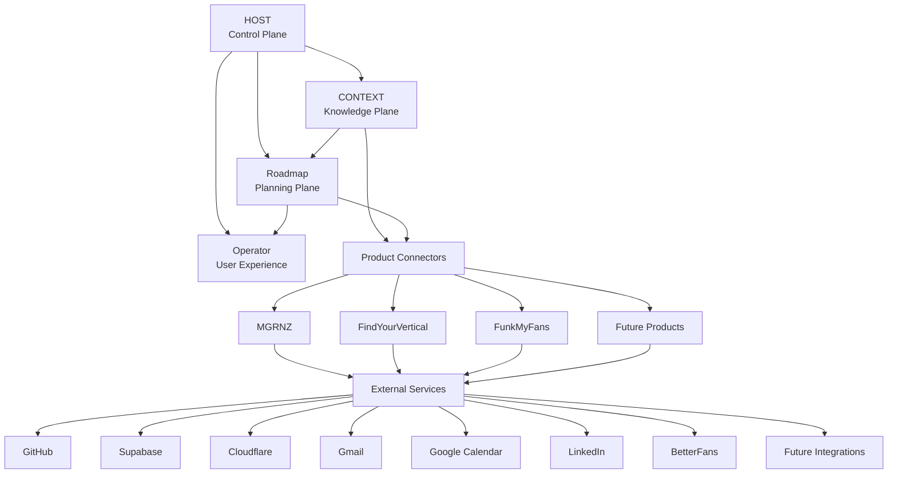
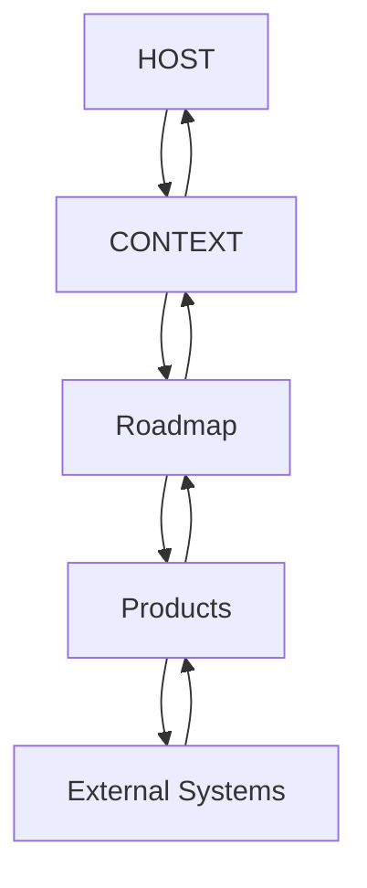
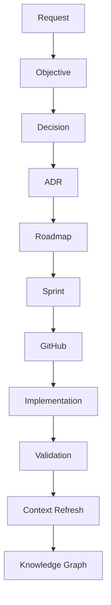
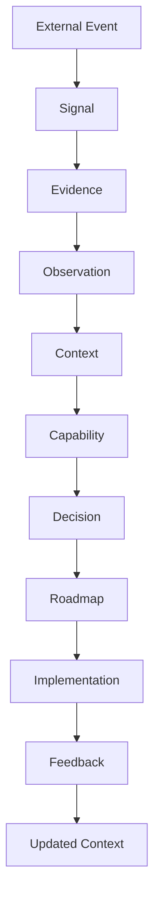
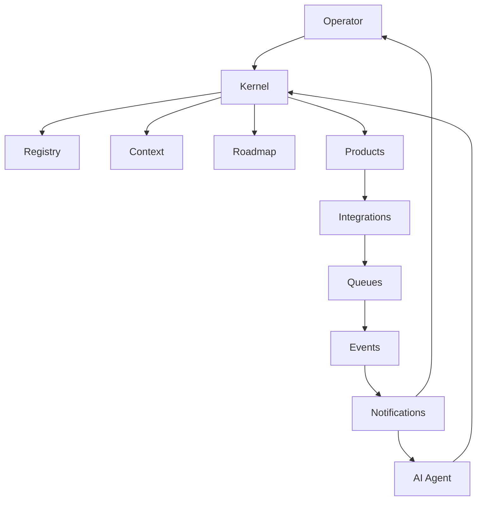
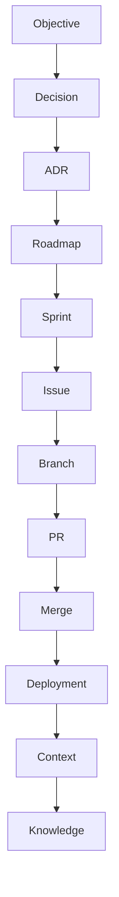

# HOST-0 - Ecosystem System Architecture

## Governance Metadata

| Field | Value |
| --- | --- |
| Originating Objective | HOST-0 |
| Status | Architecture Baseline Approved |
| Version | 1.0 |
| Owner | HOST |
| Last reviewed | 2026-06-29 |
| Constitution | [OBJ-000](../constitution/ecosystem-constitution.md) |
| Related documents | [OBJ-001](../taxonomy/taxonomy-registry.md), [OBJ-002](../kernel/operating-model.md), [OBJ-003](../services/registry-service-specification.md), [OBJ-004](../context/context-domain-model.md), [OBJ-005](../lifecycle/ecosystem-state-machine.md), [docs/changelog.md](../changelog.md), [ADR-001](ADR-001-ecosystem-taxonomy-and-numbering.md), [ADR-002](ADR-002-host-kernel-operating-model.md), [ADR-004](ADR-004-execution-layer-architecture-baseline.md), [ADR-005](ADR-005-context-persistence-api-boundary.md), [ADR-006](ADR-006-application-layer-architecture-baseline.md), [Application Layer Architecture](application-layer.md) |

## Executive Overview

HOST is the constitutional control layer for the ecosystem.

It exists to ensure that governance, planning, knowledge, and execution all share the same canonical vocabulary, ownership boundaries, and traceability rules before implementation begins.

The system architecture does not introduce new governance rules. It explains how the approved governance baseline fits together as a complete ecosystem.

At a high level:

- HOST governs the ecosystem and defines the control layer.
- CONTEXT stores canonical knowledge, evidence, and relationships.
- Roadmap sequences approved work into planning objects.
- Product repositories implement approved changes through application and delivery surfaces that sit below the HOST-controlled architecture layers.
- External services provide runtime and integration capabilities around the ecosystem.

## Ecosystem Architecture



The diagram shows the ecosystem as a controlled architecture, not as a deployment diagram.

HOST is the control plane.
CONTEXT is the canonical knowledge plane.
Roadmap is the planning plane.
Product repositories are the delivery plane beneath the HOST application boundary.

## Architectural Planes

### Control Plane

Owned by HOST.

Responsibilities:

- governance
- orchestration
- lifecycle control
- workflow direction
- kernel rules

### Knowledge Plane

Owned by CONTEXT.

Responsibilities:

- entities
- capabilities
- signals
- evidence
- observations
- relationships
- knowledge graph

### Planning Plane

Owned by Roadmap.

Responsibilities:

- objectives
- epics
- initiatives
- sprint planning
- dependencies
- release planning

### Execution Plane

Owned by HOST execution architecture until application-specific adapters begin.

Responsibilities:

- runtime execution boundaries
- storage boundaries
- persistence-provider coordination
- deterministic contract enforcement

### Application Layer

Owned by HOST application architecture.

Responsibilities:

- orchestration
- asynchronous workflows
- persistence-backed APIs
- external transports
- composition of execution-layer capabilities
- application-specific policies

The canonical execution stack is frozen as:

```text
Knowledge Plane

kernel-types
kernel-core
kernel-taxonomy
kernel-validation
kernel-api

↓

Execution Plane

context-runtime
context-store
context-persistence

↓

Future Provider Layer

filesystem
sqlite
postgres
supabase
graph

↓

Application Layer

context-service
application-runtime
api-host

↓

Products
```

Product repositories remain the implementation and delivery plane for product code, but they do not own the Knowledge Plane, Execution Layer, provider layer, or Application Layer package boundaries defined above.

## Repository Interaction Model



Information flows downward for execution and upward for validation, context refresh, and governance closure.

Ownership boundaries remain unchanged:

- HOST owns governance and orchestration.
- CONTEXT owns canonical meaning and evidence.
- Roadmap owns sequencing and commitments.
- HOST application architecture owns shared orchestration, persistence-backed APIs, and transport boundaries above the execution stack.
- Product repositories own implementation and delivery artifacts beneath that shared application boundary.

## Request Lifecycle



| Stage | Owning Repository |
| --- | --- |
| Request | Request originator |
| Objective | HOST |
| Decision | HOST |
| ADR | HOST |
| Roadmap | Roadmap |
| Sprint | Roadmap |
| GitHub | Product repository or delivery repository |
| Implementation | Product repository |
| Validation | HOST with repository owners |
| Context Refresh | CONTEXT |
| Knowledge Graph | CONTEXT |

This lifecycle is governed by OBJ-002 and operationalized through OBJ-005.

## Knowledge Flow



Knowledge enters the ecosystem as signals and evidence, is interpreted through CONTEXT, influences decision-making and planning, and returns as updated context after implementation and feedback.

## Runtime Architecture



This is a conceptual runtime view only.

It shows how operator interactions, AI sessions, registry access, context updates, planning activity, product execution, and integrations relate to each other.

No implementation detail is implied by the diagram.

The executable Context Runtime now sits behind a canonical storage boundary package and a canonical persistence-provider framework:

- `@host/context-runtime` owns immutable runtime values and deterministic validation for the Context model
- `@host/context-store` owns storage contracts, snapshots, transactions, and optimistic versioning semantics
- `@host/context-persistence` owns provider registration, lifecycle, capability discovery, and health reporting

No concrete persistence technology is selected inside the execution plane.

Future adapters must land in a provider layer below applications and above the execution plane according to [ADR-004](ADR-004-execution-layer-architecture-baseline.md).

HOST-2.5 introduces the first concrete provider-layer implementation as a filesystem adapter package, `@host/context-provider-filesystem`, without changing the frozen execution-plane package boundaries.

HOST-2.8A further clarifies that persistence-backed API endpoints do not belong in HOST-1.
The existing `kernel-api` context endpoints remain runtime-only, while persistence-backed transports are deferred to a future execution/application boundary according to [ADR-005](ADR-005-context-persistence-api-boundary.md).

HOST-3.0 establishes that future boundary as the Application Layer, where orchestration, asynchronous workflows, persistence-backed APIs, external transports, and application-specific policies begin without altering HOST-1 or HOST-2 contracts. See [Application Layer Architecture](application-layer.md) and [ADR-006](ADR-006-application-layer-architecture-baseline.md).

## Traceability Architecture



Traceability is preserved by carrying the originating Objective ID through every downstream artefact.

OBJ-001 defines the canonical numbering model.
OBJ-002 defines the lifecycle path.
OBJ-004 defines the context objects.
OBJ-005 defines the state machine behavior.

## Implementation Roadmap

The system architecture establishes the sequence for implementation, but it does not define implementation internals.

Recommended sequence:

1. HOST-1 Registry Service
2. HOST-2 Objective Engine
3. HOST-3 Application Layer
4. HOST-4 Roadmap Engine
5. HOST-5 Orchestration Engine
6. HOST-6 Operator Console

Dependencies:

- HOST-1 depends on the canonical taxonomy, kernel operating model, and registry specification.
- HOST-2 depends on registry records and objective allocation rules.
- HOST-3 depends on the frozen execution/provider stack and the HOST-1/HOST-2 boundary decisions.
- HOST-4 depends on planning objects and governance input.
- HOST-5 depends on the control, knowledge, and planning planes being stable.
- HOST-6 depends on the previous services being available as a coherent operator surface.

These are architectural sequencing labels only. They do not define delivery scope.

Current status:

- HOST-1 complete
- HOST-2 complete
- Control Plane complete
- Execution Layer baseline frozen
- HOST-3 architecture baseline established
- HOST-3 application implementation deferred beyond this sprint

## Reading Order

Read the ecosystem in this order:

1. [OBJ-000 - Ecosystem Constitution](../constitution/ecosystem-constitution.md)
2. [OBJ-001 - Ecosystem Taxonomy Registry](../taxonomy/taxonomy-registry.md)
3. [OBJ-002 - HOST Kernel Operating Model](../kernel/operating-model.md)
4. [HOST-0 - Ecosystem System Architecture](system-architecture.md)
5. [OBJ-003 - Registry Service Specification](../services/registry-service-specification.md)
6. [OBJ-004 - Context Domain Model Specification](../context/context-domain-model.md)
7. [OBJ-005 - Ecosystem State Machine](../lifecycle/ecosystem-state-machine.md)
8. Implementation artifacts

## Validation

This document introduces no new governance concept.

It aligns with Governance Baseline v1.0 because:

- terminology follows OBJ-001
- operating boundaries follow OBJ-002
- context concepts follow OBJ-004
- lifecycle sequencing follows OBJ-005
- repository ownership is unchanged
- traceability remains anchored to the originating Objective

## Baseline Declaration

Governance Baseline v1.0 - Frozen

Architecture Baseline v1.0 - Approved

Execution Layer Baseline v1.0 - Frozen

Application Layer Baseline v1.0 - Approved
