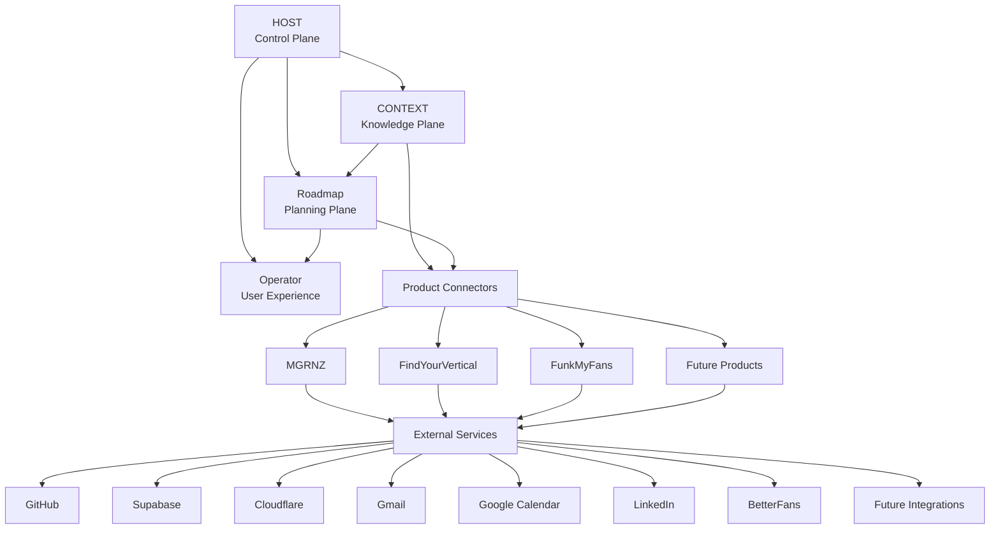
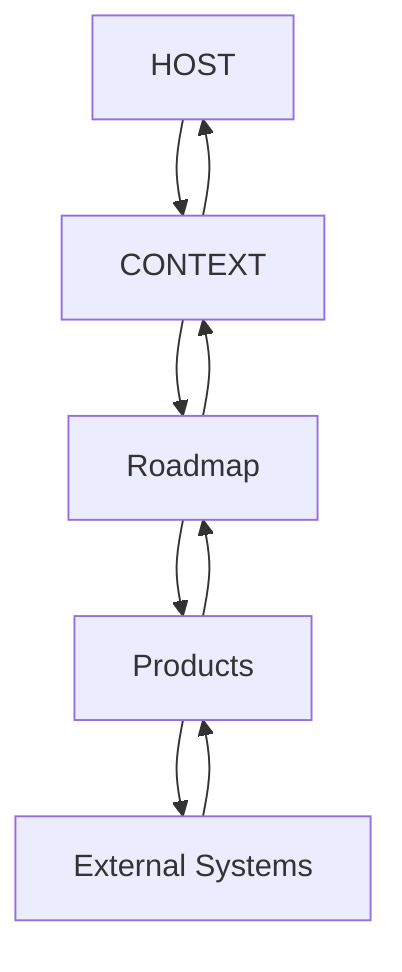
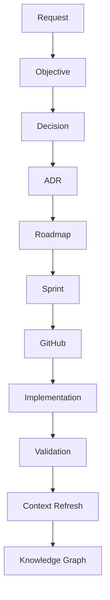
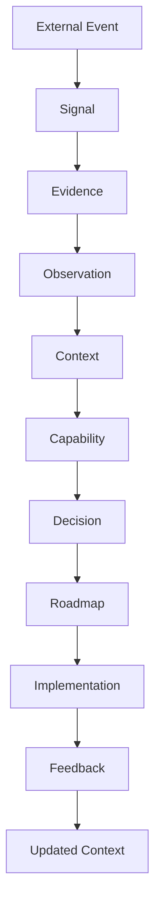
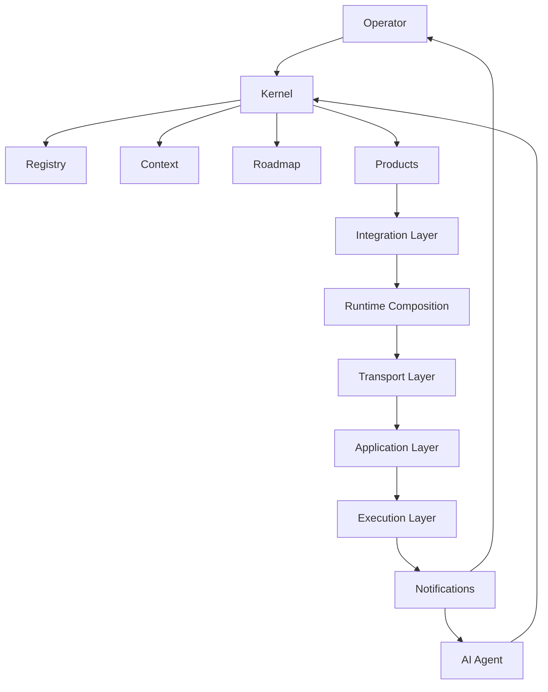
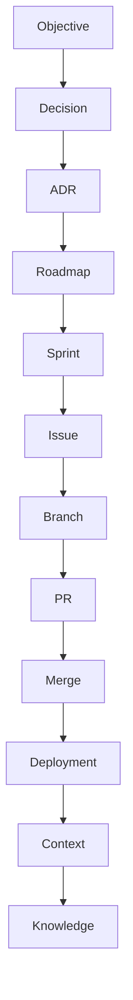

# HOST-0 - Ecosystem System Architecture

## Governance Metadata

| Field | Value |
| --- | --- |
| Originating Objective | HOST-0 |
| Status | Architecture Baseline Approved |
| Version | 1.0 |
| Owner | HOST |
| Last reviewed | 2026-06-29 |
| Constitution | [OBJ-000](../constitution/ecosystem-constitution.md) |
| Related documents | [OBJ-001](../taxonomy/taxonomy-registry.md), [OBJ-002](../kernel/operating-model.md), [OBJ-003](../services/registry-service-specification.md), [OBJ-004](../context/context-domain-model.md), [OBJ-005](../lifecycle/ecosystem-state-machine.md), [docs/changelog.md](../changelog.md), [ADR-001](ADR-001-ecosystem-taxonomy-and-numbering.md), [ADR-002](ADR-002-host-kernel-operating-model.md), [ADR-004](ADR-004-execution-layer-architecture-baseline.md), [ADR-005](ADR-005-context-persistence-api-boundary.md), [ADR-006](ADR-006-application-layer-architecture-baseline.md), [ADR-007](ADR-007-transport-adapter-architecture-baseline.md), [ADR-008](ADR-008-integration-layer-architecture-baseline.md), [Application Layer Architecture](application-layer.md), [Transport Layer Architecture](transport-layer.md), [Runtime Architecture](runtime-architecture.md), [Integration Layer Architecture](integration-layer.md) |

## Executive Overview

HOST is the constitutional control layer for the ecosystem.

It exists to ensure that governance, planning, knowledge, and execution all share the same canonical vocabulary, ownership boundaries, and traceability rules before implementation begins.

The system architecture does not introduce new governance rules.
It explains how the approved governance baseline fits together as a complete ecosystem.

At a high level:

- HOST governs the ecosystem and defines the control layer.
- CONTEXT stores canonical knowledge, evidence, and relationships.
- Roadmap sequences approved work into planning objects.
- Product repositories implement approved changes through delivery surfaces that sit below the HOST-controlled architecture layers.
- External services provide runtime and integration capabilities around the ecosystem.

## Ecosystem Architecture



The diagram shows the ecosystem as a controlled architecture, not as a deployment diagram.

HOST is the control plane.
CONTEXT is the canonical knowledge plane.
Roadmap is the planning plane.
Product repositories are the delivery plane beneath the HOST application boundary.
The Transport Layer now has `@host/transport-adapter` as its canonical contract package, `@host/transport-rest` as its first concrete translation package above the frozen API Host protocol, and `@host/rest-runtime-host` plus `@host/runtime-composition` as the runtime edge above translation.
HOST-4.0 adds the Integration Layer as the next architectural boundary above runtime composition.
HOST-4E now implements that foundation through `@host/integration-contracts`.
HOST-4.5 validates it with `@host/integration-mcp` as the first concrete reusable integration runtime.

## Architectural Planes

### Control Plane

Owned by HOST.

Responsibilities:

- governance
- orchestration
- lifecycle control
- workflow direction
- kernel rules

### Knowledge Plane

Owned by CONTEXT.

Responsibilities:

- entities
- capabilities
- signals
- evidence
- observations
- relationships
- knowledge graph

### Planning Plane

Owned by Roadmap.

Responsibilities:

- objectives
- epics
- initiatives
- sprint planning
- dependencies
- release planning

### Execution Plane

Owned by HOST execution architecture until application-specific adapters begin.

Responsibilities:

- runtime execution boundaries
- storage boundaries
- persistence-provider coordination
- deterministic contract enforcement

### Application Layer

Owned by HOST application architecture.

Responsibilities:

- orchestration
- asynchronous workflows
- persistence-backed APIs
- application-specific policies

### Transport Layer

Owned by HOST transport architecture.

Responsibilities:

- protocol translation
- authentication hand-off
- serialization
- deserialization
- transport metadata propagation

### Runtime Edge

Owned by HOST runtime composition architecture.

Responsibilities:

- runtime bootstrap
- runtime host composition
- dependency-injected assembly

### Integration Layer

Owned by HOST integration architecture.

Responsibilities:

- external system adapters
- AI tool adapters
- MCP server composition
- event consumers and publishers
- message brokers
- webhooks
- schedulers
- workflow triggers
- reusable product-facing integrations

The canonical execution, application, transport, runtime-edge, and future integration stack is now:

```text
Knowledge Plane

kernel-types
runtime-contracts
kernel-core
kernel-taxonomy
kernel-validation
kernel-api

↓

Execution Plane

context-runtime
context-store
context-persistence

↓

Future Provider Layer

filesystem
sqlite
postgres
supabase
graph

↓

Application Layer

@host/context-service
@host/api-host

↓

Transport Layer

@host/transport-adapter
@host/transport-rest

↓

Runtime Edge

@host/rest-runtime-host
@host/runtime-composition

↓

Future Integration Layer

@host/integration-contracts
@host/integration-mcp

↓

Products
```

Product repositories remain the implementation and delivery plane for product code, but they do not own the Knowledge Plane, Execution Layer, provider layer, Application Layer package boundaries, Transport Layer package boundaries, runtime-edge package boundaries, or the future Integration Layer package boundary.

## Repository Interaction Model



Information flows downward for execution and upward for validation, context refresh, and governance closure.

Ownership boundaries remain unchanged:

- HOST owns governance and orchestration.
- CONTEXT owns canonical meaning and evidence.
- Roadmap owns sequencing and commitments.
- HOST application architecture owns shared orchestration, persistence-backed APIs, and the frozen API Host protocol boundary above the execution stack.
- The Transport Layer owns protocol-specific translation between runtime hosts or integrations and the frozen Application Layer protocol.
- The Runtime Edge owns bootstrap and host composition above the Transport Layer.
- The Integration Layer owns reusable external attachment points above runtime composition and below products.
- `@host/integration-contracts` now provides the canonical registration, configuration, health, and bootstrap base for all future integrations.
- `@host/integration-mcp` now serves as the reference proof that the Integration Layer can host a real reusable runtime without bypassing runtime composition.
- Product repositories own implementation and delivery artifacts beneath those shared boundaries.

## Request Lifecycle



| Stage | Owning Repository |
| --- | --- |
| Request | Request originator |
| Objective | HOST |
| Decision | HOST |
| ADR | HOST |
| Roadmap | Roadmap |
| Sprint | Roadmap |
| GitHub | Product repository or delivery repository |
| Implementation | Product repository |
| Validation | HOST with repository owners |
| Context Refresh | CONTEXT |
| Knowledge Graph | CONTEXT |

This lifecycle is governed by OBJ-002 and operationalized through OBJ-005.

## Knowledge Flow



Knowledge enters the ecosystem as signals and evidence, is interpreted through CONTEXT, influences decision-making and planning, and returns as updated context after implementation and feedback.

## Runtime Architecture



This is a conceptual runtime view only.

It shows how operator interactions, AI sessions, registry access, context updates, planning activity, product execution, runtime composition, and integrations relate to each other.

No implementation detail is implied by the diagram.

The executable Context Runtime now sits behind a canonical storage boundary package and a canonical persistence-provider framework:

- `@host/context-runtime` owns immutable runtime values and deterministic validation for the Context model
- `@host/context-store` owns storage contracts, snapshots, transactions, and optimistic versioning semantics
- `@host/context-persistence` owns provider registration, lifecycle, capability discovery, and health reporting
- `@host/runtime-composition` owns canonical runtime bootstrap above transport and application composition
- the future Integration Layer owns reusable external attachments above runtime composition

No concrete persistence technology is selected inside the execution plane.

Future adapters must land in a provider layer below applications and above the execution plane according to [ADR-004](ADR-004-execution-layer-architecture-baseline.md).

HOST-2.5 introduces the first concrete provider-layer implementation as a filesystem adapter package, `@host/context-provider-filesystem`, without changing the frozen execution-plane package boundaries.

HOST-2.8A further clarifies that persistence-backed API endpoints do not belong in HOST-1.
The existing `kernel-api` context endpoints remain runtime-only, while persistence-backed transports are deferred to a future execution/application boundary according to [ADR-005](ADR-005-context-persistence-api-boundary.md).

HOST-3.0 establishes that future boundary as the Application Layer, where orchestration, asynchronous workflows, persistence-backed APIs, API hosting, and application-specific policies begin without altering HOST-1 or HOST-2 contracts.

HOST-3.1 implements `@host/context-service` as the canonical persisted context service boundary above the execution stack.

HOST-3.2 implements `@host/api-host` as the canonical transport-neutral composition point between future adapters and application services, without introducing adapter frameworks or provider awareness.

HOST-3.3 hardens `@host/api-host` as protocol version `1.0.0`, freezing the canonical request envelope, response envelope, operation registry, error taxonomy, and transaction-handle semantics before adapter implementation begins.

HOST-3.4 establishes the Transport Layer as a separate architecture boundary above `@host/api-host`, responsible for protocol translation, authentication hand-off, serialization, correlation, and tracing propagation without owning orchestration or business logic.

HOST-3.5 implements `@host/transport-adapter` as the sole canonical Transport Layer contract package, freezing Transport Adapter Contract v`1.0.0` without introducing any runtime adapter.

HOST-3.6 implements `@host/transport-rest` as the first reusable REST translation package, keeping the Transport Layer stateless and server-free while mapping REST semantics into the frozen API Host protocol.

HOST-3.7 implements `@host/rest-runtime-host` as the first real runtime composition boundary above `@host/transport-rest`, suitable for future HTTP-capable environments without becoming a framework app itself.

HOST-3E completes the HOST-3 runtime foundation with `@host/runtime-contracts` for transport-neutral authentication, correlation, and observability contracts plus `@host/runtime-composition` for canonical provider-to-runtime-host bootstrap assembly through dependency injection.

HOST-4.0 introduces the Integration Layer as the next architectural boundary above `@host/runtime-composition`, defining reusable external integration responsibilities.

HOST-4E implements the Integration Foundation through `@host/integration-contracts`, establishing canonical contracts, registry behavior, configuration validation, and deterministic lifecycle bootstrap.

HOST-4.5 implements `@host/integration-mcp` as the first concrete Integration Layer runtime, proving MCP tools and resources can be exposed through the approved runtime path without introducing a network listener or product-specific integration.

## Traceability Architecture



Traceability is preserved by carrying the originating Objective ID through every downstream artefact.

OBJ-001 defines the canonical numbering model.
OBJ-002 defines the lifecycle path.
OBJ-004 defines the context objects.
OBJ-005 defines the state machine behavior.

## Implementation Roadmap

The system architecture establishes the sequence for implementation, but it does not define implementation internals.

Recommended sequence:

1. HOST-1 Registry Service
2. HOST-2 Objective Engine
3. HOST-3 Application Layer
4. HOST-4 Integration Layer
5. HOST-5 Orchestration Engine
6. HOST-6 Operator Console

Dependencies:

- HOST-1 depends on the canonical taxonomy, kernel operating model, and registry specification.
- HOST-2 depends on registry records and objective allocation rules.
- HOST-3 depends on the frozen execution/provider stack and the HOST-1/HOST-2 boundary decisions.
- HOST-4 depends on the frozen runtime edge and the HOST-3 layering decisions.
- HOST-5 depends on the control, knowledge, and planning planes being stable.
- HOST-6 depends on the previous services being available as a coherent operator surface.

These are architectural sequencing labels only.
They do not define delivery scope.

Current status:

- HOST-1 complete
- HOST-2 complete
- Control Plane complete
- Execution Layer baseline frozen
- HOST-3 architecture baseline established
- `@host/context-service` implemented
- `@host/api-host` implemented
- `@host/api-host` contract frozen at HOST-3.3 / protocol `1.0.0`
- Transport Layer baseline established at HOST-3.4
- `@host/transport-adapter` implemented as the canonical Transport Layer contract package
- `@host/transport-rest` implemented as the first REST translation package
- `@host/rest-runtime-host` implemented as the first REST runtime host boundary
- `@host/runtime-contracts` implemented as the shared runtime auth and observability contract package
- `@host/runtime-composition` implemented as the canonical runtime bootstrap package
- HOST-4.0 integration architecture baseline established
- `@host/integration-contracts` implemented as the Integration Foundation package
- `@host/integration-mcp` implemented as the reference MCP integration runtime

## Reading Order

Read the ecosystem in this order:

1. [OBJ-000 - Ecosystem Constitution](../constitution/ecosystem-constitution.md)
2. [OBJ-001 - Ecosystem Taxonomy Registry](../taxonomy/taxonomy-registry.md)
3. [OBJ-002 - HOST Kernel Operating Model](../kernel/operating-model.md)
4. [HOST-0 - Ecosystem System Architecture](system-architecture.md)
5. [OBJ-003 - Registry Service Specification](../services/registry-service-specification.md)
6. [OBJ-004 - Context Domain Model Specification](../context/context-domain-model.md)
7. [OBJ-005 - Ecosystem State Machine](../lifecycle/ecosystem-state-machine.md)
8. [Runtime Architecture](runtime-architecture.md)
9. [Integration Layer Architecture](integration-layer.md)
10. Implementation artifacts

## Validation

This document introduces no new governance concept.

It aligns with Governance Baseline v1.0 because:

- terminology follows OBJ-001
- operating boundaries follow OBJ-002
- context concepts follow OBJ-004
- lifecycle sequencing follows OBJ-005
- repository ownership is unchanged
- traceability remains anchored to the originating Objective

## Baseline Declaration

Governance Baseline v1.0 - Frozen

Architecture Baseline v1.0 - Approved

Execution Layer Baseline v1.0 - Frozen

Application Layer Baseline v1.0 - Approved

Integration Layer Baseline v1.0 - Approved
