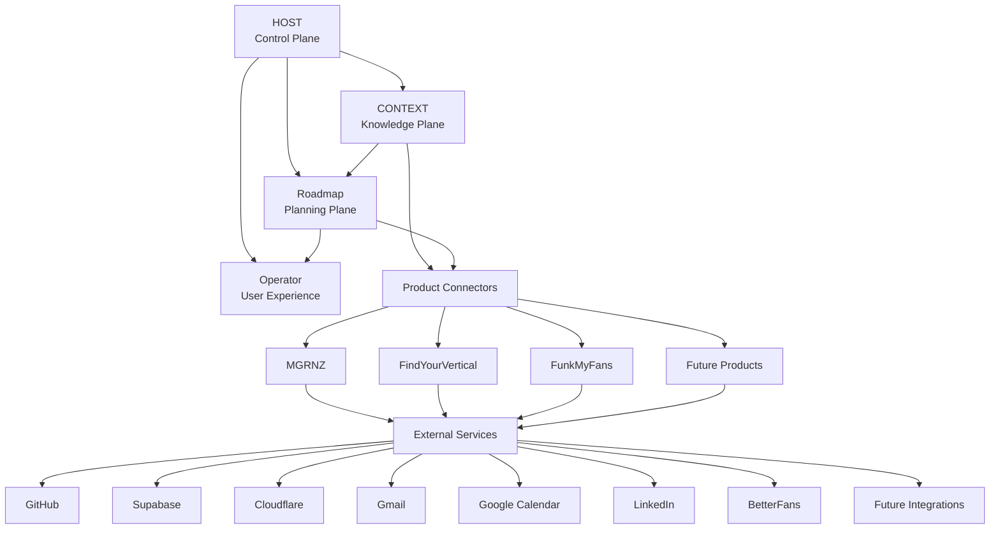
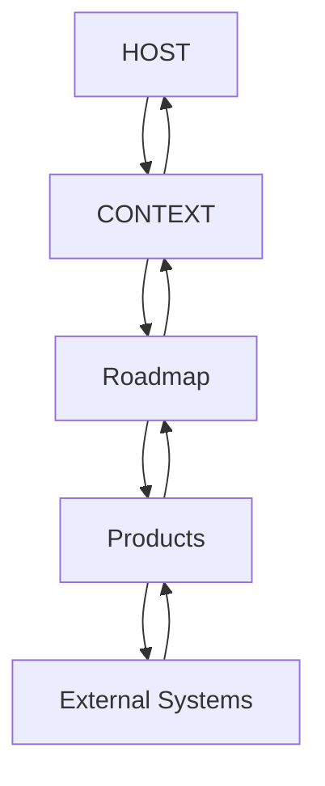
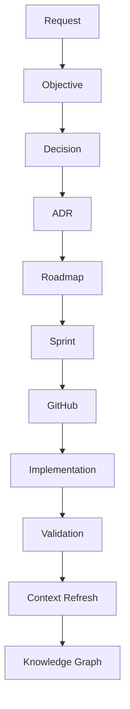
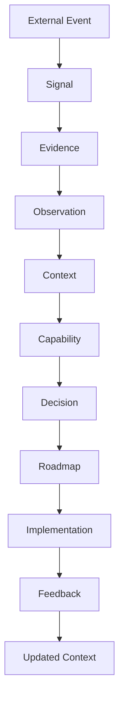
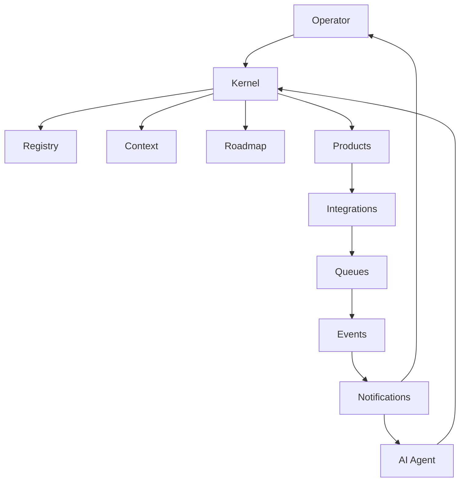
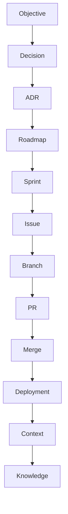

# HOST-0 - Ecosystem System Architecture

## Governance Metadata

| Field | Value |
| --- | --- |
| Originating Objective | HOST-0 |
| Status | Architecture Baseline Approved |
| Version | 1.0 |
| Owner | HOST |
| Last reviewed | 2026-06-28 |
| Constitution | [OBJ-000](../constitution/ecosystem-constitution.md) |
| Related documents | [OBJ-001](../taxonomy/taxonomy-registry.md), [OBJ-002](../kernel/operating-model.md), [OBJ-003](../services/registry-service-specification.md), [OBJ-004](../context/context-domain-model.md), [OBJ-005](../lifecycle/ecosystem-state-machine.md), [docs/changelog.md](../changelog.md), [ADR-001](ADR-001-ecosystem-taxonomy-and-numbering.md), [ADR-002](ADR-002-host-kernel-operating-model.md) |

## Executive Overview

HOST is the constitutional control layer for the ecosystem.

It exists to ensure that governance, planning, knowledge, and execution all share the same canonical vocabulary, ownership boundaries, and traceability rules before implementation begins.

The system architecture does not introduce new governance rules. It explains how the approved governance baseline fits together as a complete ecosystem.

At a high level:

- HOST governs the ecosystem and defines the control layer.
- CONTEXT stores canonical knowledge, evidence, and relationships.
- Roadmap sequences approved work into planning objects.
- Product repositories implement approved changes.
- External services provide runtime and integration capabilities around the ecosystem.

## Ecosystem Architecture

The diagram shows the ecosystem as a controlled architecture, not as a deployment diagram.

HOST is the control plane.
CONTEXT is the canonical knowledge plane.
Roadmap is the planning plane.
Product repositories are the execution plane.

## Architectural Planes

### Control Plane

Owned by HOST.

Responsibilities:

- governance
- orchestration
- lifecycle control
- workflow direction
- kernel rules

### Knowledge Plane

Owned by CONTEXT.

Responsibilities:

- entities
- capabilities
- signals
- evidence
- observations
- relationships
- knowledge graph

### Planning Plane

Owned by Roadmap.

Responsibilities:

- objectives
- epics
- initiatives
- sprint planning
- dependencies
- release planning

### Execution Plane

Owned by product repositories.

Responsibilities:

- implementation
- testing
- deployment
- releases

## Repository Interaction Model

Information flows downward for execution and upward for validation, context refresh, and governance closure.

Ownership boundaries remain unchanged:

- HOST owns governance and orchestration.
- CONTEXT owns canonical meaning and evidence.
- Roadmap owns sequencing and commitments.
- Product repositories own implementation and delivery artifacts.

## Request Lifecycle

| Stage | Owning Repository |
| --- | --- |
| Request | Request originator |
| Objective | HOST |
| Decision | HOST |
| ADR | HOST |
| Roadmap | Roadmap |
| Sprint | Roadmap |
| GitHub | Product repository or delivery repository |
| Implementation | Product repository |
| Validation | HOST with repository owners |
| Context Refresh | CONTEXT |
| Knowledge Graph | CONTEXT |

This lifecycle is governed by OBJ-002 and operationalized through OBJ-005.

## Knowledge Flow

Knowledge enters the ecosystem as signals and evidence, is interpreted through CONTEXT, influences decision-making and planning, and returns as updated context after implementation and feedback.

## Runtime Architecture

This is a conceptual runtime view only.

It shows how operator interactions, AI sessions, registry access, context updates, planning activity, product execution, and integrations relate to each other.

No implementation detail is implied by the diagram.

## Traceability Architecture

Traceability is preserved by carrying the originating Objective ID through every downstream artefact.

OBJ-001 defines the canonical numbering model.
OBJ-002 defines the lifecycle path.
OBJ-004 defines the context objects.
OBJ-005 defines the state machine behavior.

## Implementation Roadmap

The system architecture establishes the sequence for implementation, but it does not define implementation internals.

Recommended sequence:

1. HOST-1 Registry Service
2. HOST-2 Objective Engine
3. HOST-3 Context Engine
4. HOST-4 Roadmap Engine
5. HOST-5 Orchestration Engine
6. HOST-6 Operator Console

Dependencies:

- HOST-1 depends on the canonical taxonomy, kernel operating model, and registry specification.
- HOST-2 depends on registry records and objective allocation rules.
- HOST-3 depends on the context domain model and state machine.
- HOST-4 depends on planning objects and governance input.
- HOST-5 depends on the control, knowledge, and planning planes being stable.
- HOST-6 depends on the previous services being available as a coherent operator surface.

These are architectural sequencing labels only. They do not define delivery scope.

## Reading Order

Read the ecosystem in this order:

1. [OBJ-000 - Ecosystem Constitution](../constitution/ecosystem-constitution.md)
2. [OBJ-001 - Ecosystem Taxonomy Registry](../taxonomy/taxonomy-registry.md)
3. [OBJ-002 - HOST Kernel Operating Model](../kernel/operating-model.md)
4. [HOST-0 - Ecosystem System Architecture](system-architecture.md)
5. [OBJ-003 - Registry Service Specification](../services/registry-service-specification.md)
6. [OBJ-004 - Context Domain Model Specification](../context/context-domain-model.md)
7. [OBJ-005 - Ecosystem State Machine](../lifecycle/ecosystem-state-machine.md)
8. Implementation artifacts

## Validation

This document introduces no new governance concept.

It aligns with Governance Baseline v1.0 because:

- terminology follows OBJ-001
- operating boundaries follow OBJ-002
- context concepts follow OBJ-004
- lifecycle sequencing follows OBJ-005
- repository ownership is unchanged
- traceability remains anchored to the originating Objective

## Baseline Declaration

Governance Baseline v1.0 - Frozen

Architecture Baseline v1.0 - Approved
