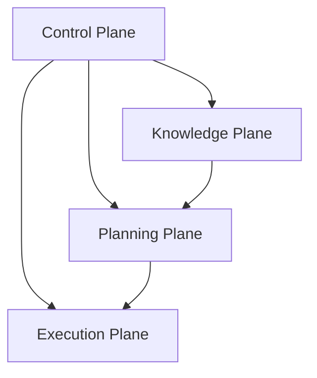

# OBJ-000 - Ecosystem Constitution

## Governance Metadata

| Field | Value |
| --- | --- |
| Objective | OBJ-000 |
| Status | Approved |
| Version | 1.0 |
| Owner | HOST |
| Last reviewed | 2026-06-28 |
| Constitution | [OBJ-000](ecosystem-constitution.md) |
| Related documents | [OBJ-001](../taxonomy/taxonomy-registry.md), [OBJ-002](../kernel/operating-model.md), [OBJ-003](../services/registry-service-specification.md), [OBJ-004](../context/context-domain-model.md), [OBJ-005](../lifecycle/ecosystem-state-machine.md), [ADR-001](../architecture/ADR-001-ecosystem-taxonomy-and-numbering.md), [ADR-002](../architecture/ADR-002-host-kernel-operating-model.md) |

Canonical entry point for the HOST governance framework.

## Purpose

This document is the executive summary for the HOST ecosystem.

It exists to give humans and AI agents a single place to start before any governance, planning, knowledge, delivery, or implementation work begins.

It does not replace the lower-level canonical documents. It points to them.

## Canonical References

| Document | Role |
| --- | --- |
| [OBJ-001 - Ecosystem Taxonomy Registry](../taxonomy/taxonomy-registry.md) | Canonical vocabulary, numbering, ownership, and traceability registry |
| [OBJ-002 - HOST Kernel Operating Model](../kernel/operating-model.md) | Canonical governance operating model |
| [ADR-001](../architecture/ADR-001-ecosystem-taxonomy-and-numbering.md) | Records the taxonomy and numbering decision |
| [ADR-002](../architecture/ADR-002-host-kernel-operating-model.md) | Records the kernel operating model decision |
| [OBJ-003 - Registry Service Specification](../services/registry-service-specification.md) | Canonical registry service behaviour |
| [OBJ-004 - Context Domain Model Specification](../context/context-domain-model.md) | Canonical CONTEXT conceptual model |
| [OBJ-005 - Ecosystem State Machine](../lifecycle/ecosystem-state-machine.md) | Canonical lifecycle state rules |

## Vision

HOST exists to provide a constitutional control layer for the ecosystem.

The long-term direction is a platform where every request, decision, object, and implementation artefact is traceable from origin to outcome without ambiguity.

## Architecture

The ecosystem is organized into four planes.



### Control Plane

The Control Plane is owned by HOST.

It defines:

- governance rules
- constitutional documents
- lifecycle constraints
- validation policy
- traceability requirements

### Knowledge Plane

The Knowledge Plane is owned by CONTEXT.

It defines:

- entities
- relationships
- capabilities
- observations
- evidence
- context records

### Planning Plane

The Planning Plane is owned by Roadmap.

It defines:

- roadmaps
- epics
- initiatives
- sprints
- release sequencing

### Execution Plane

The Execution Plane is owned by product repositories and delivery repositories.

It defines:

- implementation work
- branch and pull request activity
- deployment records
- product validation artefacts

## Repository Responsibilities

| Repository | Responsibility |
| --- | --- |
| HOST | Sets governance, standards, lifecycle rules, and constitutional direction |
| CONTEXT | Records the canonical knowledge model and its evidence chain |
| Roadmap | Sequences delivery, priorities, and planning commitments |
| Product repositories | Implement approved work within their own domain boundary |

## Governance Principles

- One concept has one canonical meaning.
- One repository owns one responsibility boundary.
- One Objective governs one traceable path of work.
- One downstream artefact must be linkable to its origin.
- No implementation begins before governance is complete.
- No repository may redefine a canonical term from OBJ-001.
- No governance decision may contradict OBJ-002.
- No document may introduce a new canonical source when an existing one already exists.

## Taxonomy

The canonical ecosystem vocabulary, numbering model, and ownership boundaries are defined in [OBJ-001](../taxonomy/taxonomy-registry.md) and its supporting taxonomy documents.

This constitution does not redefine those terms.

## Kernel

The governing lifecycle, request path, repository coordination rules, and validation chain are defined in [OBJ-002](../kernel/operating-model.md) and its supporting kernel documents.

This constitution does not duplicate those mechanics.

## Traceability

The constitutional lineage for any governed work is:

```text
Request
  -> Objective
  -> Decision
  -> ADR
  -> Roadmap
  -> Delivery Object
  -> Implementation
  -> Validation
  -> Context Refresh
  -> Completion
```

The minimum traceability set is defined by OBJ-001 and the traceability model it references.

Every constitution-level artefact must preserve:

- the originating Objective ID
- the governing Decision or ADR reference
- the owning repository
- the downstream implementation or knowledge reference
- the validation or completion record

## Onboarding

Read the governance framework in this order:

1. [OBJ-000 - Ecosystem Constitution](ecosystem-constitution.md)
2. [OBJ-001 - Ecosystem Taxonomy Registry](../taxonomy/taxonomy-registry.md)
3. [ADR-001](../architecture/ADR-001-ecosystem-taxonomy-and-numbering.md)
4. [OBJ-002 - HOST Kernel Operating Model](../kernel/operating-model.md)
5. [ADR-002](../architecture/ADR-002-host-kernel-operating-model.md)
6. [OBJ-003 - Registry Service Specification](../services/registry-service-specification.md)
7. [OBJ-004 - Context Domain Model Specification](../context/context-domain-model.md)
8. [OBJ-005 - Ecosystem State Machine](../lifecycle/ecosystem-state-machine.md)

New developers and AI agents should start here before reading any implementation-oriented repository documentation.
