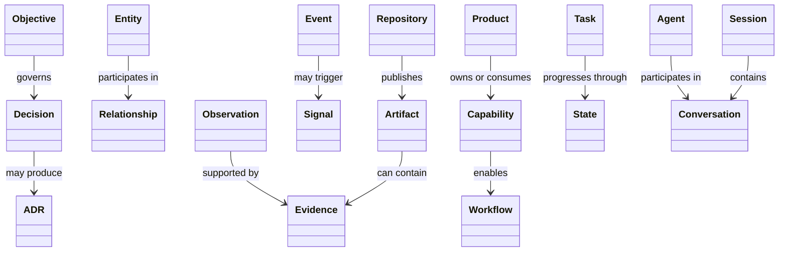

# OBJ-004 - Context Domain Model Specification

## Governance Metadata

| Field | Value |
| --- | --- |
| Originating Objective | OBJ-004 |
| Status | Canonical |
| Version | 1.0 |
| Owner | CONTEXT |
| Last reviewed | 2026-06-28 |
| Constitution | [OBJ-000](../constitution/ecosystem-constitution.md) |
| Related documents | [OBJ-001](../taxonomy/taxonomy-registry.md), [OBJ-002](../kernel/operating-model.md), [OBJ-003](../services/registry-service-specification.md), [OBJ-005](../lifecycle/ecosystem-state-machine.md), [ADR-001](../architecture/ADR-001-ecosystem-taxonomy-and-numbering.md), [ADR-002](../architecture/ADR-002-host-kernel-operating-model.md), [ADR-003](../architecture/ADR-003-context-runtime-governance-alignment.md) |

Canonical conceptual blueprint for the CONTEXT repository.

## Purpose

This document defines the canonical conceptual model for CONTEXT.

It describes the objects that represent ecosystem meaning, relationships, evidence, and operational memory.

It is a conceptual model only. It does not define database tables or storage implementation.

## Canonical References

| Document | Role |
| --- | --- |
| [OBJ-000](../constitution/ecosystem-constitution.md) | Ecosystem entry point |
| [OBJ-001](../taxonomy/taxonomy-registry.md) | Canonical object families, naming, and identifiers |
| [OBJ-002](../kernel/operating-model.md) | Canonical governance and lifecycle operating model |
| [ADR-001](../architecture/ADR-001-ecosystem-taxonomy-and-numbering.md) | Taxonomy and numbering decision record |
| [ADR-002](../architecture/ADR-002-host-kernel-operating-model.md) | Kernel operating model decision record |
| [OBJ-003](../services/registry-service-specification.md) | Registry interface specification |
| [OBJ-005](../lifecycle/ecosystem-state-machine.md) | Lifecycle state machine |

## Conceptual Model

## Object Model

| Object | Purpose | Identifier | Owner | Lifecycle | Relationships | Validation | Example |
| --- | --- | --- | --- | --- | --- | --- | --- |
| Entity | Canonical named thing in the knowledge graph | `ENT-###` | CONTEXT | Proposed -> registered -> deprecated | Linked by Relationships, referenced by Evidence and Observations | Must have one canonical name and one type | `Product`, `Repository`, `Capability` |
| Relationship | Directed or undirected link between objects | `RLT-###` | CONTEXT | Proposed -> active -> retired | Connects Entities, Capabilities, Artifacts, and Decisions | Must declare source, target, and relationship type | `owns`, `depends on` |
| Capability | Stable ability provided by a product or team | `CAP-###` | CONTEXT with product ownership | Proposed -> registered -> active -> deprecated -> retired | Linked to Products, Workflows, Tasks, and Evidence | Must have unique canonical name and owner | `Registry Read` |
| Workflow | Ordered transformation of state | `WF-###` | CONTEXT or product owner | Draft -> active -> retired | Uses Tasks, Signals, States, and Decisions | Must define entry and exit conditions | `Request Lifecycle` |
| Signal | Measurable indication of change | `SIG-###` | CONTEXT | Draft -> active -> archived | May trigger Observations, Events, and Workflows | Must have source and detection rule | `New PR merged` |
| Observation | Human or machine note about what was seen | `OBS-###` | CONTEXT | Captured -> verified -> archived | Supported by Evidence and linked to Events or Entities | Must state what was observed and when | `Kernel baseline completed` |
| Evidence | Verifiable record supporting a claim | `EVD-###` | CONTEXT | Collected -> verified -> archived | Supports Observations, Decisions, and Validation | Must be attributable and reproducible | `Test output` |
| Decision | Recorded choice made in response to a need | `DEC-###` | HOST | Draft -> proposed -> accepted -> superseded -> archived | Anchors ADRs, Roadmaps, and Objectives | Must include alternatives and rationale | `Adopt canonical taxonomy` |
| Event | Fact that something happened at a specific time | `EVT-###` | Runtime or product owner | Emitted -> consumed -> archived | Triggered by Actions, Signals, or Workflows | Must include timestamp and actor/source | `Repository registered` |
| Artifact | Durable document or record produced by the ecosystem | `ART-###` | Owning repository | Draft -> current -> archived | Can reference Objectives, Decisions, Evidence, and Context Records | Must be traceable to owner and origin | `Architecture note` |
| State | Current condition of an object | `ST-###` or canonical state name | Owning repository | Proposed -> active -> retired or object-specific | Describes lifecycle position for other objects | Must map to an allowed lifecycle model | `Approved` |
| Task | Discrete unit of delivery work | `TASK-###` | Product or delivery owner | Open -> in progress -> done -> closed | Linked to Objectives, Capabilities, and Implementations | Must have completion criteria and owner | `Implement registry endpoint` |
| Objective | Smallest governed unit of intended work | `OBJ-###` | HOST | Draft -> proposed -> approved -> planned -> active -> implemented -> validated -> closed -> archived | Governs Decisions, Roadmaps, and downstream work | Must have a unique ID and canonical title | `OBJ-003` |
| Repository | Canonical code or documentation boundary | `repository key` | Owning repository | Registered -> active -> archived | Owns Artifacts, Implementations, and releases | Must have a unique boundary and owner | `HOST`, `CONTEXT` |
| Product | Deliverable domain or platform surface | canonical product code | Product owner | Proposed -> registered -> active -> deprecated -> retired | Owns Capabilities, Tasks, Releases, and Events | Must match canonical product naming | `MGRNZ` |
| Agent | Autonomous or semi-autonomous actor | `AGT-###` | Runtime owner | Provisioned -> active -> retired | Participates in Sessions and Conversations | Must be attributable and authorized | `Codex` |
| Conversation | Bounded exchange between participants | `CVS-###` | Runtime owner | Open -> active -> archived | Contains Messages, Decisions, and Context references | Must have participants and topic | `Objective review` |
| Session | Bounded runtime interaction period | `SES-###` | Runtime owner | Open -> active -> closed | Contains Conversations and Executions | Must have start and end boundaries | `Codex session` |

## Core Relationships

| From | To | Relationship | Meaning |
| --- | --- | --- | --- |
| Objective | Decision | governs | The Objective creates the reason to decide |
| Decision | ADR | documents | The Decision may be formalized as an ADR |
| Objective | Roadmap | traces to | The Objective is sequenced by planning |
| Roadmap | Task | decomposes into | Planning becomes actionable delivery work |
| Task | Artifact | produces | Delivery work creates durable output |
| Artifact | Evidence | is supported by | Artifacts are justified by evidence where needed |
| Observation | Evidence | is supported by | Observations are verified by evidence |
| Entity | Relationship | participates in | Entities are linked through relationships |
| Capability | Product | is owned or consumed by | Capabilities belong to or are used by products |
| Repository | Artifact | publishes | Repositories produce canonical artefacts |
| Session | Conversation | contains | A session bounds a conversation |
| Agent | Conversation | participates in | Agents can take part in a conversation |

## Validation Rules

- Every object must use the canonical identifier family from OBJ-001.
- Every relationship must declare a source, target, and meaning.
- Every object must have a clear owner.
- Every object must have an allowed lifecycle.
- Every object must preserve traceability to the originating Objective or governing decision where applicable.
- Every derived record must point back to a canonical source object.

## Executable Runtime Alignment

ADR-003 approves the minimum canonical runtime surface required to implement HOST-2.1 without introducing new taxonomy object families.

| Runtime Contract | Classification | Canonical Anchor | Identifier Model | Notes |
| --- | --- | --- | --- | --- |
| ContextRecord | Subordinate derived record contract | One canonical source object plus supporting references | None | Must point back to a canonical source object |
| ContextSnapshot | Subordinate immutable snapshot contract | One or more Context Records captured at a point in time | None | Snapshot is a runtime view, not a taxonomy object |
| ContextReference | Subordinate reference contract | Existing canonical identifiers or existing `document` validation references | None | Reuses canonical reference kinds rather than defining a new object family |
| Confidence | Subordinate deterministic value object | Attached to a Context Record or Context Snapshot | None | Expresses confidence without AI interpretation semantics |
| Freshness | Subordinate deterministic value object | Attached to a Context Record or Context Snapshot | None | Expresses recency or validity metadata only |
| Provenance | Subordinate deterministic value object | Attached to a Context Record or Context Snapshot | None | Expresses source and attribution lineage only |

HOST-2.4A further freezes the executable layering around these contracts:

- `@host/context-runtime` owns creation, validation, and serialization of the runtime contracts above
- `@host/context-store` owns versioned storage and transaction boundaries for runtime values
- `@host/context-persistence` owns provider lifecycle, capability reporting, and store access coordination

These packages remain subordinate execution contracts. They do not create new taxonomy object families and they do not redefine canonical knowledge ownership.

## Conceptual Examples

- A `Decision` can be linked to one `ADR` and many `Task` objects.
- A `Capability` can be used by multiple `Workflow` objects and owned by one product or repository boundary.
- An `Observation` can be supported by one or more `Evidence` objects.
- A `Repository` can publish many `Artifact` objects but does not own the canonical meaning of the `Entity` objects described in those artefacts.
- A `Session` can contain several `Conversation` objects, but those conversations remain runtime records, not governance records.

## Domain Boundary

CONTEXT records meaning.

It does not decide governance policy, planning priority, or implementation approval.

Those responsibilities remain with HOST and Roadmap according to OBJ-001 and OBJ-002.
