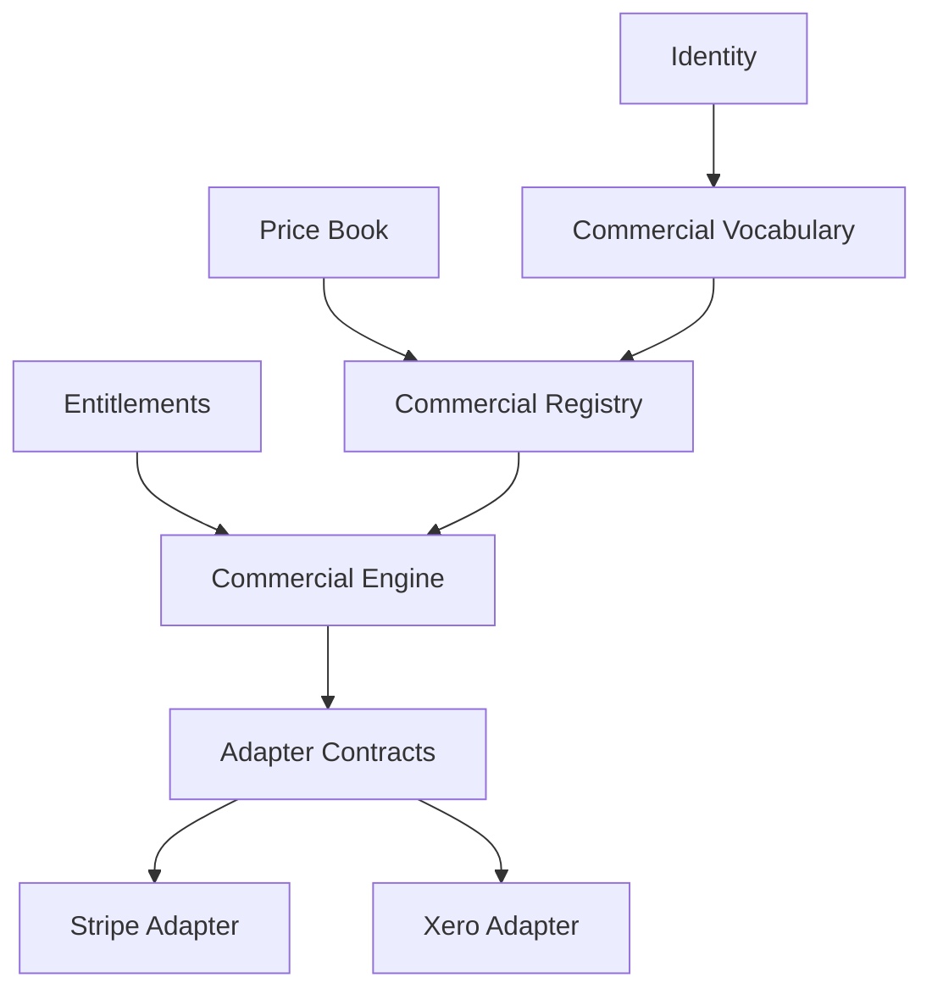

# Commercial Delivery Plan

## Governance Metadata

| Field | Value |
| --- | --- |
| Originating Objective | OBJ-007 |
| Status | Draft |
| Version | 0.1 |
| Owner | HOST |
| Last reviewed | 2026-07-14 |
| Constitution | [OBJ-000](../constitution/ecosystem-constitution.md) |
| Related documents | [ADR-BILLING-01](../architecture/ADR-BILLING-01-commercial-architecture-decomposition.md), [ADR-COMMREG-01](../architecture/ADR-COMMREG-01-commercial-registry.md), [ADR-COMMRUN-01](../architecture/ADR-COMMRUN-01-commercial-engine.md), [ADR-REA-01](../architecture/ADR-REA-01-registry-engine-adapter-pattern.md), [commercial delivery objectives](../objectives/HOST-commercial-delivery-objectives.md) |

## Purpose

This document translates the accepted Commercial Architecture into an executable HOST delivery plan.

Architecture decisions are fixed. This plan sequences implementation work only.

## Delivery Workstreams

### 1. Commercial Vocabulary

Establish the commercial domain model in CONTEXT so the execution layer has canonical terms to consume.

### 2. Commercial Registry

Implement the governed publication, versioning, resolution, and traceability model for commercial definitions.

### 3. Commercial Engine

Implement the runtime that consumes registry outputs and executes commercial lifecycle state transitions.

### 4. Adapter Contracts

Define the provider-neutral contract boundary for external commercial integrations.

### 5. Provider Adapters

Implement provider-specific adapters only after the contract boundary is stable.

## Implementation Sequence

```text
Commercial Vocabulary
  -> Commercial Registry
  -> Commercial Engine
  -> Adapter Contracts
  -> Stripe Adapter
  -> Xero Adapter
```

This is the minimum viable sequence that preserves the accepted architecture and avoids speculative fragmentation.

## Dependency Graph



Identity, Entitlements, and Price Book are planning dependencies only where the implementation requires them. They are not newly allocated governance objectives.

## Roadmap Integration

The repo defines roadmap sequencing in the Roadmap / delivery stage of the canonical request lifecycle, but it does not yet provide a commercial-specific release-numbering scheme that can be safely reused here.

Roadmap integration therefore remains at the placeholder level:

- Commercial work should be inserted after the frozen HOST-4 integration baseline and before any product-specific commercial delivery.
- Commercial delivery should be sequenced as a dedicated platform stream rather than as scattered product work.
- Release numbering is intentionally left undefined until the repository’s roadmap conventions provide a canonical slot for the commercial platform.

## Repository Plan

### Minimum viable BILLING repository

Purpose:

- host the Commercial Registry
- host the Commercial Engine
- host adapter contracts
- host shared commercial models

Initial structure:

- `packages/commercial-models`
- `packages/commercial-registry`
- `packages/commercial-engine`
- `packages/commercial-contracts`
- `docs/`

Initial boundaries:

- no Stripe implementation
- no Xero implementation
- no Commercial UI
- no product applications

Initial responsibility set:

- canonical commercial models
- governed commercial publication
- commercial lifecycle execution
- provider-neutral adapter contracts

## Milestone Plan

Milestones are ordered by implementation dependency, not by speculative release numbering.

| Milestone | Scope | Exit condition |
| --- | --- | --- |
| M1 | Commercial Vocabulary | Canonical commercial model is available to downstream work |
| M2 | Commercial Registry | Registry publishes and resolves commercial definitions |
| M3 | Commercial Engine | Engine executes commercial lifecycle transitions against published definitions |
| M4 | Adapter Contracts | Provider-neutral adapter boundary is documented and testable |
| M5 | Stripe Adapter | Stripe integration validates against the adapter contract |
| M6 | Xero Adapter | Xero integration validates against the adapter contract |

## Risks

### Technical risks

- Registry and engine coupling if the contract boundary is not kept explicit.
- Overloading the repository with provider implementations before the contracts stabilise.
- Shared commercial models drifting away from the accepted CONTEXT vocabulary.

### Governance risks

- Reopening accepted ADR decisions through planning work.
- Introducing unallocated governance objectives just to label delivery slices.
- Confusing delivery objectives with governance objectives.

### Dependency risks

- Identity and Entitlements may become blocking if their canonical contracts are not available in time.
- Price Book availability may gate registry publication content.

### Migration risks

- Existing commercial draft artefacts may remain structurally useful but must not be treated as new authority.
- Product teams may try to implement commercial behaviour before the repository boundary is ready.

### Commercial risks

- Provider work may fragment if adapter contracts are not established first.
- Registry content could become inconsistent if vocabulary and pricing inputs are not aligned.

## Recommended First Implementation Task

Create the shared commercial model boundary for the minimum viable BILLING repository, then implement the Commercial Registry contract against that model.

