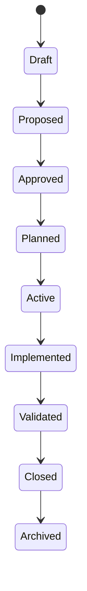

# OBJ-005 - Ecosystem State Machine

## Governance Metadata

| Field | Value |
| --- | --- |
| Originating Objective | OBJ-005 |
| Status | Canonical |
| Version | 1.0 |
| Owner | HOST |
| Last reviewed | 2026-06-28 |
| Constitution | [OBJ-000](../constitution/ecosystem-constitution.md) |
| Related documents | [OBJ-001](../taxonomy/taxonomy-registry.md), [OBJ-002](../kernel/operating-model.md), [OBJ-003](../services/registry-service-specification.md), [OBJ-004](../context/context-domain-model.md), [ADR-001](../architecture/ADR-001-ecosystem-taxonomy-and-numbering.md), [ADR-002](../architecture/ADR-002-host-kernel-operating-model.md) |

Canonical lifecycle specification for governed HOST ecosystem objects.

## Purpose

This document defines deterministic state machines for ecosystem objects.

It ensures that every important object moves through allowed states, with explicit entry conditions, exit conditions, validation rules, and ownership of transitions.

## Canonical References

| Document | Role |
| --- | --- |
| [OBJ-000](../constitution/ecosystem-constitution.md) | Governance entry point |
| [OBJ-001](../taxonomy/taxonomy-registry.md) | Canonical names, ownership, and identifiers |
| [OBJ-002](../kernel/operating-model.md) | Canonical request and operating model |
| [ADR-001](../architecture/ADR-001-ecosystem-taxonomy-and-numbering.md) | Taxonomy and numbering decision record |
| [ADR-002](../architecture/ADR-002-host-kernel-operating-model.md) | Kernel operating model decision record |
| [OBJ-003](../services/registry-service-specification.md) | Registry service behaviour |
| [OBJ-004](../context/context-domain-model.md) | Canonical CONTEXT object model |

## Core State Path

The canonical end-to-end progression is:

Not every object uses every state, but every object must use a deterministic subset of the allowed lifecycle pattern.

## Ownership of Transitions

| Owner | Transition Authority |
| --- | --- |
| HOST | Governance objects, approvals, constitutional records, and override decisions |
| CONTEXT | Knowledge objects, relationships, observations, evidence, and context records |
| Roadmap | Planning objects, sequencing objects, and release planning states |
| Product repositories | Implementation, branch, release, and delivery artefacts |
| Runtime owner | Session, conversation, execution, and agent runtime records |

## State Families

### Governance Objects

Governance objects include Objectives, Decisions, ADRs, Policies, and Standards.

| Object | Allowed States | Entry Condition | Exit Condition | Illegal Transitions |
| --- | --- | --- | --- | --- |
| Objective | Draft -> Proposed -> Approved -> Planned -> Active -> Implemented -> Validated -> Closed -> Archived | A request is expressed clearly enough to govern | Validation proves the objective was satisfied | Draft -> Active, Proposed -> Closed, Closed -> Active |
| Decision | Draft -> Proposed -> Accepted -> Superseded -> Archived | A choice is required and alternatives are known | The decision is recorded and no longer current | Proposed -> Implemented, Accepted -> Draft |
| ADR | Draft -> Proposed -> Accepted -> Archived | A durable architecture choice needs recording | The decision is accepted and traceable | Accepted -> Proposed, Archived -> Active |
| Policy | Draft -> Proposed -> Approved -> Retired | A rule must constrain behaviour | The rule is superseded or retired | Approved -> Draft, Retired -> Active |
| Standard | Draft -> Proposed -> Approved -> Revised -> Retired | A repeatable rule needs canonicalisation | The standard is replaced or retired | Revised -> Draft, Retired -> Approved |

### Planning Objects

Planning objects include Roadmaps, Epics, Initiatives, Sprints, Milestones, and Releases.

| Object | Allowed States | Entry Condition | Exit Condition | Illegal Transitions |
| --- | --- | --- | --- | --- |
| Roadmap | Draft -> Active -> Closed -> Archived | Planning intent exists | Sequencing is complete and superseded | Draft -> Closed, Archived -> Active |
| Epic | Draft -> Planned -> Active -> Complete -> Archived | An outcome needs grouping | All work in the epic is delivered | Planned -> Archived without completion |
| Initiative | Draft -> Active -> Done -> Archived | A sub-outcome is approved | The initiative work is finished | Draft -> Done, Done -> Active |
| Sprint | Planned -> Active -> Complete -> Archived | Capacity and dates are set | Sprint commitment is finished | Active -> Planned after start |
| Milestone | Proposed -> Reached -> Archived | A checkpoint is defined | The checkpoint is achieved or retired | Reached -> Proposed |
| Release | Planned -> Built -> Released -> Retired | A version is scheduled | The release is delivered or retired | Released -> Planned |

### Knowledge Objects

Knowledge objects include Entities, Relationships, Capabilities, Workflows, Signals, Observations, Evidence, Events, States, and Context Records.

| Object | Allowed States | Entry Condition | Exit Condition | Illegal Transitions |
| --- | --- | --- | --- | --- |
| Entity | Proposed -> Registered -> Deprecated | A canonical concept is identified | The concept is replaced or removed | Registered -> Proposed |
| Relationship | Proposed -> Active -> Retired | Source and target are known | The linkage is no longer valid | Active -> Proposed |
| Capability | Proposed -> Registered -> Active -> Deprecated -> Retired | The capability is named and owned | The capability is no longer current | Retired -> Active |
| Workflow | Draft -> Active -> Retired | The steps are defined | The workflow is superseded | Active -> Draft |
| Signal | Draft -> Active -> Archived | A measurable trigger is defined | The signal is no longer monitored | Archived -> Active |
| Observation | Captured -> Verified -> Archived | Something was observed | The observation is archived after verification | Verified -> Captured |
| Evidence | Collected -> Verified -> Archived | A supporting record exists | Evidence is no longer current | Archived -> Verified |
| Event | Emitted -> Consumed -> Archived | An occurrence happened | The event record is no longer active | Archived -> Emitted |
| State | Proposed -> Current -> Superseded -> Archived | The state is associated with an object | The state is replaced | Archived -> Current |
| Context Record | Draft -> Verified -> Current -> Superseded -> Archived | A knowledge record is created | The record is no longer current | Current -> Draft |

### Delivery Objects

Delivery objects include Tasks, Issues, Implementations, Branches, Pull Requests, Merges, and Deployments.

| Object | Allowed States | Entry Condition | Exit Condition | Illegal Transitions |
| --- | --- | --- | --- | --- |
| Task | Open -> In Progress -> Done -> Closed | Work is admitted | Acceptance criteria are met | Done -> Open |
| Issue | Open -> Triaged -> Closed | A problem or request is logged | The issue is resolved or rejected | Closed -> Triaged |
| Implementation | Planned -> Active -> Implemented -> Validated -> Closed -> Archived | Approved scope exists | The change is validated and closed | Active -> Planned after implementation starts |
| Branch | Created -> Active -> Merged -> Deleted | A change set is created | The branch is merged or removed | Merged -> Active |
| Pull Request | Open -> Reviewed -> Approved -> Merged -> Closed | A change is ready for review | The change is integrated or closed | Merged -> Open |
| Merge | Created -> Completed -> Archived | A PR or branch is integrated | The merge is recorded | Archived -> Created |
| Deployment | Planned -> Deployed -> Rolled Back -> Retired | A release is scheduled | The deployment is complete or rolled back | Retired -> Deployed |

### Runtime Objects

Runtime objects include Sessions, Conversations, Agents, Jobs, Queues, Notifications, and Executions.

| Object | Allowed States | Entry Condition | Exit Condition | Illegal Transitions |
| --- | --- | --- | --- | --- |
| Session | Open -> Active -> Closed | A runtime interaction begins | The interaction ends | Closed -> Active |
| Conversation | Open -> Active -> Archived | Participants and topic are known | The conversation is complete | Archived -> Active |
| Agent | Provisioned -> Active -> Retired | The agent is available | The agent is no longer in service | Retired -> Active |
| Job | Queued -> Running -> Complete -> Archived | Work is scheduled | The job finishes | Complete -> Running |
| Queue | Provisioned -> Active -> Retired | A queue is created | The queue is no longer needed | Retired -> Active |
| Notification | Created -> Delivered -> Archived | A message is generated | The notification is sent and stored | Archived -> Delivered |
| Execution | Created -> Running -> Complete -> Archived | A run starts | The run finishes | Complete -> Running |

## Entry Conditions

A state machine may only enter a state when:

- the owning repository is clear
- the current state is valid
- the required parent or reference record exists
- the transition is permitted by OBJ-002
- the traceability chain is intact

## Exit Conditions

A state may only be exited when:

- the state-specific completion criteria are satisfied
- required evidence or validation exists
- downstream records have been refreshed when needed
- ownership rules remain satisfied

## Validation Rules

- Every object family must declare its allowed state sequence.
- Every transition must have one owner.
- Every transition must be deterministic and auditable.
- Every illegal transition must fail clearly.
- Every state change must preserve traceability to the originating Objective or governing decision.

## Illegal Transition Policy

Illegal transitions are not corrected implicitly.

They must be rejected with a deterministic reason, such as:

- `transition_not_allowed`
- `missing_entry_condition`
- `ownership_conflict`
- `traceability_incomplete`
- `state_family_mismatch`

## Transition Governance

| Transition Type | Authority |
| --- | --- |
| Approve governance work | HOST |
| Register knowledge change | CONTEXT |
| Sequence planning work | Roadmap |
| Execute implementation work | Product repository owner |
| Record runtime state | Runtime owner |

## Relationship to Request Lifecycle

OBJ-002 defines the request lifecycle.

OBJ-005 defines the object-level lifecycle rules that sit underneath that request lifecycle.

The request lifecycle determines when work may advance.
The state machine determines how each governed object may advance.
