# Taxonomy Hierarchy

## Governance Metadata

| Field | Value |
| --- | --- |
| Originating Objective | OBJ-001 |
| Status | Canonical |
| Version | 1.0 |
| Owner | HOST |
| Last reviewed | 2026-06-28 |
| Constitution | [OBJ-000](../constitution/ecosystem-constitution.md) |
| Related documents | [OBJ-001](taxonomy-registry.md), [object-definitions](object-definitions.md), [repository-ownership](repository-ownership.md), [traceability-model](traceability-model.md), [numbering-standards](numbering-standards.md), [naming-conventions](naming-conventions.md), [glossary](glossary.md) |

## Overview

The HOST ecosystem taxonomy is organized from governance down to runtime and product execution.

## Hierarchy Diagram

```mermaid
flowchart TB
  ROOT["Ecosystem Taxonomy Registry"]

  ROOT --> GOV["Governance"]
  ROOT --> PLAN["Planning"]
  ROOT --> KNOW["Knowledge"]
  ROOT --> DEL["Delivery"]
  ROOT --> RUN["Runtime"]
  ROOT --> PROD["Products"]

  GOV --> OBJ["Objectives"]
  GOV --> DEC["Decisions"]
  GOV --> ADR["ADRs"]
  GOV --> POL["Policies"]
  GOV --> STD["Standards"]

  PLAN --> RDM["Roadmaps"]
  PLAN --> EPC["Epics"]
  PLAN --> INI["Initiatives"]
  PLAN --> SPT["Sprints"]
  PLAN --> MST["Milestones"]
  PLAN --> RLS["Releases"]

  KNOW --> ENT["Entities"]
  KNOW --> RLT["Relationships"]
  KNOW --> CAP["Capabilities"]
  KNOW --> WFL["Workflows"]
  KNOW --> SIG["Signals"]
  KNOW --> OBS["Observations"]
  KNOW --> EVD["Evidence"]
  KNOW --> EVT["Events"]
  KNOW --> STS["States"]
  KNOW --> ART["Artifacts"]

  DEL --> TASK["Tasks"]
  DEL --> ISS["Issues"]
  DEL --> BR["Branches"]
  DEL --> COM["Commits"]
  DEL --> PR["Pull Requests"]
  DEL --> MRG["Merges"]
  DEL --> DPL["Deployments"]

  RUN --> SES["Sessions"]
  RUN --> CVS["Conversations"]
  RUN --> AGT["Agents"]
  RUN --> JOB["Jobs"]
  RUN --> QUE["Queues"]
  RUN --> NOT["Notifications"]
  RUN --> EXE["Executions"]

  PROD --> HOST["HOST"]
  PROD --> CTX["CONTEXT"]
  PROD --> RMP["Roadmap"]
  PROD --> MGR["MGRNZ"]
  PROD --> FYV["FindYourVertical"]
  PROD --> FMF["FunkMyFans"]
  PROD --> FUT["Future Products"]

  HOST --> GOV
  HOST --> KNOW
  HOST --> RUN

  CTX --> ENT
  CTX --> RLT
  CTX --> OBS
  CTX --> EVD

  RMP --> PLAN
  MGR --> DEL
  FYV --> DEL
  FMF --> DEL
  FUT --> PROD
```

## Parent-Child Rules

- Governance defines the rules.
- Planning converts governance into sequencing.
- Knowledge captures meaning and evidence.
- Delivery converts planning into implementation records.
- Runtime captures live operational behaviour.
- Products own implementation outcomes, not the governing taxonomy.

## Notes

The diagram shows conceptual hierarchy, not repository nesting.

Repository ownership is defined separately in [repository-ownership](repository-ownership.md).
